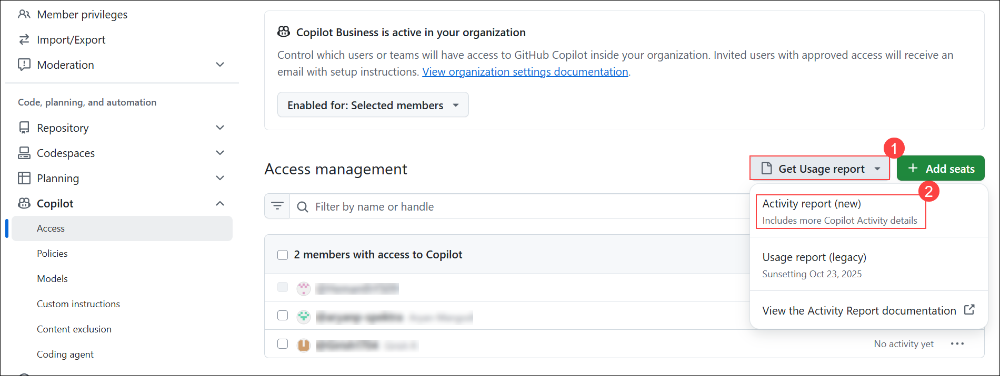
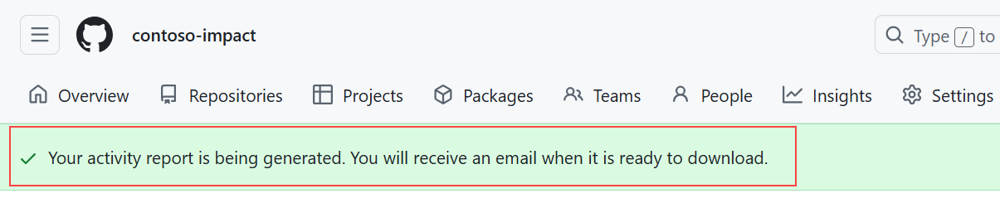
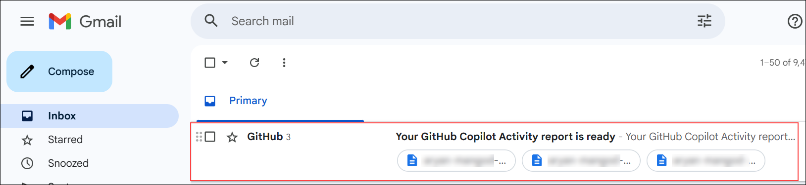

# Exercise 1 — Enable & Access Copilot Usage Reports (Read-only)

## Task 1: Generate the Activity report

1. In the top-right of GitHub, click your **profile picture (1)** → select **Organizations (2)**.

   

1. On **Settings › Organizations**, click your org **contoso-impact** (role: **Owner**).  

   

1. On the org home, select **Settings** from the top navigation.  

   

1. In the left sidebar under **Code, planning, and automation (1)**, expand **Copilot (2)** → click **Access (3)**.  

   

1. On **Access management**, open **Get Usage report (1)** → choose **Activity report (new) (2)**.

   

1. Confirm the green banner **“Your activity report is being generated…”** appears.  

   

1. Watch for the email titled **“Your GitHub Copilot Activity report is ready”** and download the CSV if available.  

   
