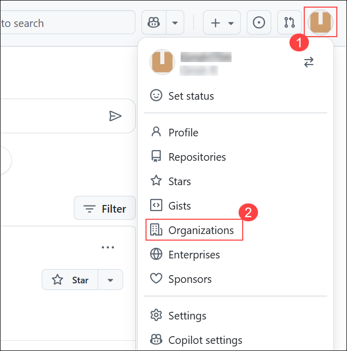
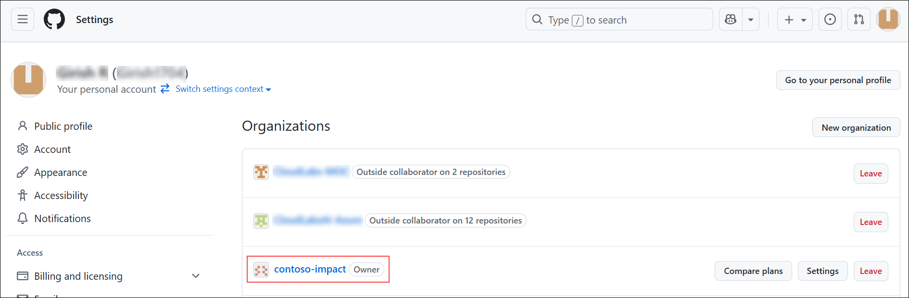
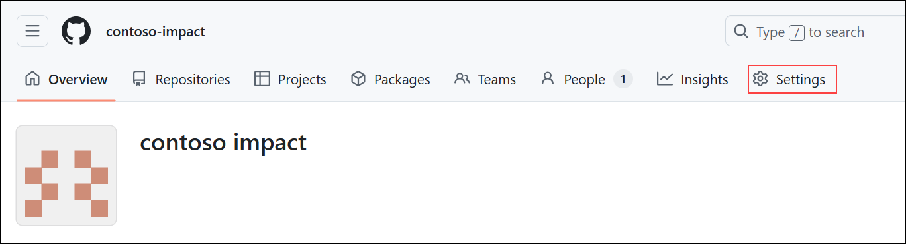
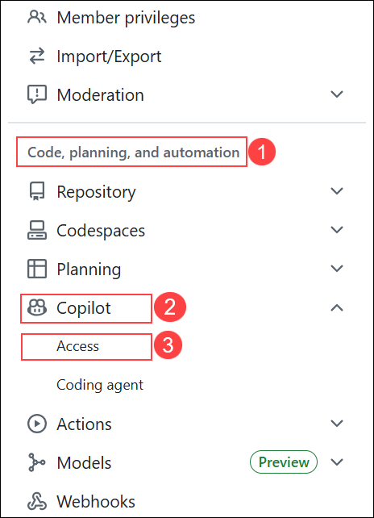

# Exercise 1 — Enable & Access Copilot Usage (Read-Only)

## Task 1: Open your organization

  

1. In the GitHub header, click your **profile avatar (1)** → select **Organizations (2)**.

  

1. On the **Organizations** page, click **contoso-impact** (Owner) to open the org.

  

1. On the org header, click **Settings**.

  
