## Exercise 2 — Analyze Manger Adoption Metrics

### Task 1: Load the Copilot org CSV into Power BI

1. Launch **Power BI Desktop** from the desktop.

   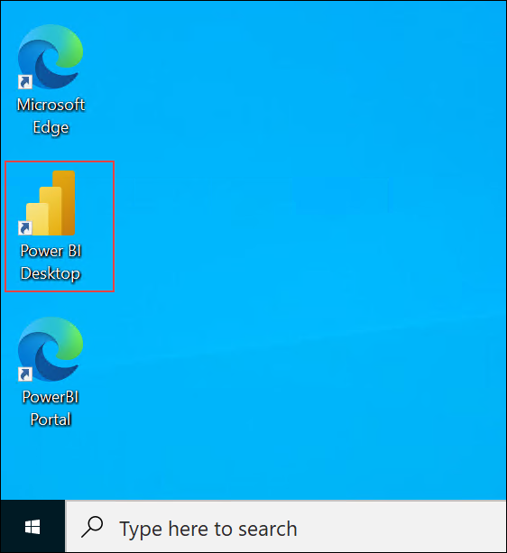

1. On the **Home** screen, select **Blank report**.

   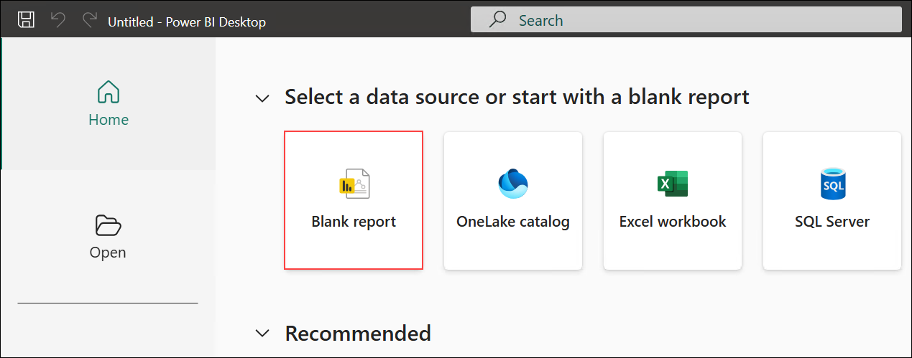

1. Go to the **Home (1)** tab and click **Get data (2)**.

   

1. In **Get Data**, choose **Text/CSV (1)** and select **Connect (2)**.

   

1. In the file picker, browse to **C:\\LabFiles (1)**, select **copilot_org (2)**, and click **Open (3)**.

   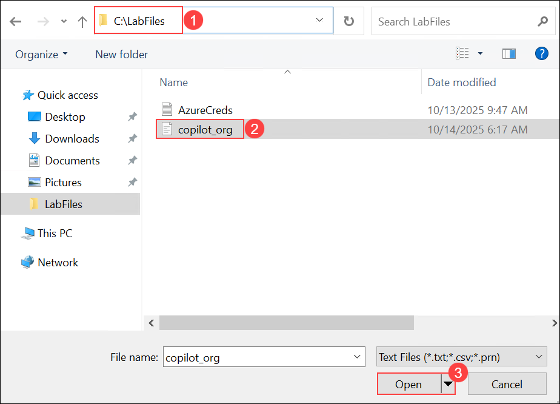

1. In the preview dialog, confirm the delimiter is **Comma** and click **Load**.

   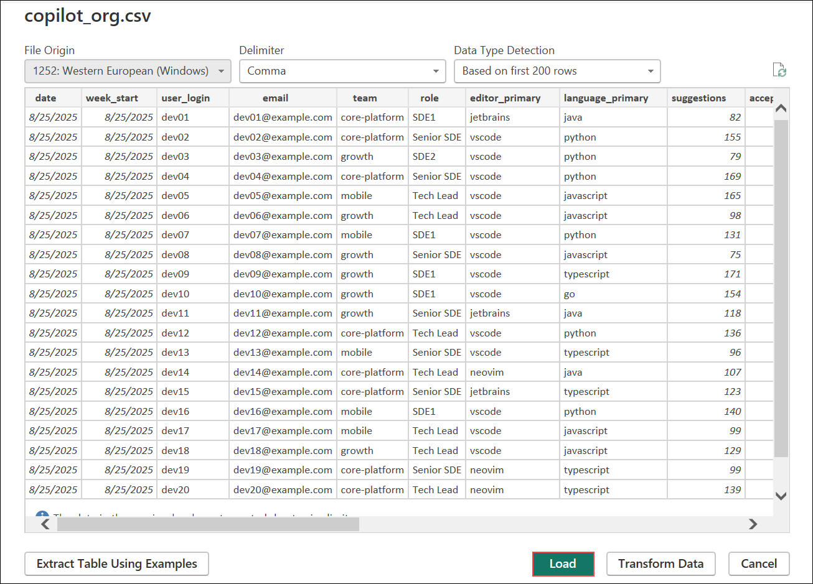

### Task 2: Create Core Measures (KPI + Trend foundations)

In this task, you’ll add the DAX measures that power all “must-ship” visuals. Follow each step and confirm the green checkmark in the formula bar before moving on.

> **Why measures?**  
> Measures are reusable calculations evaluated in filter context (e.g., by date, editor, language, or user). This keeps your model lean and your visuals consistent.

1. In the **Data** pane, right-click your table **copilot_org (1)** → choose **New measure (3)**.

   

1. In the formula bar, create **Total Suggestions** (1) and click **✔ (2)**.

   ```
   Total Suggestions = SUM('copilot_org'[suggestions])
   ```

   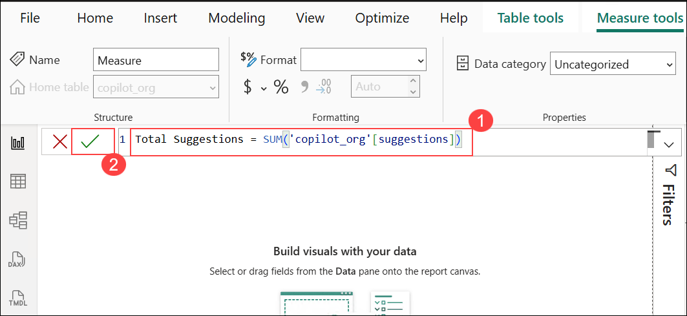

1. Confirm **Total Suggestions** appears under your table.

   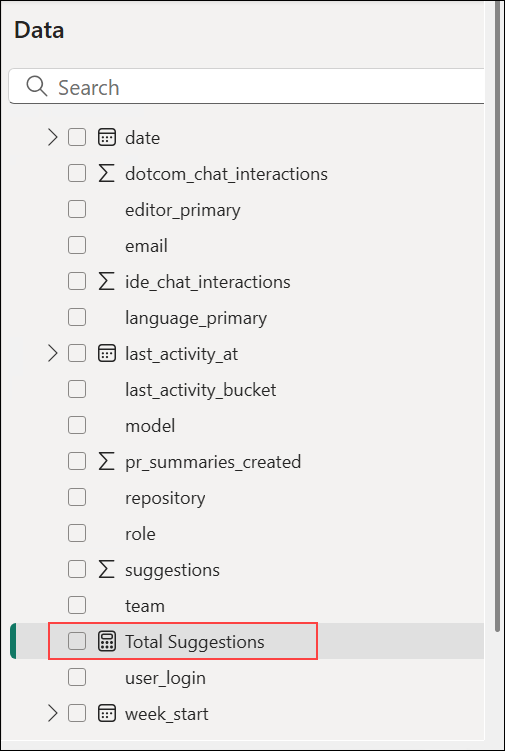

   > **Note:** If your table name is different, replace `'copilot_org'` in formulas accordingly.

1. Add another measure: right-click **copilot_org** → **New measure**.

   

1. Create **Total Acceptances** and click **✔**.

   ```
   Total Acceptances = SUM('copilot_org'[acceptances])
   ```

   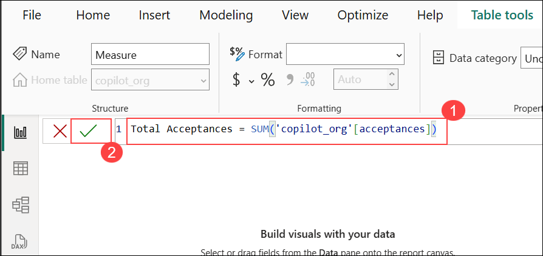

1. Add another measure: **New measure**.

   

1. Create **Acceptance Rate %** and click **✔**.

   ```
   Acceptance Rate % = DIVIDE([Total Acceptances], [Total Suggestions])
   ```

   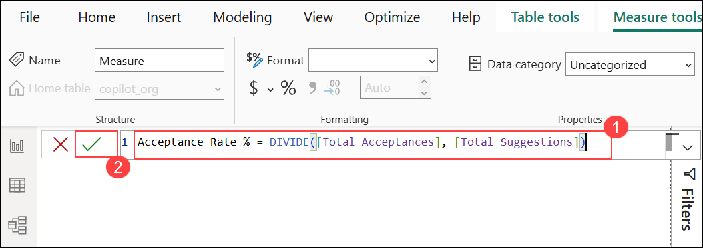

   > **Note:** `DIVIDE` safely handles divide-by-zero compared to `/`.

1. Add another measure: **New measure**.

   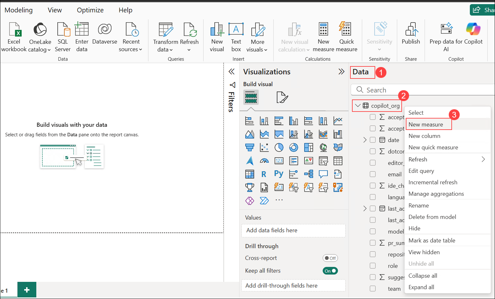

1. Create **Chat Interactions** and click **✔**.

   ```
   Text to paste:  
   Chat Interactions =  
   SUM('copilot_org'[ide_chat_interactions]) +  
   SUM('copilot_org'[dotcom_chat_interactions])
   ```

   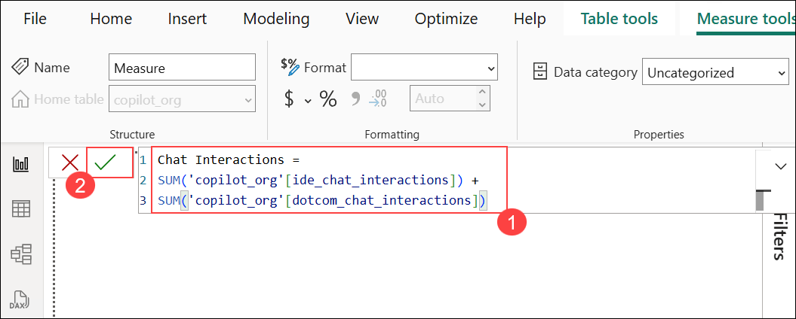

1. (If needed) Use **New measure** again from the table menu.

   

1. Create **Time Saved (hrs)** using the 10-seconds-per-acceptance heuristic, then click **✔**.

   ```
   Time Saved (hrs) = DIVIDE( SUM('copilot_org'[acceptances]) * 10, 3600 )
   ```

   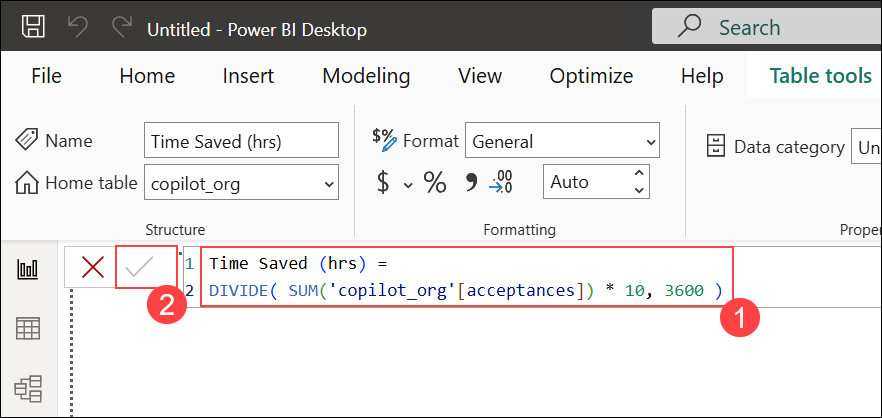

1. Add another measure: **New measure** from **copilot_org**.

   

1. Create **Active Users** and click **✔**.  
    Counts distinct users with any activity (suggestions OR chat OR PR summaries) in current filter context.

   ```
   Text to paste:  
   Active Users =  
   VAR Users = VALUES('copilot_org'[user_login])  
   RETURN  
   COUNTROWS(  
       FILTER(  
           Users,  
           CALCULATE(  
               SUM('copilot_org'[suggestions]) +  
               SUM('copilot_org'[ide_chat_interactions]) +  
               SUM('copilot_org'[dotcom_chat_interactions]) +  
               SUM('copilot_org'[pr_summaries_created])  
           ) > 0  
       )  
   )
   ```
   
   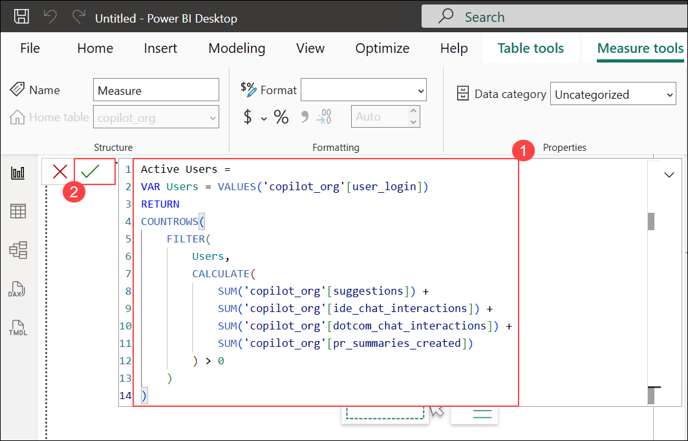

> **Note:** This measure respects slicers/filters (Editor, Language, Date). If you filter to a team/week, *Active Users* reflects only that slice.

1. Add another measure: **New measure**.

   

1. (Alternate menu view) **New measure** also appears in the compact context menu.

   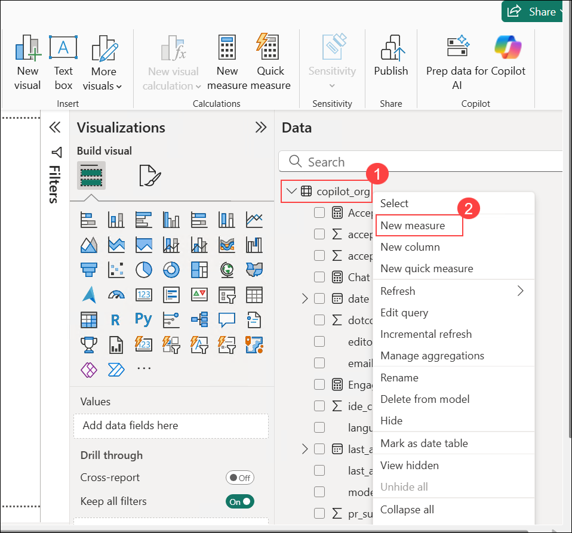

1. (Reference) Ensure your **Active Users** formula matches before proceeding.

   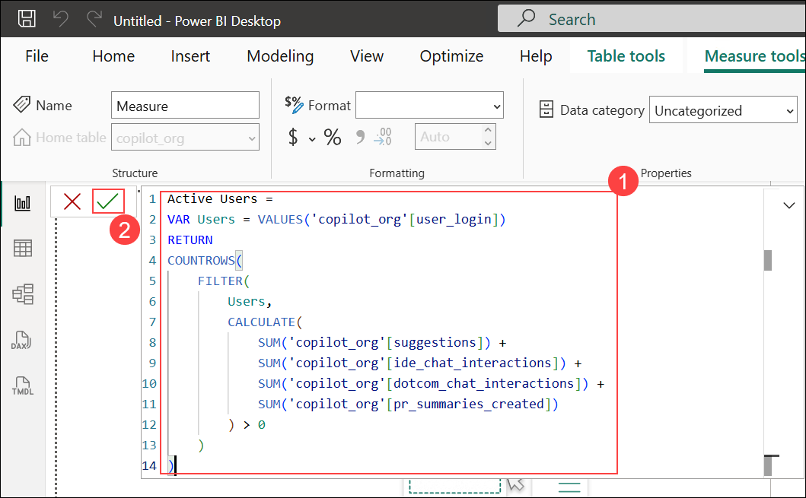

1. Create **Adoption Rate** and click **✔**.  
    Formula: Engaged Users ÷ Active Users. (You’ll add **Engaged Users** next task if not already present; for now wire the measure.)

   Text to paste:  
   Adoption Rate = DIVIDE([Engaged Users], [Active Users])

   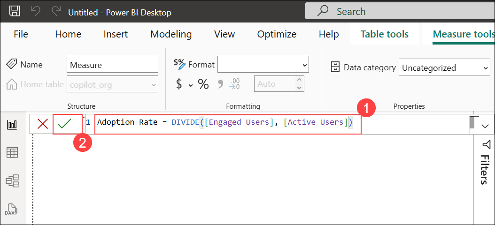

> **Note:** If **Engaged Users** isn’t created yet, you can paste this now; it will light up once that measure exists.

### Format the measures (make them exec-friendly)

1. Select **Acceptance Rate %** and set **Format = Percentage (1)** and **Decimal places = 2 (2)**.

   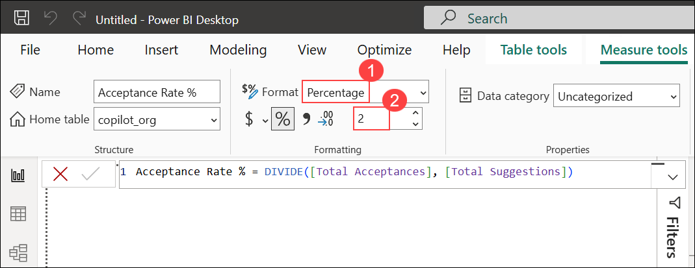

1. Select **Time Saved (hrs)** and set **Format = Decimal number (1)** and **Decimal places = 2 (2)**.

   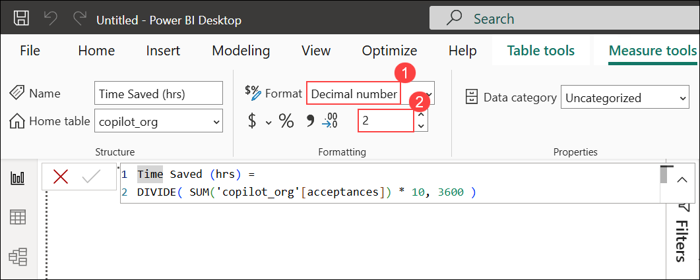

1. Select **Adoption Rate** and set **Format = Percentage (1)** and **Decimal places = 2 (2)**.

   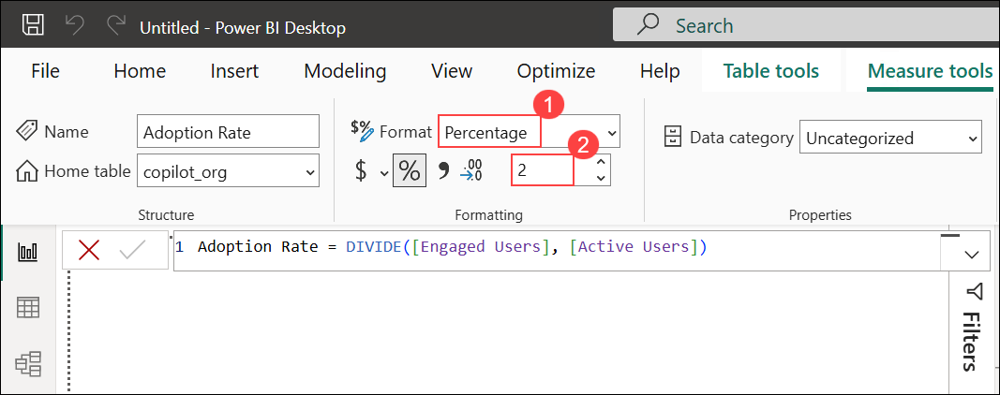

## Task 3: Create and Format KPI Cards

1. On the **Visualizations** pane, switch to **Build visual** and insert a **Card** visual. 

   

1. With the new card selected **(1)**, in **Data** expand your dataset and check **Active Users (2)**. It will land in **Fields (3)** for the card.  

   

1. Confirm the card displays the KPI value for **Active Users**.  

   

1. Resize the card as needed using the bottom-right drag handle so it reads cleanly on the canvas.  

   

1. Add a second **Card** visual for **Engaged Users** (repeat the insert step).

   

1. With the second card selected **(1)**, select **Engaged Users (3)** from **copilot_org (2)** to populate the KPI.  
   

1. Insert a third **Card** visual for **Adoption Rate**. 

   

1. Populate the third card with the **Adoption Rate** measure **(3)**. Verify it appears in **Fields (4)** and renders on the canvas **(1)**.  

   

1. With the **Adoption Rate** card selected **(1)**, open **Format visual (paint roller) (2)** → **Visual (3)** and set:  
   - **Display units:** **None (4)**  
   - **Value decimal places:** **2 (5)**  
   > **Tip:** Turning off display units avoids “K/M” abbreviations that can hide important precision for percentage KPIs.  
   
   

1. Still on the **Adoption Rate** card, go to **Format visual** → **General (3)**. Under **Apply settings to (4)** make sure **Adoption Rate** is selected, then set:  
    - **Format:** **Percentage (5)**  
    - **Decimal places:** **2 (6)**  
    > **Note:** If your measure already returns a fraction (e.g., 0.42), formatting as **Percentage** renders **42.00%** without changing the underlying calculation.
    
    

### Continue Task 3 — Build out KPI cards and charts (Steps 11–20)

1. **Add “Time Saved (hrs)” KPI card**  
    In **Visualizations**, keep **Build visual** selected and click the **Card** visual.  
    
    

1. **Bind the Time Saved (hrs) measure**  
    Select the new card, then in **Data** check **Time Saved (hrs)** so it appears in **Fields** and renders on the canvas.  
    
    

1. **Add a “Chat Interactions” KPI card**  
    With **Build visual** selected, click **Card** again to insert another card.  
    
    

1. **Bind the Chat Interactions measure**  
    Select the new card and, in **Data**, check **Chat Interactions** so the value shows in **Fields**.  
    
    

1. **Insert a Line chart for trends**  
    With **Build visual** active, choose the **Line chart** icon.  
    
    

1. **Configure the X-axis with Date hierarchy**  
    Select the line chart, expand **date ▸ Date Hierarchy** in **Data**, and ensure **Year**, **Quarter**, **Month**, and **Day** are active on the **X-axis**.  
    
    

1. **Add measures to the line chart**  
    - **Y-axis:** add **Total Acceptances**  
    - **Secondary y-axis:** add **Total Suggestions** (for dual-axis comparison)  
      
    > **Tip:** Dual axes help when the series have different scales.

1. **Add a Clustered bar chart**  
    With **Build visual** selected, click **Clustered bar chart**. 
    
    

1. **Show top acceptors by user**  
    - **Y-axis:** **user_login**  
    - **X-axis:** **Total Acceptances**  
    
    

1. **Compare Suggestions vs. Acceptances per user**  
    Keep **Y-axis = user_login** and set **X-axis** to **Total Suggestions** *and* **Total Acceptances** to render both measures side-by-side. 
    
    

> **Design note:** Keep your KPI cards left-aligned for at-a-glance context and place interactive visuals (line + bars) to the right for deeper exploration.

### 21) Add a slicer for IDE/Editor
1. In **Visualizations ▸ Build visual**, click **Slicer**.
2. Draw the slicer on the canvas (top-right area).
3. In the **Field** well, add **editor_primary**.

    

### 22) Format the editor slicer as tiles
1. With the slicer selected, open **Format visual** (paint-roller icon).
2. Go to **Visual ▸ Slicer settings**.
3. Under **Options**, set **Style = Tile**.

    

### 23) Add a slicer for Primary Language
1. In **Visualizations**, click **Slicer** again and draw a second slicer below the first.
2. In the **Field** well, add **language_primary**.

    

### 24) Format the language slicer as tiles
1. With the language slicer selected, open **Format visual**.
2. Go to **Visual ▸ Slicer settings**.
3. Under **Options**, set **Style = Tile**.

    

### 25) (Optional placeholder) Insert a Table visual
1. In **Visualizations**, click **Table**.
2. Place it in the open space (leave unconfigured for now).

    

### 26) Insert a Donut chart
1. In **Visualizations**, click **Donut chart**.
2. Draw it in the lower open area of the page.

    

### 27) Configure the Donut chart
1. In the **Legend** well, add **language_primary**.
2. In the **Values** well, add **Total Acceptances**.
3. Confirm the visual title shows **Total Acceptances by language_primary** and that slice labels and the legend appear.

