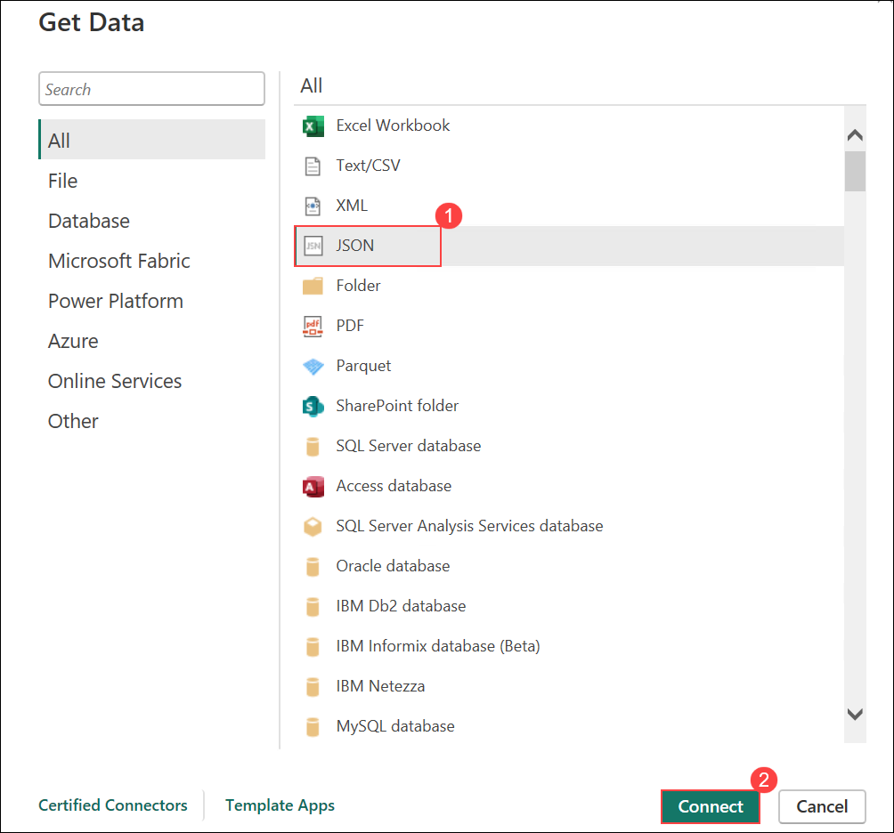
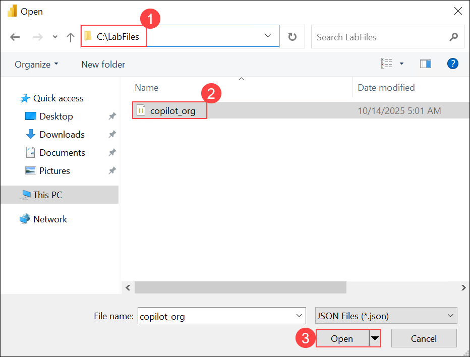
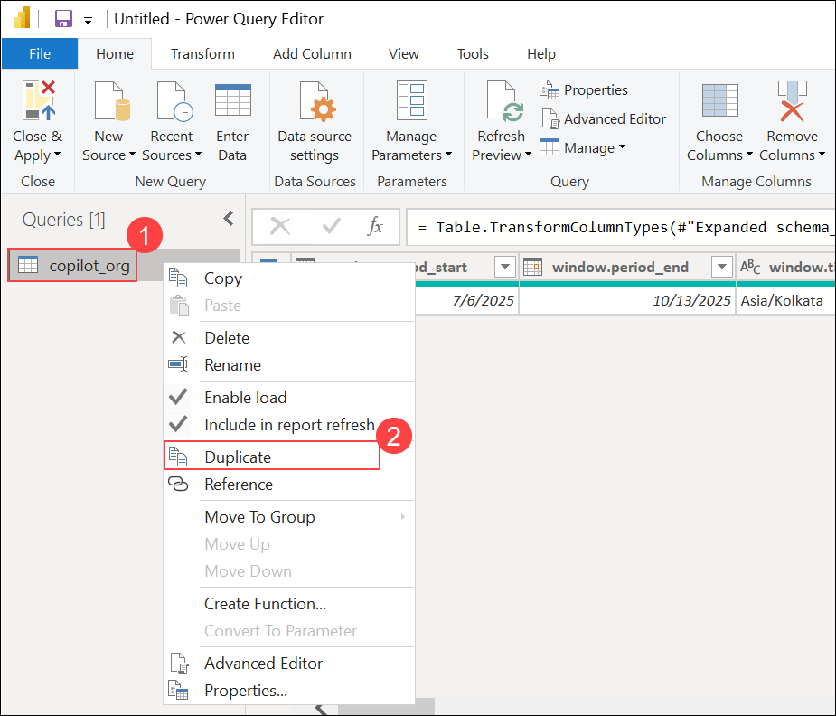
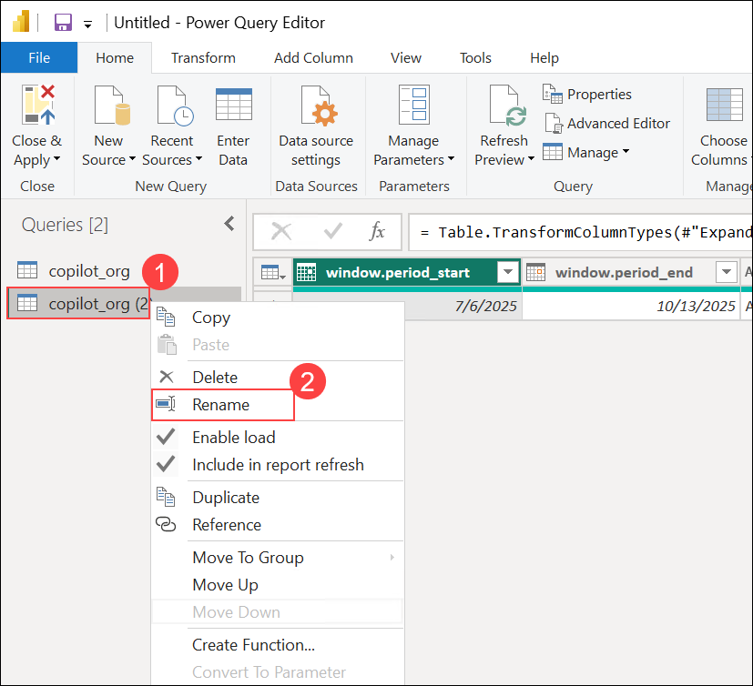
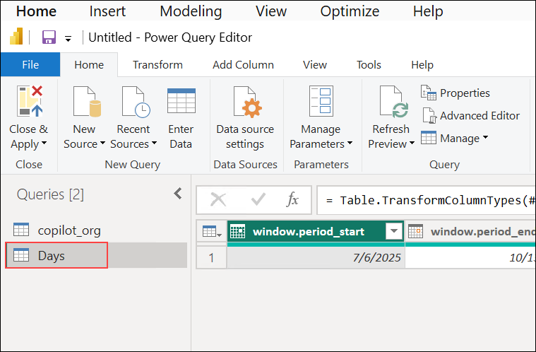
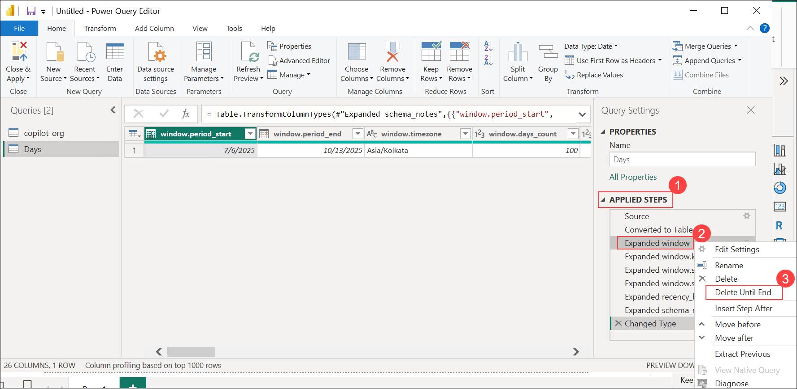
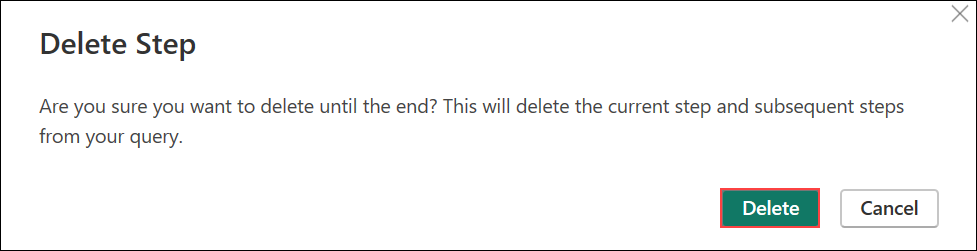
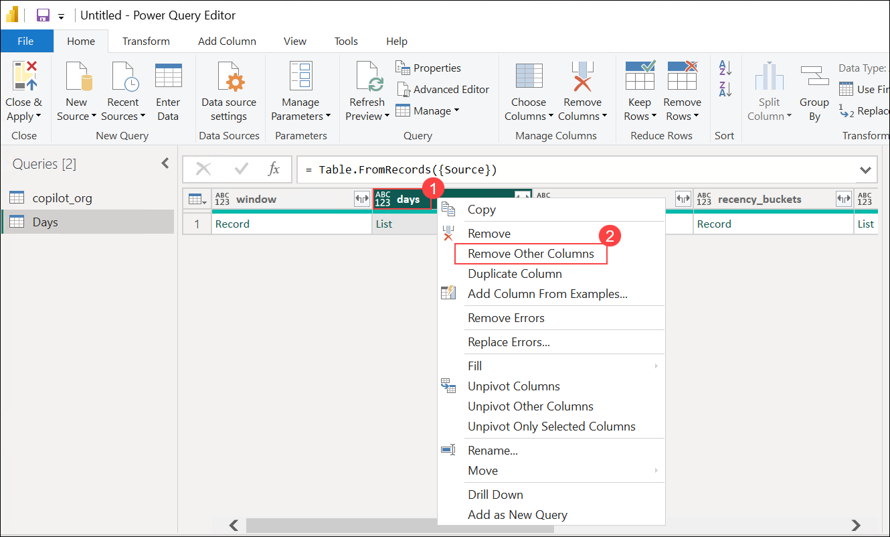
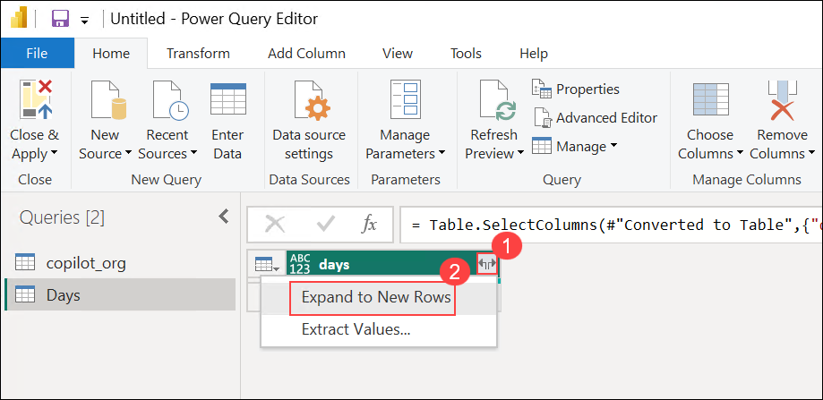

## Exercise 4: Report and Drive Adoption

### Estimated Duration: 25 Minutes

## Overview

In this exercise, you will assemble an executive-facing adoption & ROI dashboard, enrich it with cost and time-savings context, and package actionable insights for leadership. You’ll create a polished layout, add slicers for drill-down, surface savings assumptions transparently, and prepare summary artifacts that accelerate decision-making and targeted enablement.

## Objectives

You will be able to complete the following tasks:

- Task 1: Build an executive dashboard (layout, KPIs, ROI callouts, bookmarks)
- Task 2: Present findings & next steps (summary narrative, export/share, recommended actions)

## Prerequisites

- Completion of Exercises 1–3 with all core measures (Active Users, Engaged Users, Adoption Rate, Time Saved (hrs), Chat Interactions, Estimated Cost Savings if already created) available in the model.
- Power BI Desktop report open with prior visuals (line, bar, donut, table) available to copy/paste.

## Task 1: Build an Executive Dashboard

In this task, you will curate existing analytical visuals into a concise, executive-ready layout and add ROI context plus a default bookmark for consistent storytelling.

1. **Create a new page for executives**  
   - At the bottom, click **+** to add a page → rename to **Executive Dashboard**.  
   - In **View ▸ Canvas settings**, set **Type = 16:9** for widescreen layout.  

    

2. **Bring over your core visuals**  
   - From your adoption page, copy/paste these onto **Executive Dashboard**:  
     - **Cards**: *Active Users*, *Engaged Users*, *Adoption Rate*, *Time Saved (hrs)*, *Chat Interactions*.  
     - **Line chart**: *Total Acceptances vs Date* (keep dual-axis with *Total Suggestions* if used).  
     - **Clustered bar**: *Top users by Total Acceptances*.  
     - **Donut**: *Acceptances by language_primary*.  
     - **Table**: detail table.  
   - Arrange in a clean 2-row layout: **KPI strip at top**, **charts middle**, **table bottom**.  

   

3. **Add slicers for executive filtering**  
   - Add **Slicer** for **date** (use *Between* type) and place top-left.  
   - Add **Slicer** for **editor_primary** and **language_primary** (Tile style) next to date.  

   

4. **Create ROI callout measures (simple, no parameters)**  
   - In **copilot_org**, create:  
     ```DAX
     -- Adjust the 75 to your org’s fully-loaded hourly rate (currency-agnostic).
     Estimated Cost Savings =
       [Time Saved (hrs)] * 75
     ```
   - Format **Estimated Cost Savings** as **Currency** (0–0 dp).  

   

5. **Add ROI cards**  
   - Insert **Card** → bind to **Time Saved (hrs)**. Title: **Hours Saved**.  
   - Insert **Card** → bind to **Estimated Cost Savings**. Title: **Est. Cost Savings**.  
   - Place these on the right side of the KPI strip.  

   

6. **Add an “Assumptions” text box**  
   - Insert **Text box** (top-right, under ROI cards) → paste:  
     ```
     Assumptions:
     • 10 seconds saved per acceptance
     • Hourly rate = 75 (adjust per org)
     • Filters on this page recalculate savings
     ```
   - Reduce opacity slightly so it reads as a note.  
   
   

7. **Polish titles & formatting**  
   - For each visual, set **Title** to a business-friendly name (e.g., “Adoption Rate”, “Top Acceptors”, “Acceptances Over Time”).  
   - Cards: **Display units = None**, **Decimal places = 2** for percentages.  
   - Align visuals (multi-select → **Format ▸ Align / Distribute**).  

   

8. **(Optional) Add Smart narrative summary**  
   - Insert **Smart narrative** visual → Power BI autogenerates key takeaways.  
   - Edit the text to include: adoption highlights, spikes, and cohort insights.  

   

9. **Bookmark a “Default Executive View”**  
   - Clear slicers to your standard timeframe (e.g., **Last 30 days**).  
   - **View ▸ Bookmarks ▸ Add** → name **Executive Default** → enable **Data** + **Display**.  

   

## Task 2: Present Findings & Next Steps

In this task, you will synthesize insights, generate a leadership-ready summary, and share the report and recommended action plan to drive continued adoption momentum.

1. **Create a one-page summary (optional separate page)**  
   - Add a new page **Executive Summary**.  
   - Insert **Text box** with these sections and fill from your visuals:  
     - **Top Performers** (developers/teams with highest *Total Acceptances*).  
     - **Overall Gains** (Adoption Rate, Hours Saved, Est. Cost Savings).  
     - **Cohorts for Coaching** (Bottom 10 acceptors / low adoption segments).  
     - **Next Steps** (training plan, editor rollouts, language-specific tips). 

   

2. **Export or publish for leadership**  
   - **Export ▸ PDF** for a static deck handout; or **Export ▸ PowerPoint** to present live.  
   - **Home ▸ Publish** to Power BI Service → choose workspace.  

   

3. **Share with stakeholders**  
   - In Power BI Service, open the report → **Share** → enter leadership emails, add a short note, and include the **Executive Default** bookmark in your message.  

   

4. **Recommend actions (paste into your mail/Teams post)**  
   - **Train low-adoption cohort**: schedule a 60-min Copilot workshop for Bottom 10 users.  
   - **IDE focus**: prioritize the editor with highest **Acceptance Rate %** for rollout.  
   - **Language playbook**: replicate prompts/libraries seen in top-performing languages.  
   - **Quarterly goal**: +10% **Adoption Rate** and +5% **PR Throughput** vs baseline.

> You now have a polished **Executive Dashboard** with clear **ROI callouts**, plus a **shareable summary** to drive the Copilot rollout strategy.

## Notes

- Adjust the hourly rate constant in the `Estimated Cost Savings` measure to reflect your organization’s blended engineering cost.
- Consider adding a second savings scenario measure if you need conservative vs. aggressive models.
- Use bookmarks + selection pane to create alternate “Focus Views” (e.g., Language Performance, Editor Adoption).
- Smart narrative can be periodically refreshed when new data arrives—edit for clarity before sharing externally.
- Keep assumptions visible; executives often ask for transparency on time-saved multipliers.

<validation step="ex4-validate-dashboard" />

> **Validation Instructions**
> - Click the Validate button for this exercise in the lab environment UI.
> - Confirm KPI cards, ROI measures, slicers, and bookmark are present.
> - If validation fails, verify the cost savings measure formula and that visuals were copied correctly.
> - For assistance email: cloudlabs-support@spektrasystems.com.

## Summary

In this exercise, you consolidated adoption and productivity metrics into an executive dashboard, layered ROI estimates, and produced a narrative plus recommended actions to guide strategic Copilot rollout decisions. This completes the foundational analytics journey—future extensions can include cohort benchmarking, trend forecasting, and prompt quality analysis.

### You have successfully completed this exercise. Thank you for completing the lab series >>
