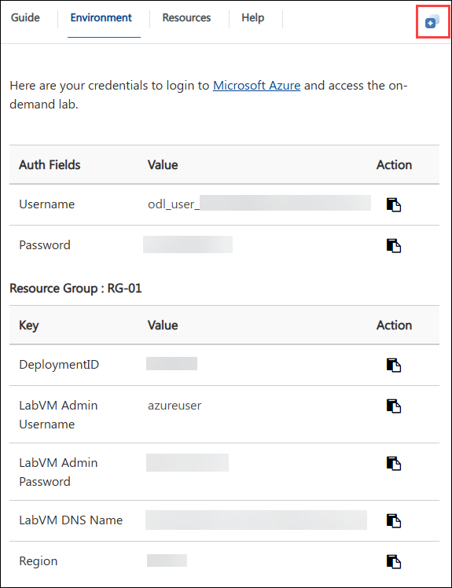
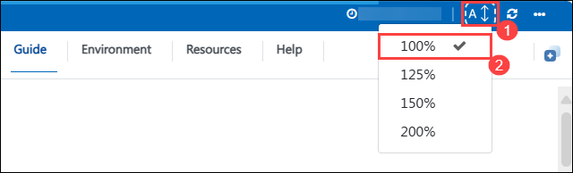
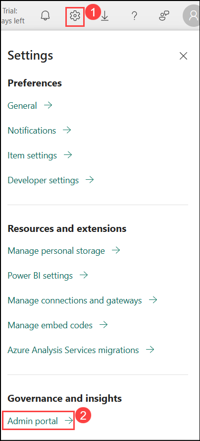
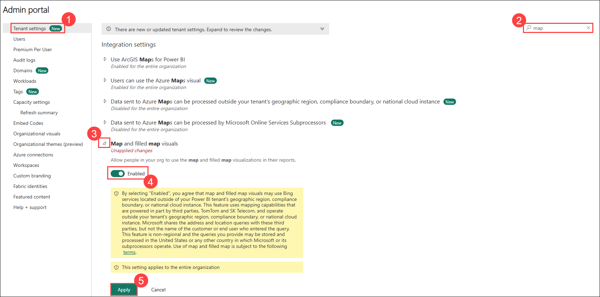
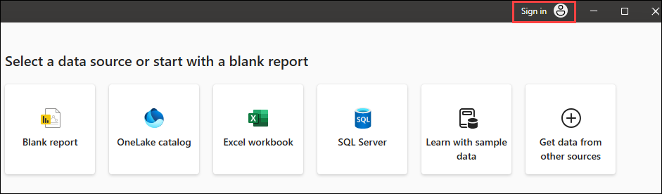
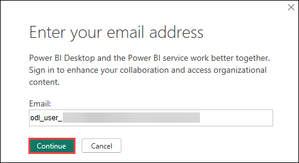
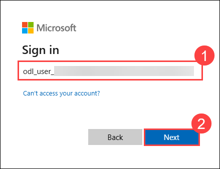
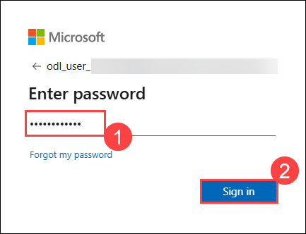
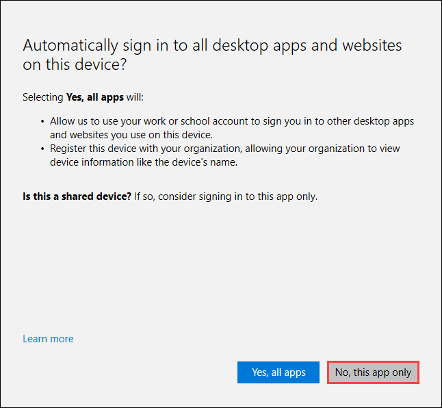

# Create and Publish Power BI Dashboards & Reports

### Overall Estimated Duration: 4 Hours

## Overview

In this lab, you will learn how to create and publish Power BI dashboards and reports. Utilizing a pre-created report, you will go through the steps to publish it to the Power BI Service. The lab covers essential skills such as applying conditional formatting, adding logos, importing custom visuals, and applying custom themes. Additionally, you will explore how to use bookmarks to enhance storytelling within your reports. Detailed instructions, along with visual aids and screenshots, guide you through each step of the process, ensuring you gain practical experience with Power BI's powerful features.

## Objective

Understand report creation and dashboard management in Power BI. By the end of this lab, you will gain insights on:

- **Create and Publish a Report:** Develop a comprehensive Power BI report, incorporating conditional formatting, custom visuals, and themes, and publish it to the Power BI Service.
- **Build and Organize a Dashboard:** Construct and organize a Power BI dashboard to effectively visualize and present data from the report.
- **Enhance Report Presentation:** Utilize features such as custom logos, conditional formatting, and bookmarks to create an engaging and informative report narrative.

## Pre-requisites

- Basic Knowledge of Power BI
- Access to Power BI Desktop and Service
- Understanding of Report Design Principles

## Architecture

In this lab, you'll start with a pre-created Power BI report and follow a structured process to enhance and publish it. Initially, you will apply conditional formatting to highlight important data points within the report. Next, you'll add logos to the visuals and filters to incorporate branding elements. After that, you'll import and integrate custom visuals to enrich the data representation. You will then apply a custom theme to ensure the report aligns with specific design guidelines. To enhance storytelling, you'll use bookmarks to create a narrative flow within the report. Finally, you'll publish the completed report to the Power BI Service for sharing and collaboration. Detailed instructions and visual aids will guide you through each step, ensuring you gain practical experience with Power BI's features.

## Architecture Diagram


## Explanation of Components

- **Pre-Created Report:** A Power BI report with existing data and visuals, used as the foundation for further customization and enhancement tasks.

- **Conditional Formatting:** A technique used to modify the appearance of report visuals based on data-driven conditions, highlighting key information.

- **Custom Visuals:** Specialized visual elements imported into Power BI to offer unique data representations and enhance the visual appeal of the report.

- **Power BI Service:** The cloud-based platform where the completed report is published for sharing, collaboration, and online access.
  
## Getting Started with the Lab
 
Once you're ready to dive in, your virtual machine and lab guide will be right at your fingertips within your web browser.

  new.png)

## Virtual Machine & Lab Guide
 
Your virtual machine is your workhorse throughout the workshop. The lab guide is your roadmap to success.
 
## Exploring Your Lab Resources
 
To get a better understanding of your lab resources and credentials, navigate to the **Environment** tab.

   

## Utilizing the Split Window Feature
 
For convenience, you can open the lab guide in a separate window by selecting the **Split Window** button from the Top right corner.

   
   
## Managing Your Virtual Machine

On the **Resources (1)** tab, use the **Action buttons (2)** next to your VM. Feel free to **start**, **stop**, or **restart** your Virtual Machine as needed. Your experience is in your hands!

   

## Lab Guide Zoom In/Zoom Out

To adjust the zoom level for the environment page, click the **A↕ : 100%** icon located next to the timer in the lab environment.

   

## Let's Get Started with Power BI Portal
 
1. On the Lab VM, open **Microsoft Edge** from the desktop. In a new tab, navigate to **Microsoft Fabric** by copying and pasting the following URL into the address bar:

   ```
   https://app.powerbi.com/
   ```

2. On the **Enter your email, we'll check if you need to create a new account** tab, you will see the login screen, in that enter the following email/username, and click on **Submit**.
 
   - **Email/Username:** <inject key="AzureAdUserEmail"></inject>
 
     

3. Now enter the following password and click on **Sign in**.
 
   - **Password:** <inject key="AzureAdUserPassword"></inject>
 
     
     
1. If you see the pop-up **Stay Signed in?**, select **No**.

   .png)

1. You should be able to view the Power BI Portal.

   

1. Once logged in, navigate to **Settings (1)** icon and select **Admin portal (2)** under **Governance and insights** section.

     

1. In the **Tenant settings** (**(1)**), search for **map** **(2)**, then expand the **Map and filled map visuals** **(3)**. If the toggle is not already enabled, switch it to **Enabled** **(4)**, and click **Apply** **(5)** to save the changes.

     

1. Open the **Power BI Desktop** located on the desktop of your lab environment.

     

1. Click on the **Sign-in icon** located in the top-right corner.

     

1. Once the "Enter your email address" dialog appears, copy the **Username** and paste it into the **Email** field of the dialog and select **Continue**.

   * Email/Username: <inject key="AzureAdUserEmail"></inject>

     

1. After clicking Continue, you will be prompted to sign in again. Please use the credentials provided below to log in.

   * Email/Username: <inject key="AzureAdUserEmail"></inject>

     

1. Enter password and **Sign in**

   - **Password:** <inject key="AzureAdUserPassword"></inject>

     

1. For the pop-up **Automatically sign in to all desktop apps and websites on this device?** window, select **No,this app only**

   

## Support Contact

The CloudLabs support team is available 24/7, 365 days a year, via email and live chat to ensure seamless assistance at any time. We offer dedicated support channels tailored specifically for both learners and instructors, ensuring that all your needs are promptly and efficiently addressed.

Learner Support Contacts:

- Email Support: cloudlabs-support@spektrasystems.com
  
- Live Chat Support: https://cloudlabs.ai/labs-support

Click **Next** from the bottom right corner to embark on your Lab journey!

## Happy Learning!!
