## Exercise 1: Activate Microsoft Fabric Trial and Configure Workspace

### Task 1: Activate Microsoft Fabric Free Trial

In this task, you will activate the Microsoft Fabric free trial.

1. Click on your **Profile icon** (top-right corner) in Microsoft Fabric or Power BI.
2. In the profile pane, locate the **Free trial** button and click it.


3. Review the trial details and select **Trial capacity region** (default is usually **West US 2**). 
-Select **Activate**, then click **OK** when you see **Successfully upgraded to Microsoft Fabric** .


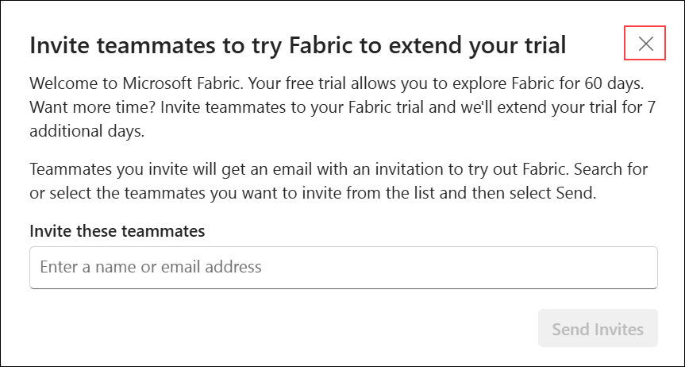

  > **Note**: click **X** to skip if you see this **invite teammates to extend your trial by 7 days** .

### Task 2: Create a New Workspace

In this task, you will create a new workspace in Microsoft Fabric.

1. In the left navigation pane, click **Workspaces** and then click **+ New workspace**.

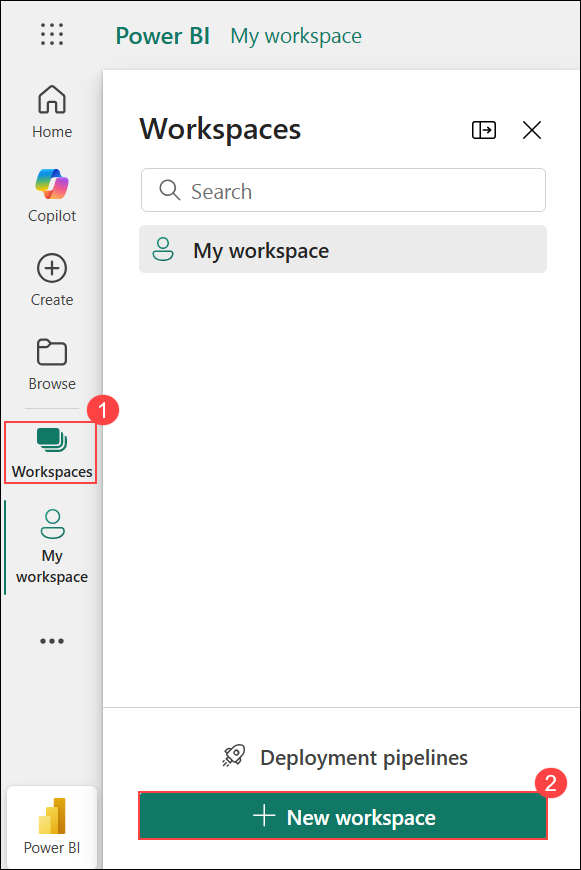

2. Provide a **Name** for your workspace (e.g., `Fabric-Project`). Optionally, add a **Description** and **Domain**. Upload a **Workspace image** if needed.

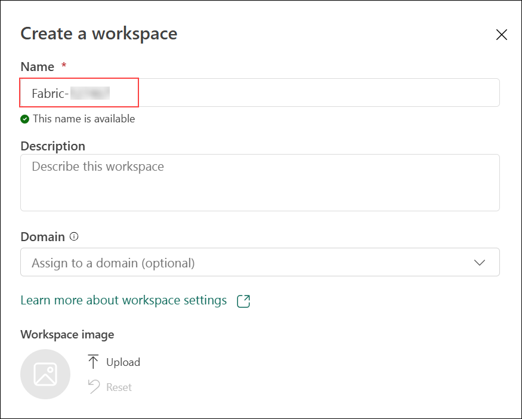

3. Expand **Advanced** settings.
4. Under **License mode**, select **Trial** to assign this workspace to your Fabric trial capacity.

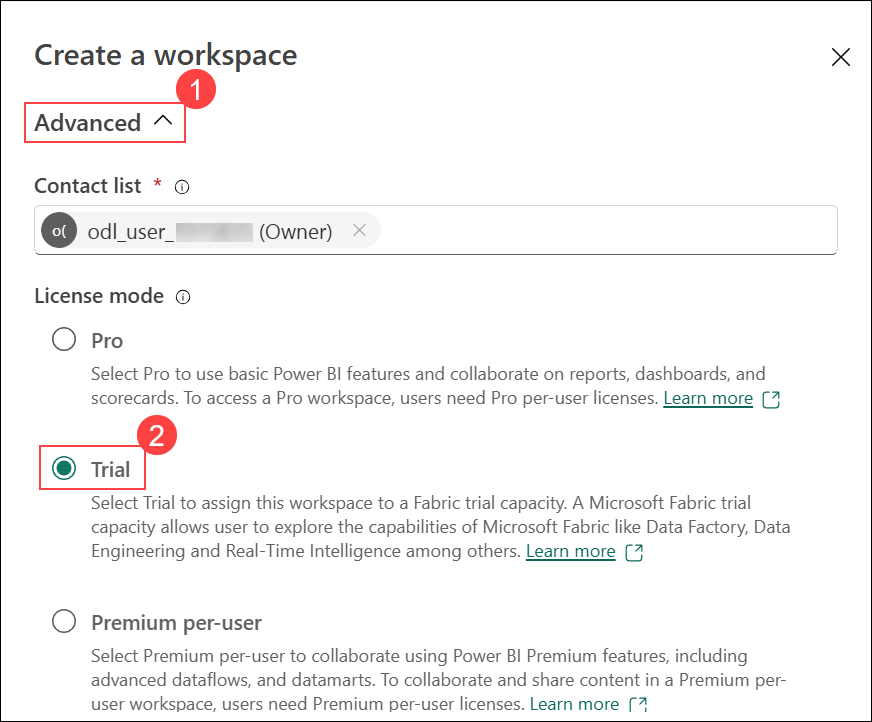

5. Assign Fabric Capacity
    - Select **Fabric capacity**.
    - Choose **Semantic model storage format** (Small or Large).
    - Select the available **Capacity** (e.g., Central US).
    - Click **Apply**.

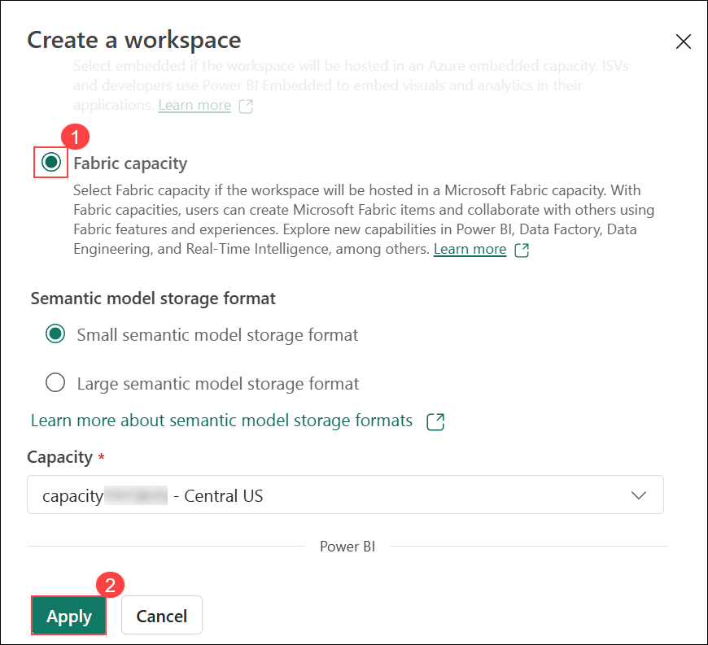


### Task 3: Create and Upload Data File

1. Click **Create**, then select **Get Data**.  

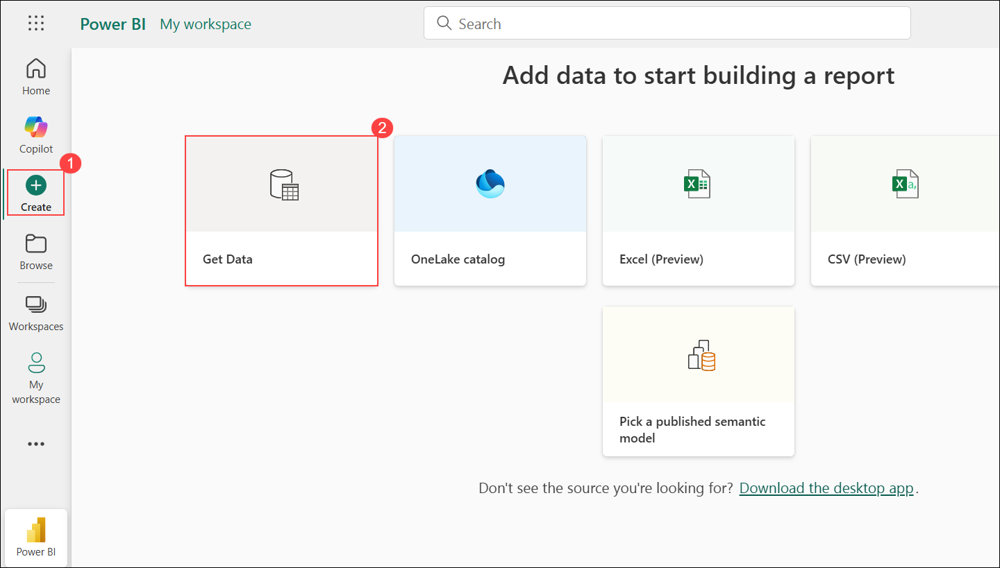

2. Click **Browse** to upload your file.  

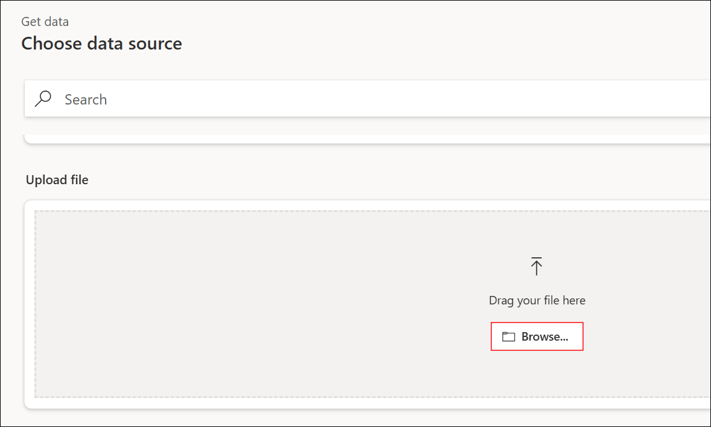

3. After upload, click **Next** for CSV and JSON files.  


### Task 5: Transform Data Using Power Query
- Switch mode to **Editing** from Viewing.  

> Additional Actions
> - Click **Open data model** to view or edit the model.  
!Open Data Model

> - Click **Get data** inside the semantic model to add more sources.  


- Apply transformations in Power Query and click **Save**.  


### Task 6: Create Report
- After transformations, click **Create a report**.  

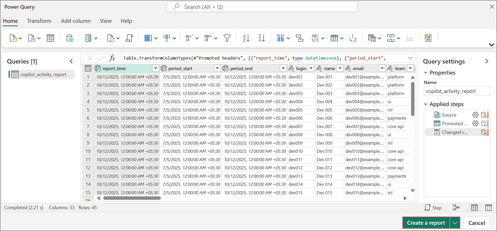

#### Task 7: Open Your Report in Microsoft Fabric
1. Sign in to Microsoft Fabric.
2. Navigate to your **workspace** and open the report where you want to add the visual.
3. In the **Visualizations** pane (right side), click the **Card visual icon**.
4. A blank card visual will appear on the canvas.
5. In the **Data** pane, expand the dataset **copilot_org_metrics**.
6. Check the field **total_active_users** to bind it to the card visual.


#### Finalize Your Card Visual
1. The card visual will now display the value of **total_active_users** (e.g., `12`).You can resize or reposition the card on the canvas.
2. Click the **Format** pane (paint roller icon).
3. Adjust **title**, **font size**, **background color**, and other settings as needed.


> **Tip:** You can add more visuals (tables, charts) by selecting other icons in the **Visualizations** pane and dragging fields from the **Data** pane.

#### Change Column Data Type
To update the data type of a column in Power BI within Microsoft Fabric, follow these steps:

1. In your Power BI report, click **Open data model** from the top menu.This will take you to the data model view where you can manage tables and columns.

   

2. In the data model view, find the table **copilot_org_metrics**.
3. From this table, select the column **total_engaged_users** that you want to modify.
4. On the right-hand side, in the **Properties** pane, look for the **Data type** dropdown.
5. Click the dropdown and choose **Whole number** from the list.This ensures the column stores numeric values without decimals.

   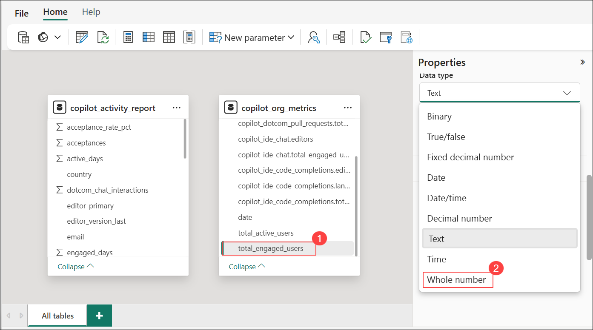

6. A confirmation dialog will appear warning that changing the data type may cause loss of data or precision.Click **Yes** to proceed with the change

   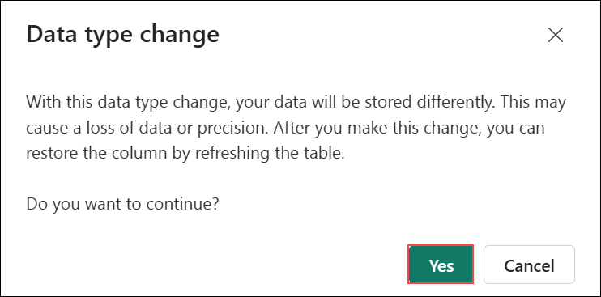

## Exercise 2: 
#### Task 1: Build and Customize Card Visuals
1. Sign in to Microsoft Fabric.
2. Open your workspace and launch the report editor.
3. In the **Visualizations** pane, click the **Card visual icon** to add a card to the canvas.
4. In the **Data** pane, expand the dataset **copilot_org_metrics**.
5. Select the field **total_active_users** to bind it to the card visual.

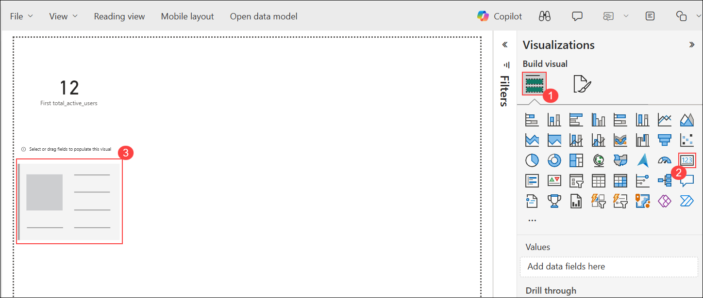

6. Resize or reposition the card as needed.
7. Click the **Format** pane (paint roller icon).
8. Customize the card with title, font size, background color, etc.


9. Repeat steps 3–5 to add another card visual for **total_engaged_users**.


10. Add a third card visual and bind it to the field **Adoption Rate**.

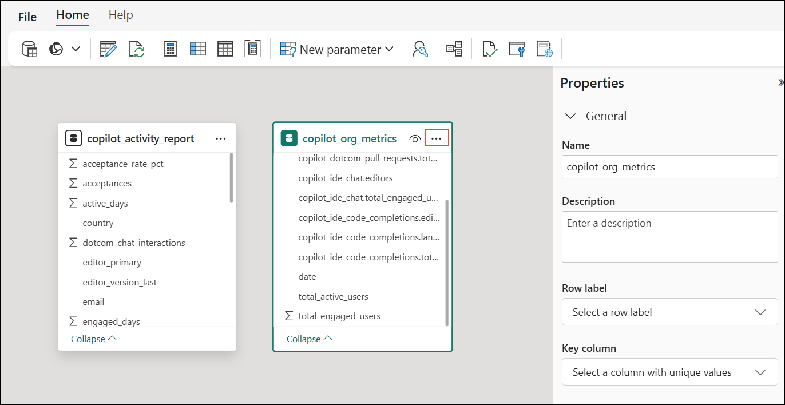

#### Task 2: Modify Column Data Type
1. Click **Open data model** from the top menu.

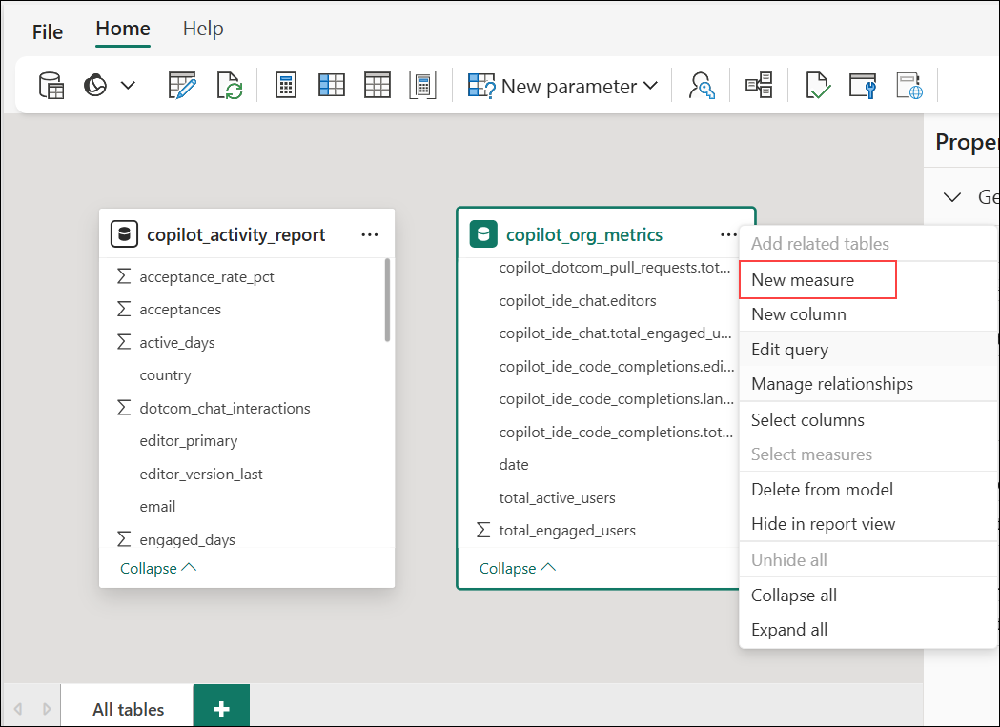

2. In the data model view, locate the table **copilot_org_metrics**.
3. Select the column **total_engaged_users**.


4. In the **Properties** pane, click the **Data type** dropdown.
5. Select **Whole number**.

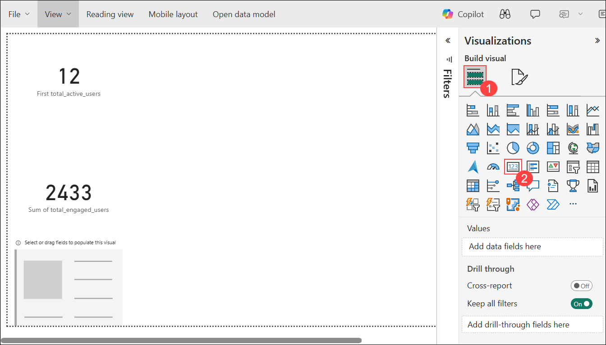

6. Confirm the change when prompted.


#### Task 3: Create and Use Measures
1. In the data model view, click the **ellipsis (three dots)** next to the table name.
2. Select **New measure**.

!.png)

3. Enter the formula:
   ```DAX
   Adoption Rate =
   DIVIDE(
       SUM('copilot_org_metrics'[total_engaged_users]),
       SUM('copilot_org_metrics'[total_active_users])
   )

