# Exercise 1: Activate Fabric Trial & Load Copilot Activity Data

### Estimated Duration: 45 Minutes

## Overview
In this exercise, you’ll enable the Microsoft Fabric trial (if prompted), upload **copilot_activity_report.csv** in Power BI Service, create a semantic model, and switch your report view to **Editing** so you’re ready to build visuals.

## Objectives
You will be able to complete the following tasks:

- **Task 1:** Activate Microsoft Fabric trial  

## Task 1: Activate Microsoft Fabric trial

1. In the Power BI Service, select your **Profile** avatar (top-right). Click **Free trial**.
    
   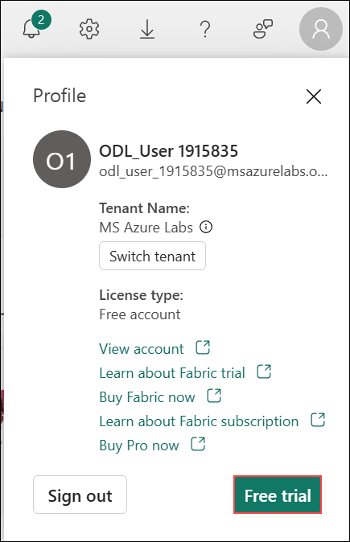

1. In **Activate your 60-day free Fabric trial capacity**, keep the default **Trial capacity region** and select **Activate**.
    
   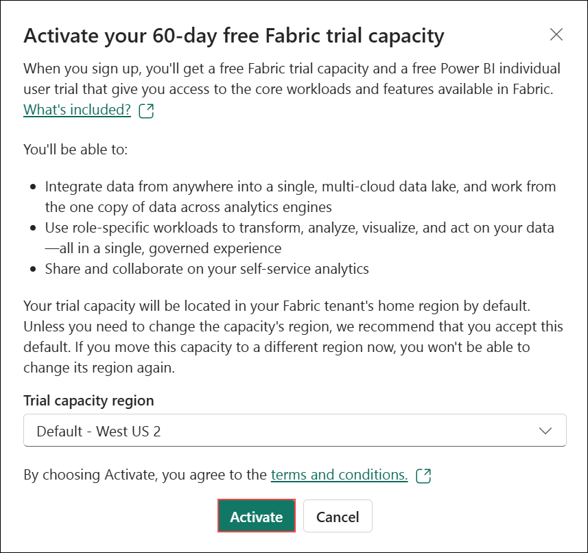

1. When you see **Successfully upgraded to Microsoft Fabric**, select **OK**.
   
   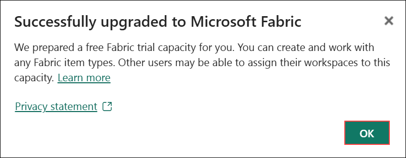

  > **Note:** If you already have Fabric enabled, continue to Task 2.

1. From **Home**, select **Get Data**.
    
   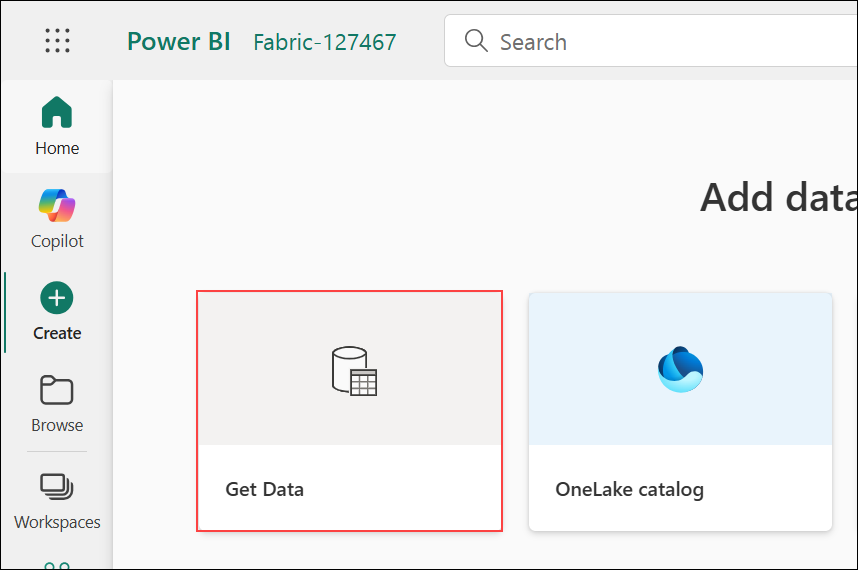

1. Choose **CSV**.
   
   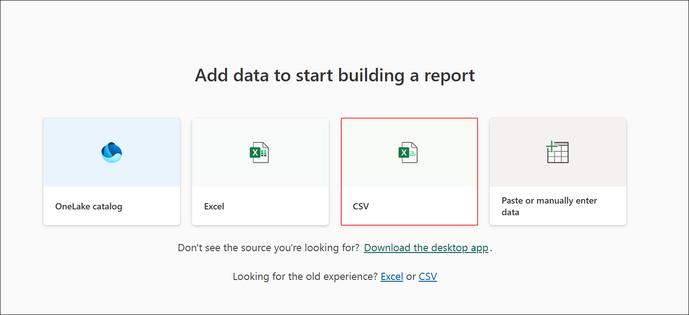

1. On **Connection settings**, keep **Upload file** selected. Upload **copilot_activity_report.csv** and select **Next**.
    
   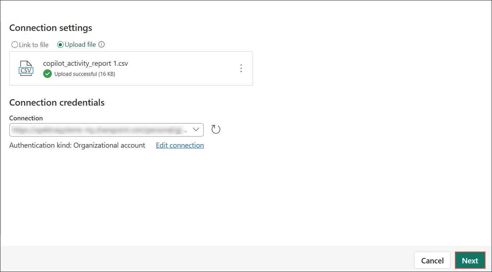

1. In **Power Query**, review the preview (no changes needed). Select **Create a report**.
    
   

1. In **Semantic model name**, enter `Copilot_Activity`, then select **Create**.
   
   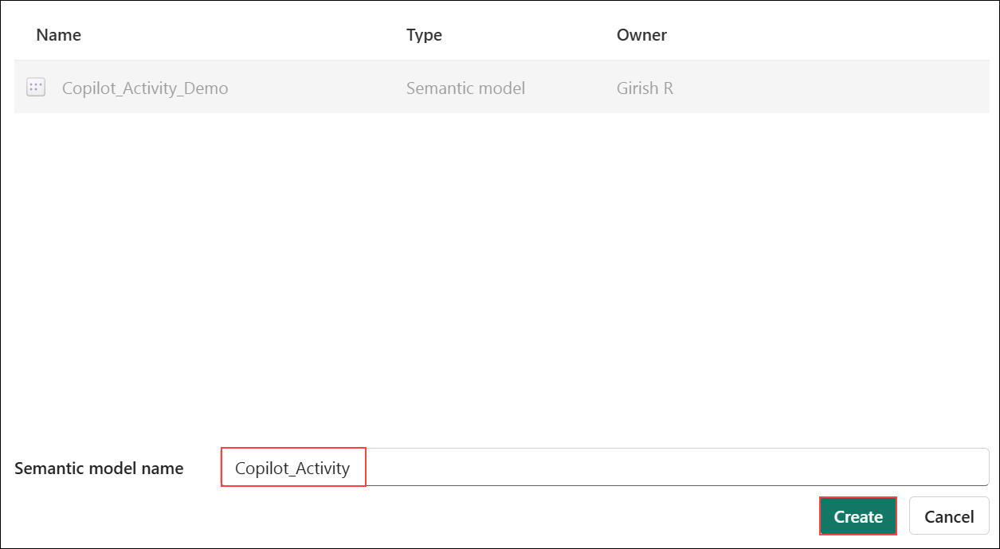

1. In the report header, select **Open data model**.
    
   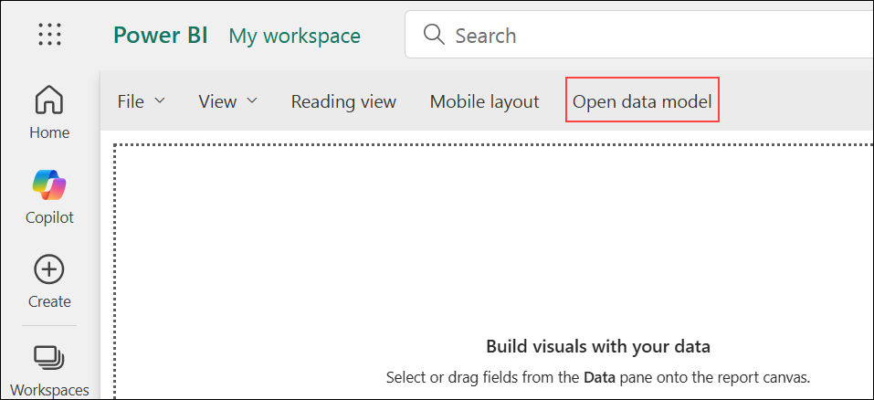

1. In the model view, switch from **Viewing** to **Editing**.
    
   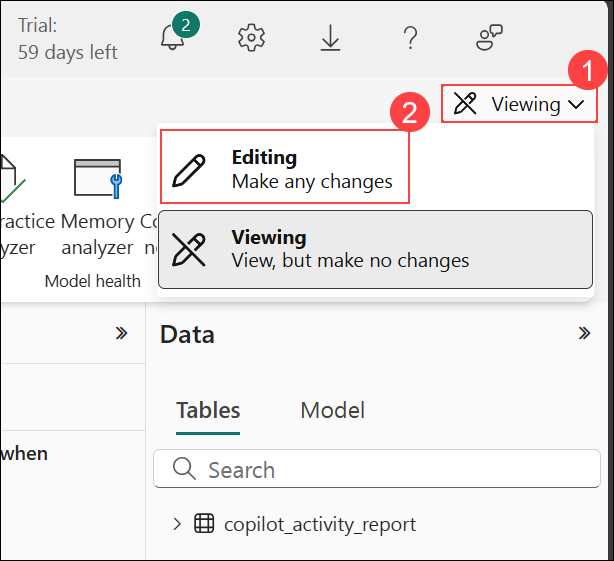

1. In **Model view**, on the **Home** tab click **Get data**.
   
   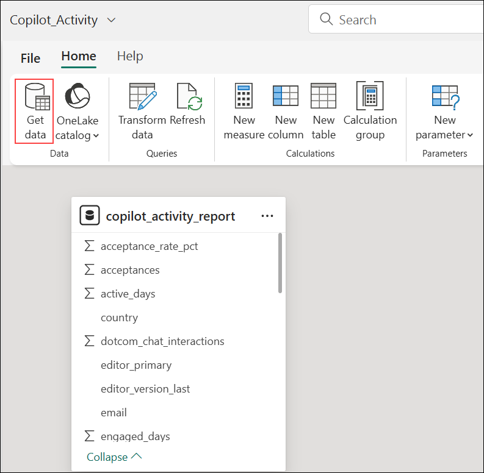

1. On **Choose data source**, under **Upload file**, click **Browse…** and select `copilot_org_metrics.json`.
    
   

1. Verify **Connection settings** show the uploaded file, keep **Authentication kind: Organizational account**, then click **Next**.
    
   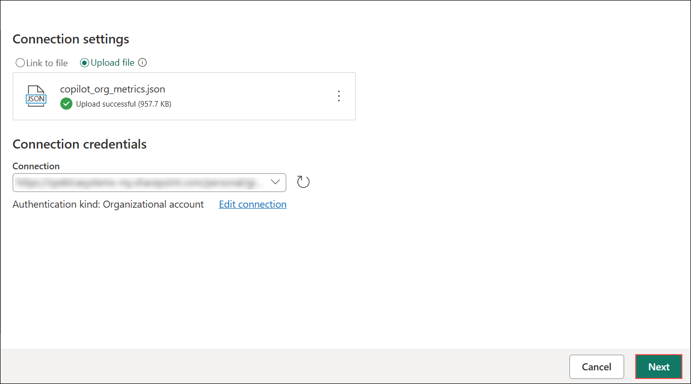

1. In **Power Query**, confirm the table name is **copilot_org_metrics (1)** and click **Save (2)** to load the shaped table.  
   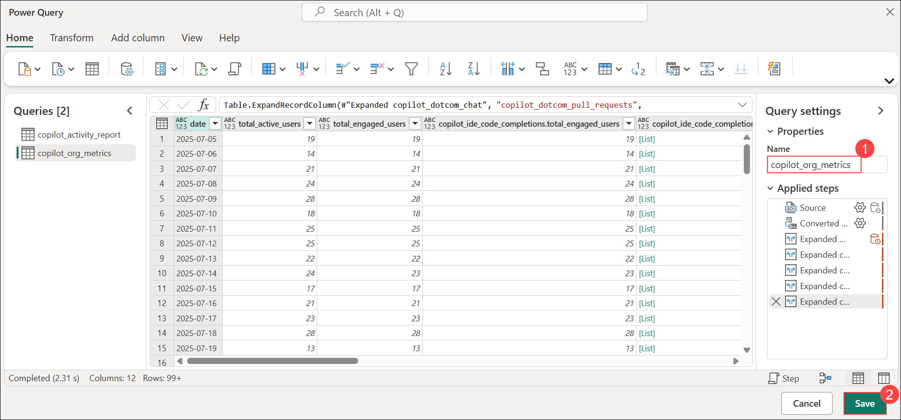

1. Back on the report canvas, in **Visualizations**, select the **Card** visual.
    
   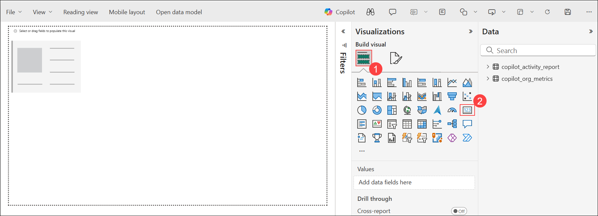

1. In **Data** → expand **copilot_org_metrics (1)** and check **total_active_users (2)** to populate the first card.
   
   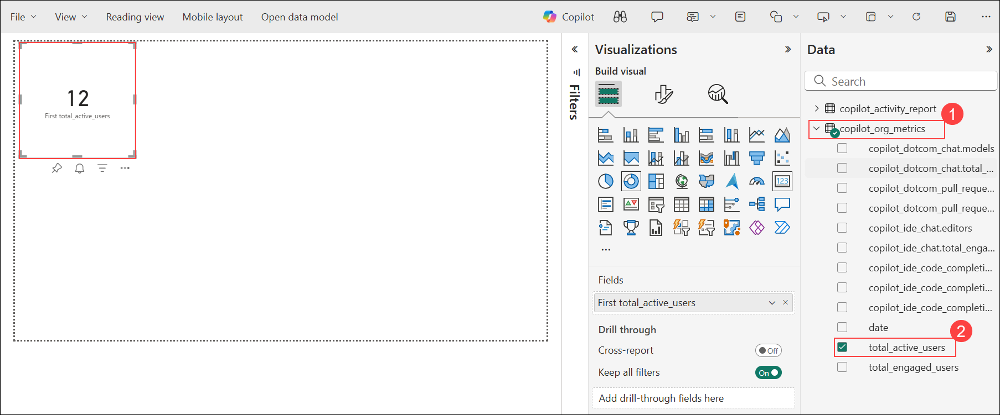

1. With an empty area selected on the canvas, click **Card** again to add a second KPI placeholder (3).
    
   

1. With the second card selected, in **Data** → **copilot_org_metrics (2)**, check **total_engaged_users (3)** to bind it.
    
   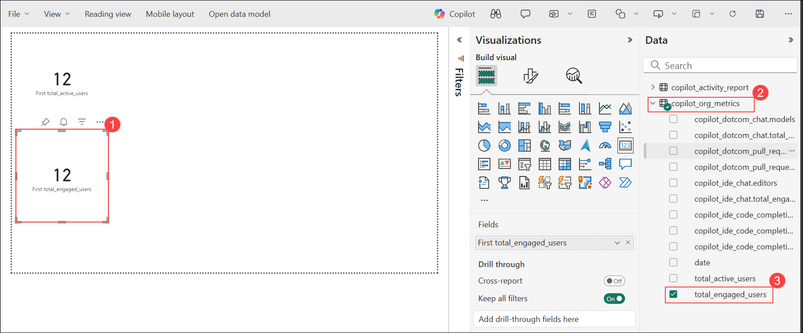

1. Click **Open data model** at the top of the report.  
   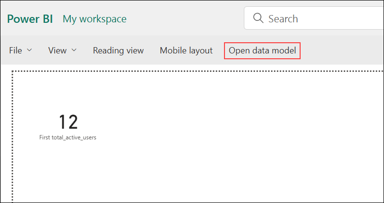

1. In **Model** view, select **copilot_org_metrics → total_engaged_users (1)**, then in **Properties** change **Data type** from **Text** to **Whole number (2)**.
   
   

1. When prompted with **Data type change**, select **Yes** to proceed.

   

1. Back in the **Report** canvas, select the second **Card (1)** and, in **copilot_org_metrics (2)**, check **total_engaged_users (3)**. The card should now show **Sum of total_engaged_users**. 

   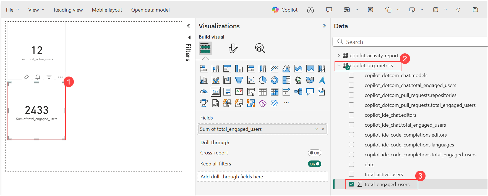

1. From the top bar, choose **Open data model** to switch to the model view.  

   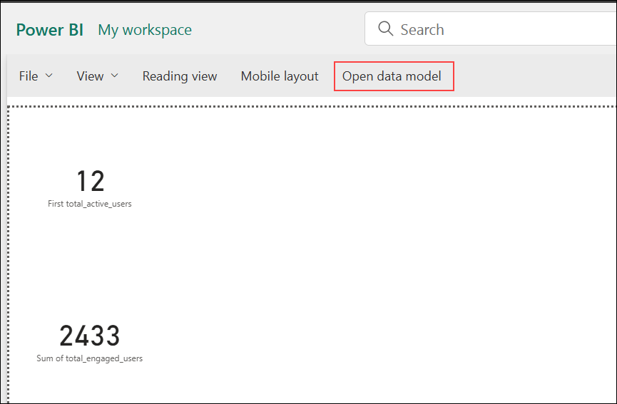

1. In **Model** view, select the **copilot_org_metrics** table to view its fields and properties. 

   

1. Create a new measure: select the **…** menu on **copilot_org_metrics** and choose **New measure**.  

   

1. In the formula bar, enter the following DAX for **Adoption Rate**, then click the **checkmark** to validate:  

   ```
   Adoption Rate =
   DIVIDE(
       SUM('copilot_org_metrics'[total_engaged_users]),
       SUM('copilot_org_metrics'[total_active_users])
   )
   ```

    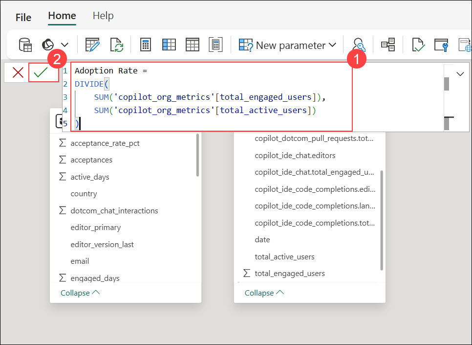

1. With the **Adoption Rate** measure selected, format it as a percentage: set **Format = Percentage** and turn **Percentage format** to **Yes** (optionally set **Decimal places = 0**).  

   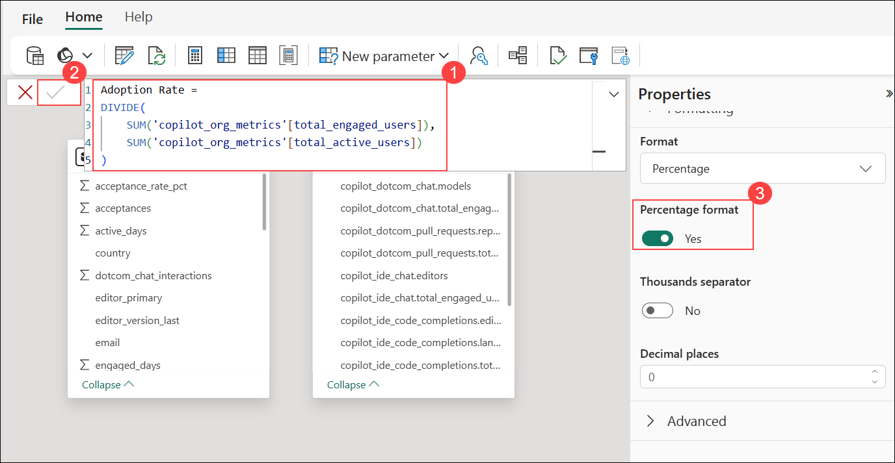

1. Return to the **Report** canvas and insert a new **Card** visual.  

   

1. (If needed) Ensure **total_active_users** is numeric: in **Model** view, select **total_active_users (1)** → open **Data type (2)** → choose **Whole number (3)**.  

   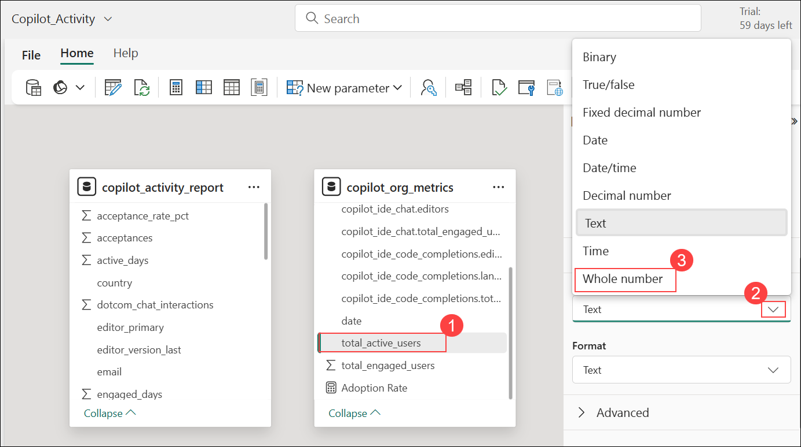

1. On the report page, select the new **Card (1)**, expand **copilot_org_metrics (2)**, and check **Adoption Rate (3)** to bind the measure.  

    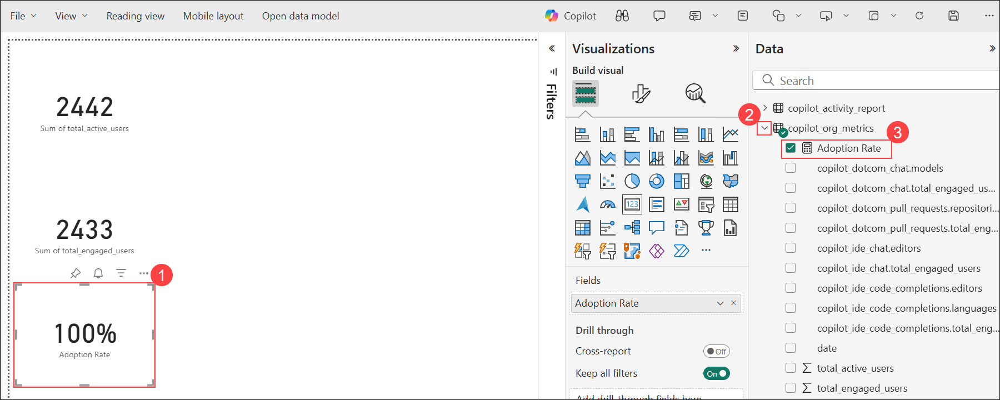
   
