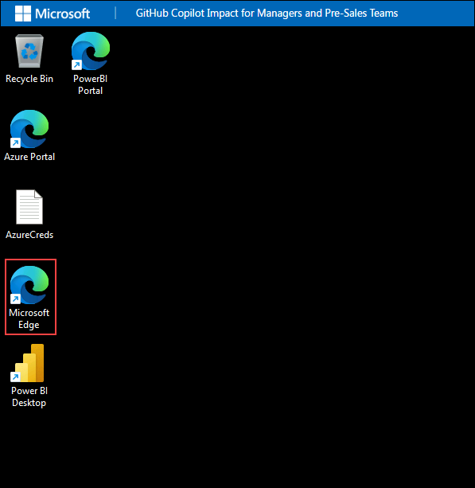
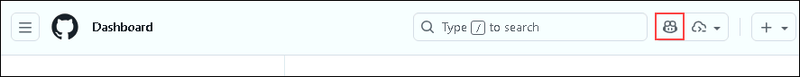
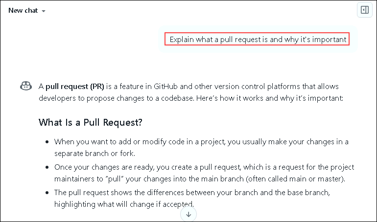
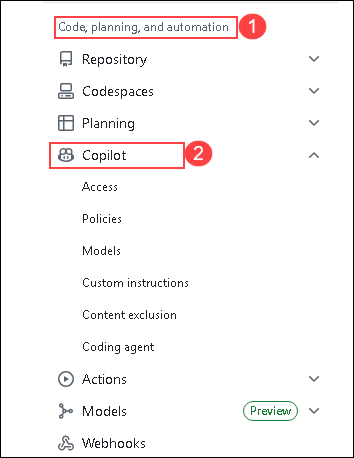
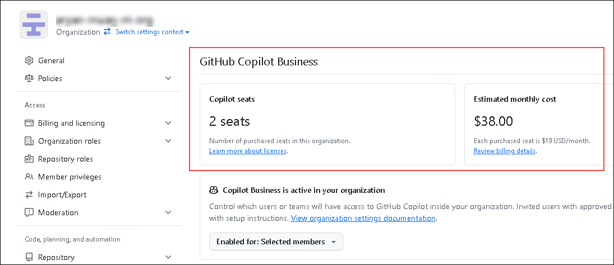
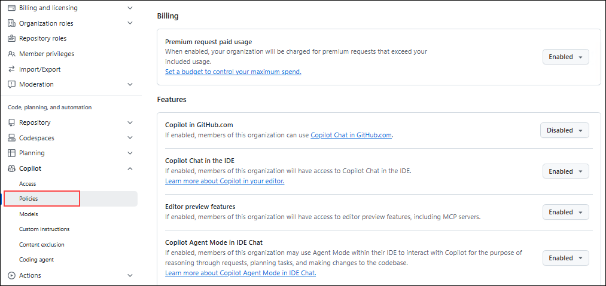
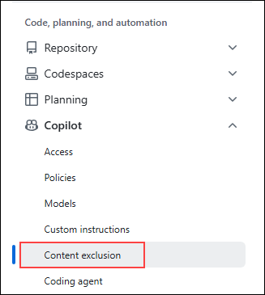

# Exercise 1: Understanding GitHub Copilot Features & Governance `Read Only`

### Estimated Duration: 30 Minutes

## Overview

In this exercise, you will explore GitHub Copilot's administrative capabilities. You'll learn how to configure organizational policies, manage feature access, understand the different Copilot capabilities, and implement governance best practices.

> **Purpose:** Understanding Copilot's administrative features enables informed decision-making regarding security policies, compliance requirements, and feature management.

## Objectives

You will be able to complete the following tasks:

- Task 1: Understand GitHub Copilot capabilities and what developers experience
- Task 2: Navigate Copilot administrative settings and policy management
- Task 3: Configure feature controls and content exclusions
- Task 4: Implement governance best practices for your organization

## Prerequisites

- You are an **Organization Owner** of the target GitHub organization.
- GitHub Copilot Business or Enterprise is licensed for the organization.

---

## Task 1: Understanding GitHub Copilot Capabilities

In this task, you will learn about the different GitHub Copilot features and understand what developers experience when using Copilot. This knowledge helps you set realistic expectations and have informed conversations with your teams.

### A. Copilot Feature Overview

GitHub Copilot provides several AI-powered capabilities that help developers write code faster:

| Feature | Description | Manager Insight |
|---------|-------------|-----------------|
| **Code Completions** | AI suggests code as developers type in their IDE | Core feature - high volume of suggestions, key metric for adoption |
| **Copilot Chat (IDE)** | Conversational AI within VS Code, JetBrains, etc. | Deep integration - developers ask questions without leaving their editor |
| **Copilot Chat (GitHub.com)** | Chat interface on GitHub website | Accessible without IDE - good for code review, documentation |
| **PR Summaries** | AI-generated pull request descriptions | Saves time on documentation, improves PR quality |
| **CLI Suggestions** | Command-line assistance | Helps with DevOps tasks and terminal commands |
| **Copilot in GitHub Mobile** | AI assistance on mobile app | On-the-go code review and chat |

> **Note:** Adoption metrics provide data for each feature category. Understanding feature capabilities enables accurate interpretation of usage patterns and team adoption levels.

### B. Understanding the Developer Experience

1. In your browser, navigate to **GitHub.com**.

   ```
   https://github.com/login
   ```

   

1. And sign in with the organization credentials provided in the lab enviornement page.

1. Let's explore what Copilot Chat looks like on GitHub.com.

1. Once signed in, you will see the **GitHub Dashboard**. Locate the **Copilot icon** in the top-right corner of the navigation bar.

   

   > **Developer Interface:** This chat interface provides code assistance, explanations, and guidance directly within GitHub.com, accessible without IDE integration.

1. Try asking Copilot some questions to see how it responds. Type any of these example questions in the chat:

   **For understanding code:**
   ```
   Explain what a pull request is and why it's important
   ```

   

   **For business scenarios:**
   ```
   How can I automate sales report generation using Python?
   ```

   **For learning:**
   ```
   What's the difference between GitHub Copilot Business and Enterprise?
   ```

   **For practical tasks:**
   ```
   Write a function to calculate ROI based on time saved and cost
   ```

   > **Note:** Copilot provides contextual responses to natural language queries, enabling developers to receive assistance without interrupting their workflow.

1. Explore the Copilot Chat interface:
   - Notice the **context awareness** - Copilot understands which repository you're viewing
   - See how developers can ask **natural language questions** about code
   - Observe the **code suggestion format** with syntax highlighting

      > **Note:** Chat feature usage correlates with overall engagement levels. Low chat interaction rates may indicate need for additional training resources.

### C. Copilot Business vs. Enterprise Features

Understanding the differences helps you make licensing decisions:

| Feature | Copilot Business | Copilot Enterprise |
|---------|------------------|-------------------|
| Code completions | ✅ | ✅ |
| Copilot Chat | ✅ | ✅ |
| PR Summaries | ✅ | ✅ |
| CLI suggestions | ✅ | ✅ |
| Organization policy controls | ✅ | ✅ |
| Usage metrics & reporting | ✅ | ✅ |
| **Knowledge Bases** | ❌ | ✅ |
| **Fine-tuned models** | ❌ | ✅ |
| **Audit logs (advanced)** | Basic | ✅ Advanced |

> **Decision Point:** If your organization has proprietary coding standards, internal libraries, or compliance requirements for detailed audit trails, Copilot Enterprise provides additional capabilities.

---

## Task 2: Navigate Copilot Administrative Settings

In this task, you will navigate the GitHub Copilot administrative area and understand the different configuration options available to organization owners.

1. In the top-right corner of GitHub, click your **profile picture (1)** and select **Your organizations (2)** from the dropdown menu.

   

1. On the Organizations page, locate and click your organization **contoso-impact** where you have Owner permissions.

   

1. Navigate to the **Settings** tab from the top navigation menu.

   

### A. Understanding the Copilot Settings Structure

1. In the left sidebar, locate the **Code, planning, and automation** section and expand **Copilot**.

   

   You'll see several sub-sections:

   | Section | Purpose | Manager Use Case |
   |---------|---------|------------------|
   | **Access** | Manage who can use Copilot | License allocation, team enablement |
   | **Policies** | Configure feature permissions | Security controls, feature rollout |
   | **Content exclusions** | Exclude files/repos from Copilot | IP protection, sensitive code |

   > **Note:** These three administrative areas provide comprehensive control over Copilot usage, supporting governance requirements and compliance discussions.

### B. Explore Access Management

1. Click on **Access** under the Copilot section.

   

1. On the Access management page, you can see:
   - **Total seats purchased** vs. **seats in use**
   - **List of users** with Copilot access
   - **Pending invitations**

      

      > **Note:** The Access management page displays license utilization metrics. Unassigned seats represent unutilized budget, while full capacity with pending requests indicates potential need for license expansion.

1. Review the user list and note:
   - Which team members have access
   - Their last activity date
   - Whether they've accepted the invitation

   > **Recommendation:** Regular review of user access enables identification of:
   > - Inactive users who may require training support
   > - High-engagement users suitable for knowledge sharing
   > - Outstanding invitations requiring follow-up

---

## Task 3: Configure Policies and Feature Controls

In this task, you will explore and configure Copilot policies that control which features are enabled for your organization.

### A. Navigate to Policies

1. In the left sidebar under Copilot, click **Policies**.

   

1. Review the available policy settings:

   | Policy | Options | Recommendation |
   |--------|---------|----------------|
   | **Suggestions matching public code** | Allow / Block | Consider blocking for IP-sensitive environments |
   | **Copilot Chat in IDE** | Enabled / Disabled | Enable - high value feature |
   | **Copilot Chat on GitHub.com** | Enabled / Disabled | Enable - accessible to all developers |
   | **Copilot in the CLI** | Enabled / Disabled | Enable for DevOps teams |
   | **Copilot pull request summaries** | Enabled / Disabled | Enable - saves documentation time |

   > **Security Insight:** The "Suggestions matching public code" policy is often a topic in security reviews. When set to "Block," Copilot will not show suggestions that match public code, reducing potential licensing concerns.

### B. Understanding Policy Inheritance

Policies can be set at different levels:

```
Enterprise (if applicable)
    └── Organization (your level)
            └── Repository (can override)
```

> **Note:** Organization-level policy settings establish defaults for all repositories. Repository administrators may be granted override permissions or restricted to organizational policies based on configuration.

### C. Feature Rollout Strategy

When rolling out Copilot features, consider a phased approach:

| Phase | Features Enabled | Target Users |
|-------|------------------|--------------|
| Pilot (Week 1-2) | Code completions only | 5-10 developers |
| Expand (Week 3-4) | Add Copilot Chat | Early adopters (20-30) |
| Full Rollout | All features | Organization-wide |

> **Note:** Phased feature rollout enables gradual adoption, allowing developers to become familiar with core functionality before advanced features are introduced.

---

## Task 4: Configure Content Exclusions (Read Only)

Content exclusions allow you to prevent Copilot from accessing specific files or repositories. This is critical for protecting intellectual property and sensitive code.

### A. Understanding Content Exclusions

1. In the left sidebar under Copilot, click **Content exclusions**.

   

1. Review the content exclusion options:

   | Exclusion Type | Example | Use Case |
   |---------------|---------|----------|
   | **Repository exclusion** | `secret-sauce-repo` | Entire repo contains proprietary algorithms |
   | **Path exclusion** | `**/credentials/**` | Specific folders with sensitive data |
   | **File pattern** | `*.env, *.key` | Configuration files with secrets |

   > **Security Best Practice:** Work with your security team to identify:
   > - Repositories containing trade secrets or proprietary code
   > - Configuration files that might contain credentials
   > - Any code subject to export controls or regulatory requirements

### B. Common Exclusion Patterns

Here are recommended exclusion patterns for most organizations:

```
# Credentials and secrets
**/credentials/**
**/.env
**/*.key
**/*.pem
**/secrets/**

# Proprietary algorithms (customize for your org)
**/core-algorithm/**
**/trading-engine/**

# Compliance-sensitive areas
**/hipaa/**
**/pci/**
```

> **Note:** Content exclusions restrict Copilot access to specified files or repositories while maintaining general functionality. Excluded content is not used for training or suggestions.

---

## Task 5: Governance Best Practices for Managers

This task covers the non-technical aspects of Copilot governance that managers need to address.

### A. Creating an Organizational Copilot Policy

Work with your legal and compliance teams to establish:

1. **Acceptable Use Guidelines**
   - What types of code can be developed with Copilot assistance?
   - Are there restrictions for client-facing or regulated projects?
   - How should developers review AI-generated code?

2. **Code Review Requirements**
   - Should AI-generated code have additional review?
   - How do you ensure code quality and security?
   - What documentation is required?

3. **Training Requirements**
   - Do developers need training before using Copilot?
   - Are there resources for learning best practices?
   - How do you handle developers who are resistant?

> **Note:** Documented policies provide clear guidance for audits, onboarding, and leadership inquiries while establishing consistent expectations.

### B. Addressing Common Developer Concerns

As a manager, you'll encounter these concerns:

| Concern | Response |
|---------|----------|
| "Will Copilot replace my job?" | Copilot is a tool that handles routine coding, letting you focus on creative problem-solving and architecture |
| "Is the code secure?" | All code should go through your normal review process; Copilot assists but doesn't replace developer judgment |
| "Does it learn from my code?" | Copilot Business/Enterprise does not train on your private code |
| "What about licensing?" | Configure the "block public code matches" policy to address concerns |

### C. Setting Team Adoption Goals

Establish realistic metrics for your teams:

| Metric | Target (Month 1) | Target (Month 3) | Target (Month 6) |
|--------|------------------|------------------|------------------|
| Users with Copilot access | 100% assigned | 100% assigned | 100% assigned |
| Users actively using | 50% | 75% | 85%+ |
| Acceptance rate | 20%+ | 30%+ | 40%+ |
| Chat feature usage | 25% | 50% | 60%+ |

> **Note:** These metrics enable identification of teams requiring additional support. Adoption rates typically increase gradually as developers integrate Copilot into established workflows.

---

## Summary

In this exercise, you gained comprehensive knowledge of GitHub Copilot from a management perspective:

- **Understood Copilot capabilities** - You now know what developers experience and can have informed conversations about features and adoption.

- **Navigated administrative settings** - You can access and manage Copilot configuration for your organization.

- **Learned policy management** - You understand how to control features and ensure security compliance.

- **Explored content exclusions** - You can protect sensitive code while enabling Copilot for appropriate use.

- **Established governance framework** - You have best practices for policies, addressing concerns, and setting adoption goals.

This foundation prepares you to effectively measure Copilot's impact in the following exercises, because you now understand exactly what you're measuring and why.

### You have successfully completed this exercise. Click Next >> to continue.
