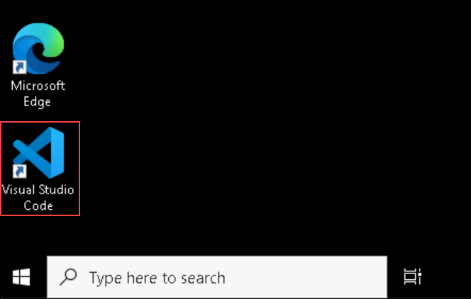
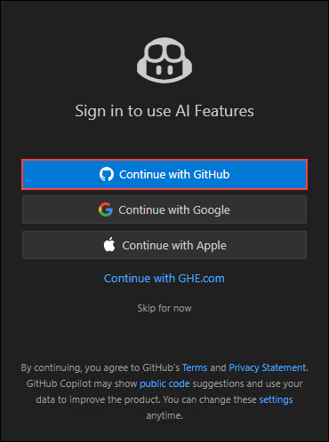
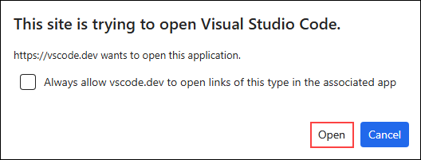
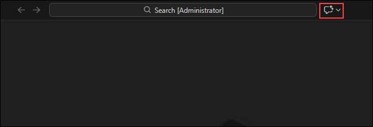
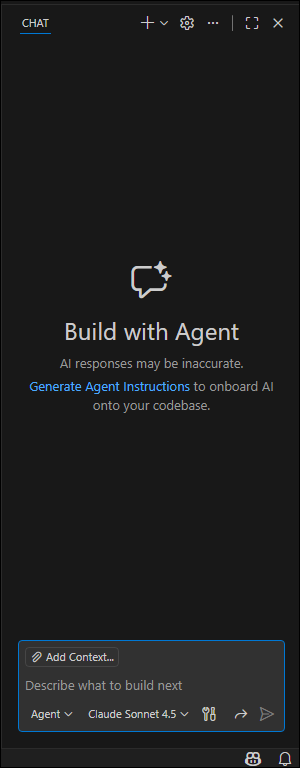
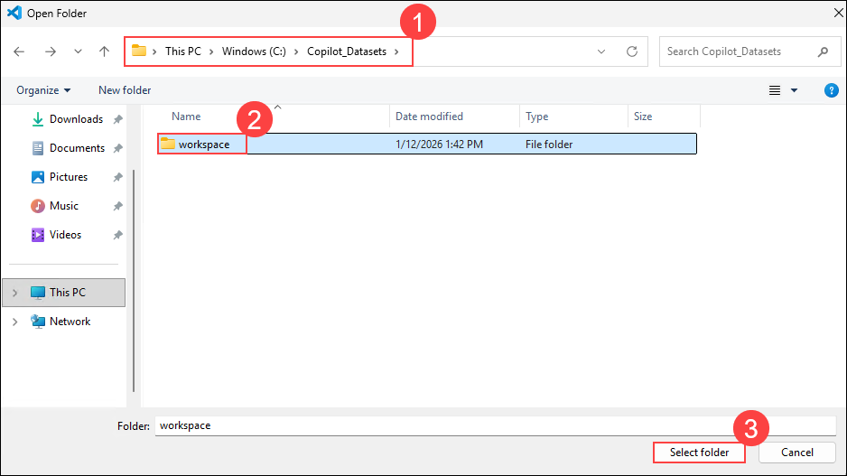
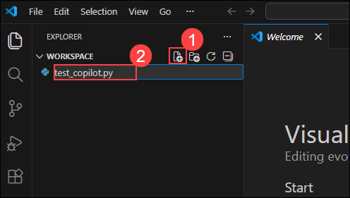
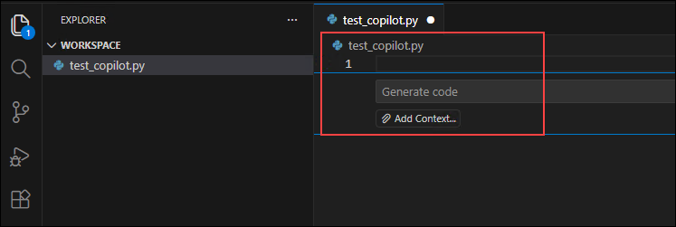
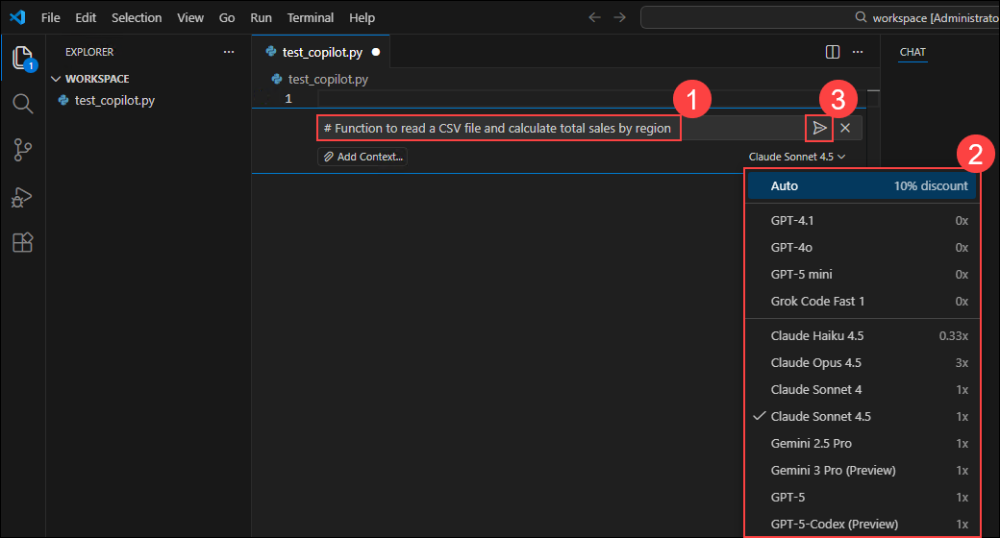
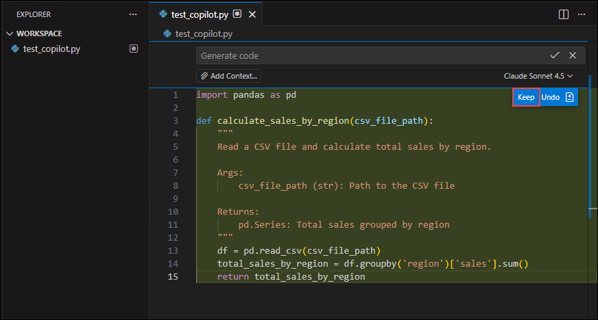

# Exercise 2: Experience GitHub Copilot Yourself

### Estimated Duration: 30 Minutes

## Overview

In this exercise, you will use GitHub Copilot hands-on to understand the developer experience with AI-powered code assistance. You'll build practical scripts, generate code with AI assistance, and observe how Copilot integrates into development workflows.

> **Purpose:** Direct experience with Copilot provides insight into its capabilities, limitations, and practical applications in software development contexts.

## Objectives

You will be able to complete the following tasks:

- Task 1: Verify GitHub Copilot is active and understand the interface
- Task 2: Build business automation scripts with Copilot assistance
- Task 3: Use Copilot Chat for explanations and demo scenarios

## Prerequisites

- VS Code installed with GitHub Copilot extension enabled
- GitHub Copilot license assigned to your account
- Basic familiarity with VS Code interface
- Completion of Exercise 1 (understanding Copilot features)

---

## Task 1: Setup and Verify Your Copilot Experience

In this task, you'll verify that GitHub Copilot is active and understand the two main ways to interact with it: inline suggestions and Copilot Chat.

### A. Verify Copilot is Active

1. Open **Visual Studio Code** from your desktop.

   

1. In the bottom-left corner of VS Code, click the **Account** icon (1), then select **Sign in to use AI features... (2)** from the menu to authenticate and enable Copilot/AI features.

   

1. In the bottom-left corner of VS Code, click the **Account** icon, then select **Sign in to use AI features...** from the menu to authenticate and enable Copilot/AI features.

   

1. Then sign in using the **credentials** provided in the lab **environment** section of the lab guide.

1. On the "Authorize Visual Studio Code" page, confirm the account shown and click **Continue** to grant VS Code access.

   

1. When the browser shows "This site is trying to open Visual Studio Code", click **Open** to allow the link to launch VS Code.

   

1. In the top-right corner of the window, click the **Copilot** icon to open Copilot and access suggestions or the chat panel.

   

1. This is how the Copilot Chat (Agent) panel looks when opened the sidebar.

   

1. Open the **worspace** folder in the vscode.

   ```
   C:\Copilot_Datasets\workspace
   ```

   

1. In the Explorer sidebar, click the **New File** icon (1), type the filename `test_copilot.py` (2), and press Enter to create the file.

   

### B. Understand the Two Copilot Interfaces

GitHub Copilot provides two ways to assist you:

| Interface | How It Works | Best For |
|-----------|--------------|----------|
| **Inline Suggestions** | AI suggests code as you type (gray text) | Writing code quickly, autocomplete on steroids |
| **Copilot Chat** | Conversational AI in a sidebar panel | Asking questions, explaining code, generating templates |

## Task 2: Build Business Automation with Copilot

In this task, you'll create practical business scripts that demonstrate Copilot's capabilities. These are the same types of tasks your developers (or customer developers) handle daily.

### A. Scenario 1: Sales Data Analysis Script

Let's build a Python script that analyzes sales data from a CSV file - a common business need.

1. In your `test_copilot.py` file, press **Ctrl+I**.

   

1. Type the prompt in the **editor (1)**, open the **model dropdown (2)** and choose the model or agent that fits your workflow, then click the **Run (3)** button to generate the suggestion.

   ```python
   # Function to read a CSV file and calculate total sales by region
   ```

   

1. Review the generated suggestion shown in the editor for `test_copilot.py` (1), then click **Keep** (2) to accept and insert the code or **Undo** (3) to reject it.

   

   > **Note:** Copilot generates complete functions with error handling, documentation, and proper structure based on natural language descriptions.

1. Continue by typing another comment and letting Copilot suggest:

   ```python
   # Function to generate a sales report with charts
   ```

1. Again, press **Tab** to accept Copilot's suggestion.

   > **Observation:** Copilot translates natural language descriptions into functional code, potentially reducing development time for routine tasks.

**What Just Happened?**
- You wrote ~2 lines of comments
- Copilot generated ~20-40 lines of working code
- The code includes imports, error handling, and best practices
- **Time saved**: ~10-15 minutes of manual coding

### B. Scenario 2: Email Template Generator

Now let's create something that resonates with business users - automated email generation.

1. Create a new file: Press **Ctrl+N** and save as `email_automation.py`

1. Type this comment:

   ```python
   # Function to generate professional follow-up email template for a sales meeting
   # Include: greeting, meeting recap, next steps, call to action
   ```

1. Press **Enter** and let Copilot generate the function. Accept with **Tab**.

   

1. Below that, type:

   ```python
   # Function to personalize the email with customer name and company
   ```

1. Accept Copilot's suggestion.

   > **Note:** Copilot can assist with business logic implementation, including templates and structured content generation beyond pure code.

### C. Scenario 3: ROI Calculator

This scenario demonstrates Copilot's ability to generate complex business logic.

1. Create a new file: `roi_calculator.py`

1. Type:

   ```
    Function to calculate GitHub Copilot ROI based on:
    - Number of developers
    - Average hourly rate
    - Time saved per developer per day (hours)
    - Copilot cost per user per month
    Return: Annual ROI percentage, payback period in months
   ```

1. Let Copilot generate the complete function. You'll see it creates a sophisticated calculation.

1. Now type:

   ```
   Example usage with sample data
   ```

1. Copilot will even generate test code showing how to use the function!

   

   > **Note:** Copilot generates test code and usage examples alongside the main function implementation.

**Key Observations:**
- Three functional scripts were created in approximately 5 minutes
- Limited programming expertise was required
- Each script addresses common business automation needs
- This demonstrates the typical developer experience with Copilot assistance

---

## Task 3: Use Copilot Chat for Explanations and Demos

In this task, you'll use the conversational Copilot Chat feature to ask questions, get explanations, and prepare demo scenarios.

### A. Open Copilot Chat

1. In VS Code, click the **Chat icon** in the left sidebar (it looks like a conversation bubble) or press **Ctrl+Alt+I** (Windows) or **Cmd+Alt+I** (Mac).

   

1. The Copilot Chat panel will open on the left side of your screen.

### B. Ask Copilot to Explain Code

Let's use a real-world scenario: explaining complex Power BI DAX formulas (which you'll encounter in Exercise 5).

1. In the Copilot Chat, type:

   ```
   Explain this Power BI DAX formula in simple terms: 
   Hours Saved per Dev = DIVIDE([Total Acceptances], [Active Users], 0) * 0.5
   ```

1. Press **Enter** and watch Copilot provide a clear explanation.

   

   > **Note:** Copilot Chat can provide explanations of complex code, formulas, and technical concepts without requiring external documentation.

### C. Generate Documentation

1. Go back to your `roi_calculator.py` file and highlight the ROI function code.

1. Right-click and select **Copilot** → **Generate Docs** (or type `/doc` in Chat).

   

1. Copilot will generate professional documentation with parameter descriptions and examples.

   > **Note:** Copilot can automatically generate documentation, reducing the manual effort required for code documentation.

## Notes

### Key Observations

- **Speed**: Tasks that typically take 10-30 minutes can be completed in seconds with AI assistance
- **Quality**: Generated code includes error handling, comments, and follows best practices
- **Accessibility**: Limited programming expertise is required to generate functional code
- **Versatility**: Copilot supports data analysis, automation, documentation, and learning scenarios
- **Practical Applications**: Each script addresses common business automation requirements

### Files Created

- `test_copilot.py` - Sales data analysis functions
- `email_automation.py` - Professional email templates
- `roi_calculator.py` - ROI calculation with business metrics

These files demonstrate Copilot's code generation capabilities across different use cases.

---

## Summary

In this exercise, you gained hands-on experience with GitHub Copilot's core capabilities. You built practical automation scripts, learned how AI assistance integrates into development workflows, and observed code generation across different scenarios.

This direct experience provides context for understanding Copilot's role in development processes. In the following exercises, you'll analyze quantitative data measuring productivity improvements across development teams.

**Note:** The files created in this exercise serve as reference examples of Copilot's code generation capabilities.

---

### You have successfully completed this exercise. Click **Next >>** to continue to Exercise 3.
