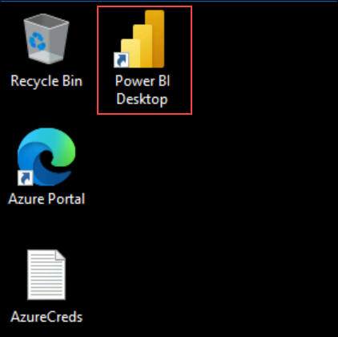

# Exercise 3: Enable & Access Copilot Usage Reports

### Estimated Duration: 30 Minutes

## Overview

In this exercise, you will enable and access GitHub Copilot organization-level usage reports. These reports provide crucial data about adoption patterns, user engagement, and usage metrics across your organization. You'll learn how to request activity reports and understand the data they contain - setting the foundation for the analytics you'll perform in subsequent exercises.

> **Manager Value:** Usage reports are your primary tool for understanding how Copilot is being adopted across teams. The data you obtain here will drive all your adoption analysis and ROI calculations.

## Objectives

You will be able to complete the following tasks:

- Task 1: Navigate to GitHub Copilot reporting settings and generate activity reports
- Task 2: Understand the usage data structure and key metrics
- Task 3: Prepare data for analysis

## Prerequisites

- You are an **Organization Owner** of the target GitHub organization `contoso-impact`.
- GitHub Copilot Business or Enterprise is already licensed for the org.
- Completion of Exercise 1 (understanding Copilot features and governance).

---

## Task 1: Generate Copilot Activity Reports

In this task, you will navigate to the GitHub Copilot administrative area and initiate the Activity report generation.

1. In the top-right corner of GitHub, click your **profile picture (1)** and select **Your organizations (2)** from the dropdown menu.

   

   > **Note:** You must have Organization Owner permissions to access Copilot usage reports. If you don't see your organization listed, contact your GitHub administrator.

1. On the Organizations page, locate and click your organization **contoso-impact** where you have Owner permissions.

   

1. Navigate to the **Settings** tab from the top navigation menu.

   

1. In the left sidebar navigation, locate the **Code, planning, and automation (1)** section, expand **Copilot (2)**, and click on **Access (3)**.

   

1. On the **Access management** page, locate the **Get Usage report (1)** section and select **Activity report (new) (2)** from the available options.

   

   > **Understanding Activity Reports:** The Activity report provides per-user metrics including code suggestions, acceptances, chat usage, and technology preferences. This data is essential for measuring adoption success and identifying areas for improvement.

1. Confirm that the green notification banner **"Your activity report is being generated…"** appears at the top of the page.

   

   > **Note:** Report generation runs in the background. For large organizations, this may take several minutes.

1. You will receive an email notification titled **"Your GitHub Copilot Activity report is ready"** when the report is complete. Download the attached CSV file.

   

1. Save the CSV file to `C:\Copilot_Datasets` for use in the upcoming exercises.

   > **Best Practice:** Keep the original CSV file unmodified as your source of truth.

---

## Task 2: Understanding the Usage Data Structure

Before diving into Power BI, let's understand what the Copilot usage data contains. This knowledge helps you interpret metrics correctly and ask the right questions.

### A. Key Data Fields

The Activity Report CSV contains these essential columns:

| Field | Description | Manager Use Case |
|-------|-------------|------------------|
| `user_login` | GitHub username | Identify individual contributors |
| `team` | Team assignment | Compare adoption across teams |
| `role` | Developer seniority | Understand adoption by experience level |
| `suggestions` | Code suggestions shown | Volume of AI assistance offered |
| `acceptances` | Suggestions accepted | Quality indicator - are suggestions useful? |
| `acceptance_rate` | Acceptances ÷ Suggestions | Key efficiency metric |
| `ide_chat_interactions` | Chat usage in editor | Advanced feature adoption |
| `dotcom_chat_interactions` | Chat usage on GitHub.com | Web-based assistance usage |
| `editor_primary` | Main IDE used | VS Code, JetBrains, etc. |
| `language_primary` | Main programming language | Python, JavaScript, etc. |
| `last_activity_date` | Most recent Copilot use | Identify inactive users |
| `pr_summaries_created` | AI PR descriptions used | Documentation automation |

> **Manager Insight:** Focus on these metrics for executive reporting:
> - **Acceptance Rate** - indicates how useful developers find Copilot suggestions
> - **Active Users** - shows actual adoption vs. licensed seats
> - **Chat Interactions** - indicates adoption of advanced features

### B. Interpreting Key Metrics

Understanding what "good" looks like:

| Metric | Low (Concern) | Average | High (Excellent) |
|--------|---------------|---------|------------------|
| Acceptance Rate | < 15% | 20-35% | > 40% |
| Users with chat activity | < 30% | 40-60% | > 70% |
| Daily active rate | < 40% | 50-70% | > 80% |

> **Manager Insight:** If acceptance rates are low, it could indicate:
> - Developers aren't familiar with how to use Copilot effectively
> - Code style doesn't match AI suggestions (may need training)
> - Suggestions aren't relevant to the tech stack (investigate language/editor combinations)

### C. Team-Level Analysis Questions

When you analyze this data, focus on these management questions:

1. **Adoption:**
   - Which teams have the highest active user rates?
   - Are there teams with licenses but no activity?
   - How does adoption vary by role (senior vs. junior developers)?

2. **Engagement:**
   - Who are your "Copilot champions" with highest acceptance rates?
   - Which teams are using advanced features like chat?
   - Are there patterns by technology stack (language/editor)?

3. **Opportunities:**
   - Which teams might benefit from additional training?
   - Are there unused licenses that should be reassigned?
   - What success patterns can be replicated across teams?

> **Manager Insight:** These questions will guide your dashboard creation and executive presentations.

---

## Task 3: Prepare Data for Analysis

In this task, you'll set up Power BI to begin your analysis journey.

1. Launch **Power BI Desktop** from the desktop shortcut in your lab environment.

   

1. Verify that you are signed in - your username will appear in the top-right corner.

   

1. On the **Home** screen, select **Blank report**.

   

1. Go to the **Home (1)** tab and click **Get data (2)**.

   

1. In **Get Data**, choose **Text/CSV (1)** and select **Connect (2)**.

   

1. Navigate to **C:\Copilot_Datasets (1)**, select **copilot_org.csv (2)**, and click **Open (3)**.

   

1. In the preview dialog, confirm the delimiter is **Comma (1)** and click **Load (2)**.

   

1. After loading, verify your data appears in the **Data** pane on the right side of Power BI.

   > **Data Quality Check:** Scroll through the data to confirm:
   > - User names are populated
   > - Team and role columns have values
   > - Numeric fields (suggestions, acceptances) contain numbers

---

## Notes

- If you do not see **Activity report (new)**, ensure your organization is on a supported Copilot plan and that you have Owner permissions.
- The downloaded CSV will be used in Exercise 4 for building analytics visualizations.
- Report data typically covers the last 28 days of activity.
- Keep the raw CSV unmodified; Power BI creates its own data model.

---

## Summary

In this exercise, you successfully:

- **Generated a Copilot Activity Report** - You now have comprehensive usage data for your organization.

- **Understood the data structure** - You know what each field means and how to interpret key metrics.

- **Prepared for analysis** - Your data is loaded into Power BI and ready for dashboard creation.

- **Learned management-focused questions** - You have a framework for interpreting results and taking action.

The usage data you've obtained provides the foundation for all subsequent analysis, enabling data-driven decisions about training, resource allocation, and executive reporting.

### You have successfully completed this exercise. Click Next >> to continue.
