# Exercise 4: Analyze Copilot Adoption & User Engagement

### Estimated Duration: 30 Minutes

## Overview

In this exercise, you will create and interpret visualizations that help you understand Copilot adoption patterns, user engagement levels, and team performance. The focus is on **interpreting insights** rather than building complex formulas - we'll provide streamlined steps so you can focus on what the data tells you about your Copilot program.

> **Manager Value:** By the end of this exercise, you'll be able to answer: "Which teams are getting the most value from Copilot?" and "Where should I focus training and support efforts?"

## Objectives

You will be able to complete the following tasks:

- Task 1: Create essential adoption measures
- Task 2: Build team performance visualizations
- Task 3: Identify engagement patterns and take action

## Prerequisites

- Completion of Exercise 3 with `copilot_org.csv` loaded in Power BI
- Power BI Desktop open with data imported

---

## Task 1: Create Essential Adoption Measures

In this task, you'll create the key measures needed for adoption analysis. We've streamlined this to focus on the most impactful metrics.

> **Why These Measures?** These specific calculations answer the questions executives ask: "How many people are using it?", "Is it actually helpful?", and "Which teams are adopting best?"

### A. Create Core Metrics

1. In the **Data (1)** pane on the right side of Power BI Desktop, right-click your **copilot_org (2)** table and choose **New measure (3)**.

   

1. Create **Active Users** - counts unique users with any Copilot activity:

   ```
   Active Users = DISTINCTCOUNT('copilot_org'[user_login])
   ```

   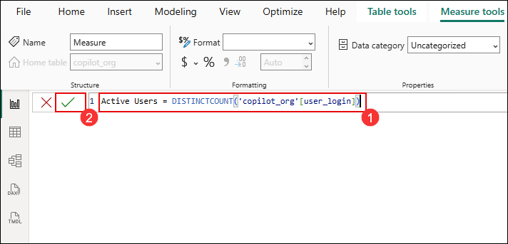

   > **Manager Insight:** Active Users shows how many people are actually using Copilot vs. how many have licenses. A large gap indicates unused licenses or adoption barriers.

1. Right-click **copilot_org** table and choose **New measure**. Create **Total Acceptances**:

   ```
   Total Acceptances = SUM('copilot_org'[acceptances])
   ```

   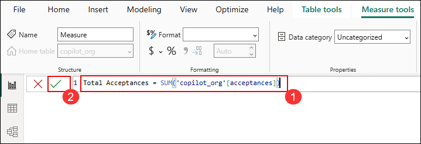

   > **Manager Insight:** Total Acceptances represents how much AI-generated code your developers are actually using. Higher numbers indicate Copilot is providing valuable assistance.

1. Right-click **copilot_org** table and choose **New measure**. Create **Acceptance Rate %**:

   ```
   Acceptance Rate % = DIVIDE(SUM('copilot_org'[acceptances]), SUM('copilot_org'[suggestions]), 0)
   ```

   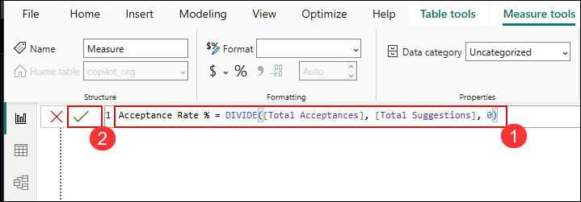

   - Format this measure as **Percentage** with **1 decimal place**.

      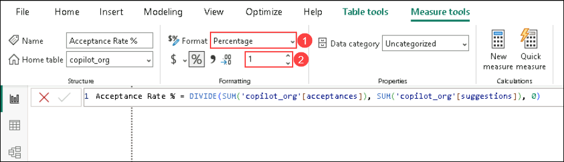

      > **Manager Insight:** Acceptance Rate is your quality indicator. Rates above 30% indicate developers find suggestions useful. Low rates (below 15%) may indicate training needs or technology mismatches.

1. Right-click **copilot_org** table and choose **New measure**. Create **Chat Users** - users leveraging AI chat features:

   ```
   Chat Users = CALCULATE(
       DISTINCTCOUNT('copilot_org'[user_login]),
       'copilot_org'[ide_chat_interactions] > 0 || 'copilot_org'[dotcom_chat_interactions] > 0
   )
   ```

   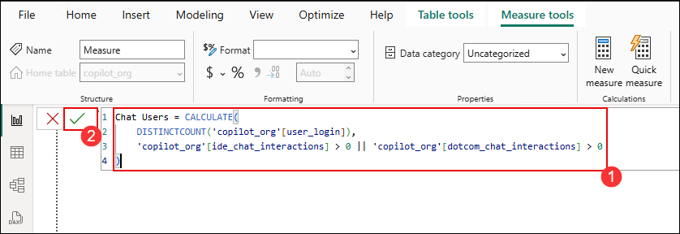

   > **Manager Insight:** Chat Users shows advanced feature adoption. If this is low compared to Active Users, developers may not know about or understand how to use Copilot Chat.

1. Right-click **copilot_org** table and choose **New measure**. Create **Highly Engaged Users**:

   ```
   Highly Engaged Users = CALCULATE(
       DISTINCTCOUNT('copilot_org'[user_login]),
       'copilot_org'[acceptances] >= 10
   )
   ```

   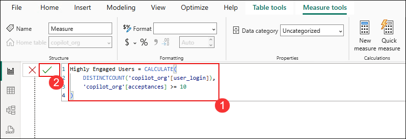

   > **Manager Insight:** These are your Copilot champions - developers getting significant value. They can help train others and share best practices.

## Task 2: Build Team Performance Visualizations

Now let's create visualizations that reveal adoption patterns across teams.

### A. Create the Dashboard Page

1. Rename your report page for better organization. Right-click on the page tab at the bottom and select **Rename**. Change it to **Copilot Adoption**.

   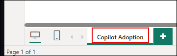

### B. Create Team Performance Table

1. Insert a **Table** visual from the Visualizations pane.

   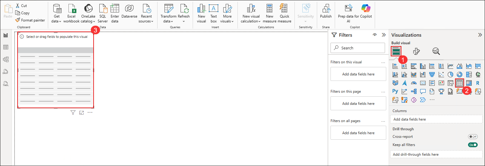

1. Add these fields to the table under **Columns**:
   - **team (1)**
   - **Active Users (2)**
   - **Highly Engaged Users (3)**
   - **Acceptance Rate % (4)**

      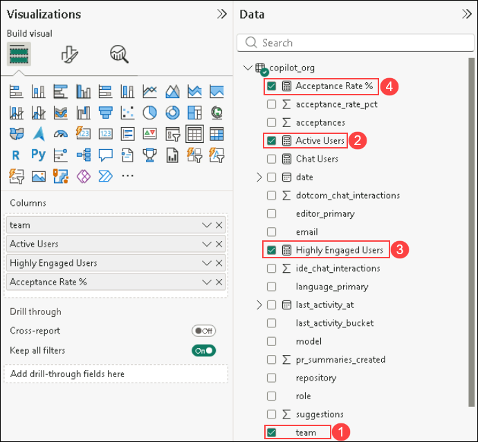

1. Review the table - it should show metrics for each team:

   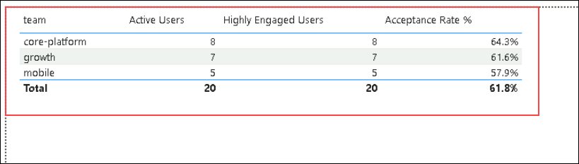

   > **Manager Action Items:**
   > - Teams with high Active Users but low Engaged Users → Need training on effective Copilot usage
   > - Teams with high Acceptance Rate → Identify what they're doing well; share practices
   > - Teams with low numbers across all metrics → May need 1:1 support or have specific barriers

### C. Create User Engagement Chart

1. Insert a **Clustered bar chart** from the Visualizations pane.

   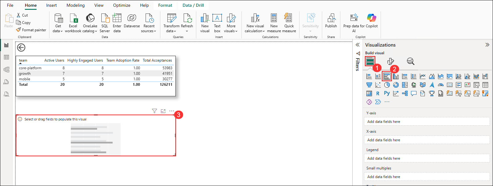

1. Configure the chart:
   - **Y-axis**: user_login
   - **X-axis**: Total Acceptances
   - **Legend**: team

      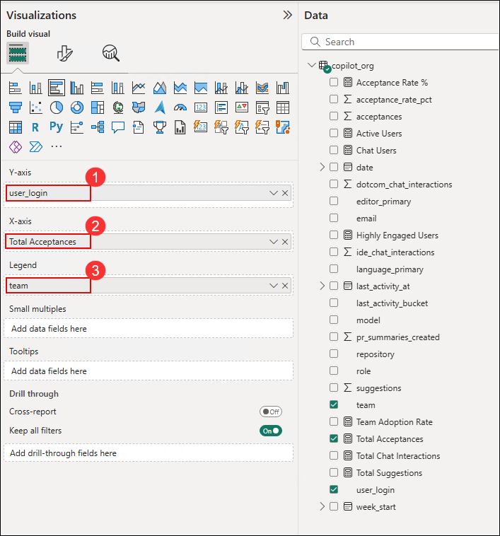

1. Review the chart:

   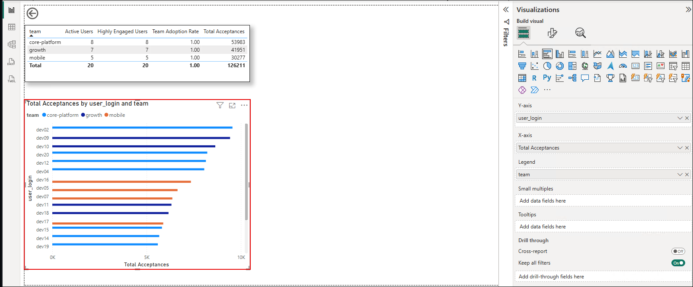

   > **Manager Insight:** This identifies your top Copilot users. Consider:
   > - Asking top users to share tips with their teams
   > - Understanding what makes them successful (editor, language, workflow)
   > - Recognizing their adoption in team meetings

### D. Create Technology Adoption Matrix

1. Insert a **Matrix** visual from the Visualizations pane.

   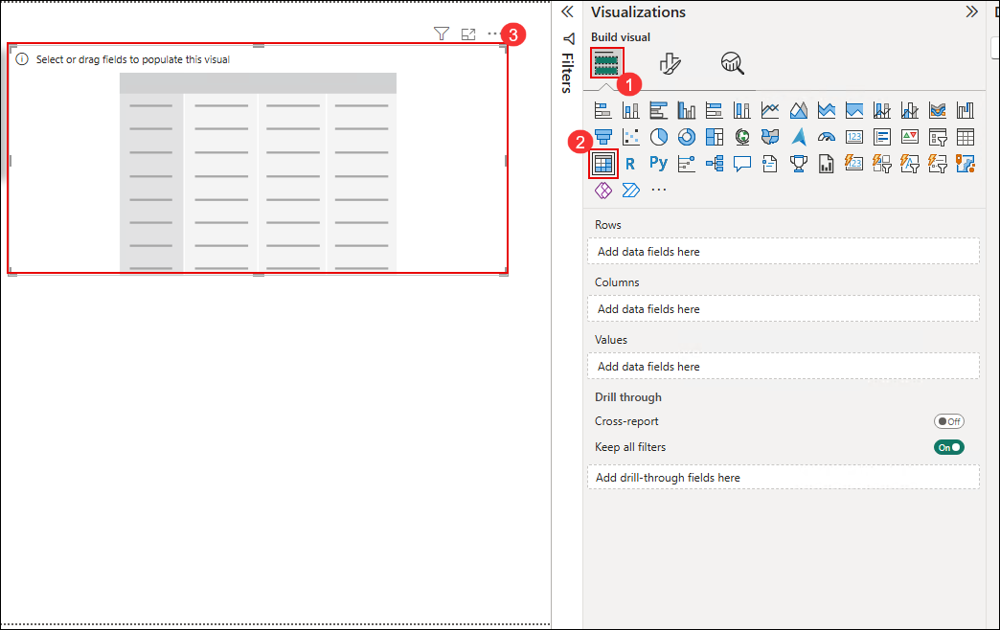

1. Configure the Matrix:
   - **Rows (1):** editor_primary
   - **Columns (2):** language_primary
   - **Values (3):** Active Users, Acceptance Rate %

      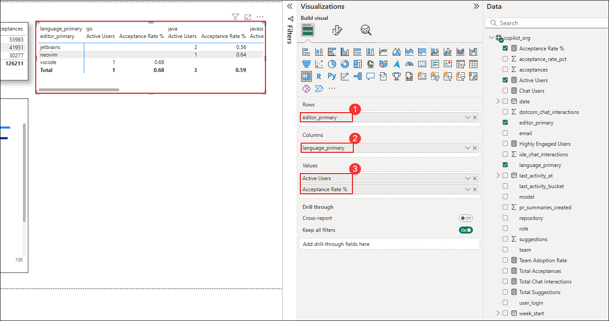

   > **Manager Insight:** This reveals which technology combinations work best with Copilot:
   > - High acceptance in VS Code + Python? Consider recommending this setup
   > - Low adoption in JetBrains? May need specific training for that IDE
   > - Some languages showing low rates? Copilot may be less mature for those languages

### E. Add Interactive Filters

1. Insert a **Slicer** from the Visualizations pane.

   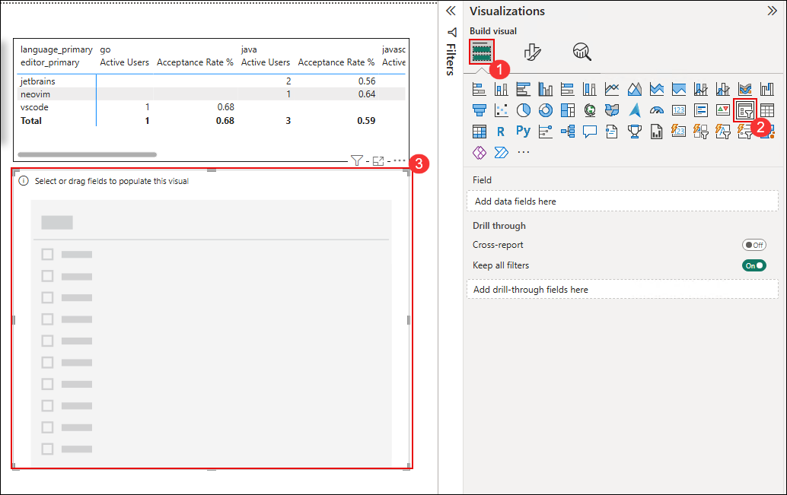

1. Add **team** and **role** fields to the slicer for filtering.

   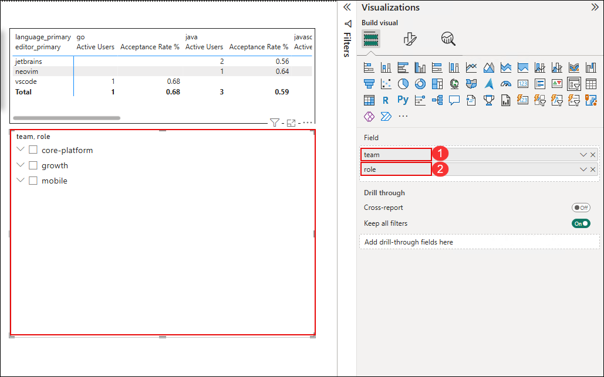

1. Test the interactivity - select different teams to see metrics update:

   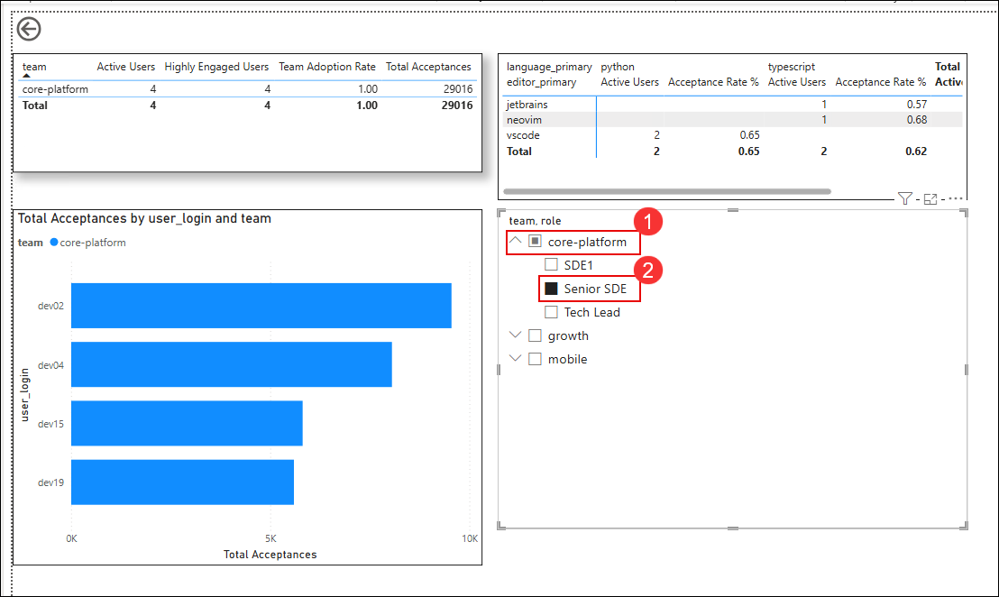

   > **Manager Benefit:** These filters let you drill into specific teams during reviews or prepare team-specific reports.

---

## Task 3: Interpret Results and Plan Actions

This task focuses on how to use your dashboard for management decisions.

### A. Reading Your Dashboard

Look at your completed dashboard and answer these questions:

| Question | Where to Look | Action if Low |
|----------|--------------|---------------|
| How many people are actively using Copilot? | Active Users card | Check license assignments; follow up with inactive users |
| Are suggestions actually helpful? | Acceptance Rate % | Provide training on prompt engineering and effective use |
| Who are our power users? | Bar chart - top users | Engage them as champions and peer trainers |
| Which teams lead/lag? | Team table | Share best practices from leaders; support lagging teams |
| Are advanced features adopted? | Chat Users metric | Promote Copilot Chat in team communications |

### B. Identifying Patterns

Common patterns and what they mean:

| Pattern | Possible Cause | Recommended Action |
|---------|---------------|-------------------|
| High suggestions, low acceptances | Suggestions not matching coding style | Training on reviewing/editing suggestions |
| Low chat usage | Unfamiliarity with feature | Demo Copilot Chat in team meetings |
| Senior devs low adoption | Skepticism or "I don't need help" | Pair with champions; show productivity benefits |
| Junior devs low adoption | Unsure how to use effectively | Structured onboarding program |
| One team excelling | Good practices worth sharing | Document and share their workflow |

### C. Creating Your Action Plan

Based on your analysis, document:

1. **Quick Wins (This Week)**
   - Which 3 users should I recognize as Copilot champions?
   - What one training topic would help most users?

2. **Short-term Actions (This Month)**
   - Which team needs dedicated support?
   - Should I reassign unused licenses?

3. **Strategic Initiatives (This Quarter)**
   - What adoption target should I set?
   - How will I measure progress?

   > **Manager Insight:** This analysis isn't just about creating charts - it's about taking action to improve your team's productivity.

## Notes

- Focus on trends rather than absolute numbers - adoption patterns are more important than raw usage counts
- Pay attention to acceptance rates by team/technology to identify where Copilot is working best
- Use this data to identify Copilot champions who can help train others
- Consider experience level (role) when analyzing adoption - patterns often differ between senior and junior developers

## Summary

In this exercise, you successfully:

- **Created essential adoption measures** - You have the key metrics executives ask about.

- **Built team performance visualizations** - You can compare adoption across teams and technologies.

- **Learned to interpret patterns** - You understand what the data means and what actions to take.

- **Developed an action plan framework** - You have a structure for translating insights into improvements.

Your adoption dashboard provides the foundation for ongoing Copilot program management. In the next exercise, you'll add productivity impact analysis to quantify the business value of this adoption.

### You have successfully completed this exercise. Click Next >> to continue.
