# Exercise 5: Measure Productivity Impact with PR Analysis

### Estimated Duration: 25 Minutes

## Overview

In this exercise, you will import and analyze pull request (PR) metrics from before and after Copilot adoption to measure concrete productivity improvements. This data provides the quantitative evidence executives need to understand Copilot's business impact.

> **Manager Value:** This exercise answers the critical question: "Is Copilot actually making our developers more productive?" You'll learn to present measurable improvements in delivery speed and throughput.

## Objectives

You will be able to complete the following tasks:

- Task 1: Import and understand PR performance data
- Task 2: Create productivity comparison measures
- Task 3: Build executive-ready productivity visuals
- Task 4: Interpret results for stakeholder conversations

## Prerequisites

- Completion of Exercise 3 with adoption analysis
- Understanding of software development metrics

---

## Understanding Productivity Metrics

Before diving in, let's ensure you understand the metrics we're measuring:

| Metric | Definition | Why It Matters |
|--------|------------|----------------|
| **Lead Time** | Time from PR creation to merge | Measures overall delivery speed |
| **Cycle Time** | Active development time | Measures developer efficiency |
| **Throughput** | PRs merged per time period | Measures team delivery capacity |
| **PR Size** | Lines changed per PR | Smaller = faster reviews, lower risk |

> **Manager Insight:** These are standard DevOps metrics (DORA-aligned). Improving them demonstrates real business value - faster delivery means faster time-to-market.

---

## Task 1: Import PR Performance Data

In this task, you will load baseline (pre-Copilot) and post-adoption pull request metrics.

### A. Create Analysis Page

1. Click the **+ (plus)** icon next to your existing page tab to create a new sheet.

   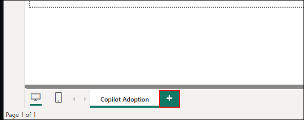

1. Rename it to **PR Impact**.

   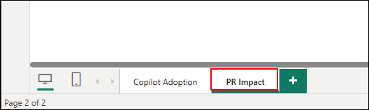

### B. Import Baseline Data

1. On the **Home** tab (1), click **Get data** (2).

   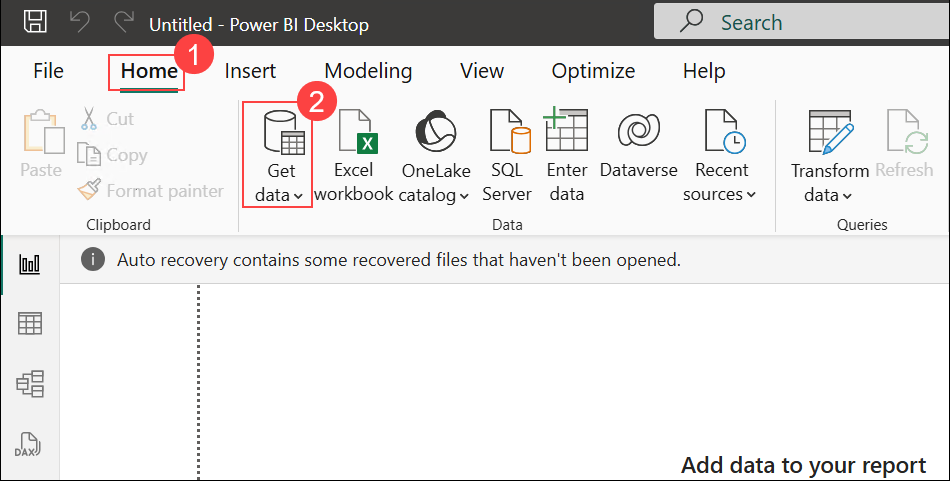

1. Choose **Text/CSV (1)** and select **Connect (2)**.

   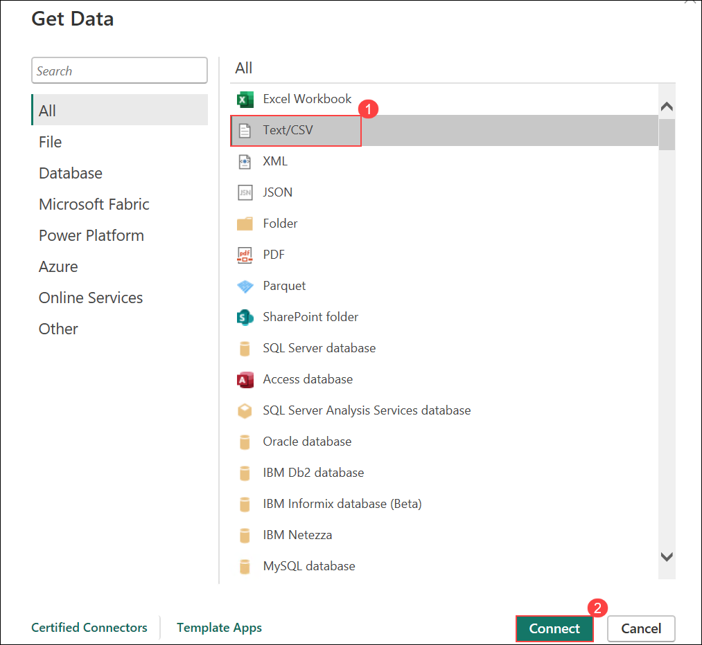

1. Navigate to **C:\Copilot_Datasets (1)**, select **pr_baseline.csv (2)**, and click **Open (3)**.

   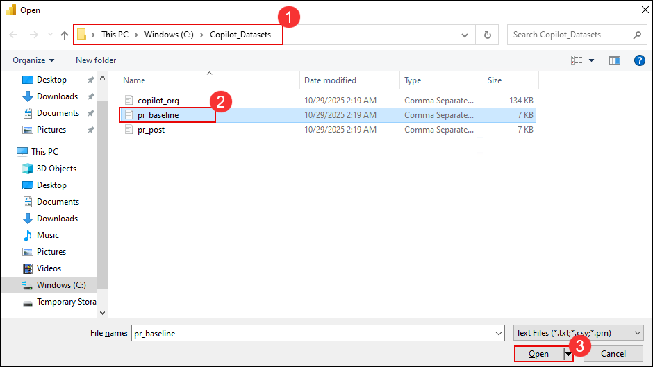

1. Verify the data preview looks correct and click **Load**.

   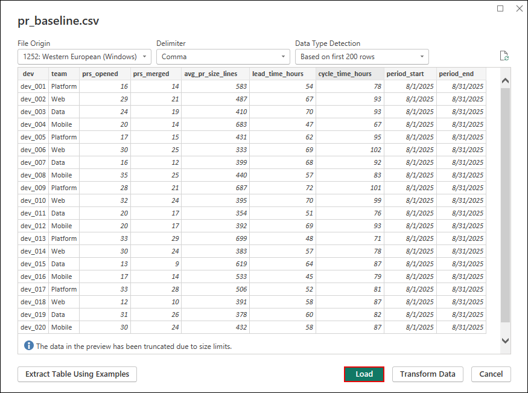

   > **Understanding Baseline Data:** This represents your team's productivity BEFORE Copilot adoption - your starting point for comparison.

### C. Import Post-Adoption Data

1. Click **Get data** again from the Home tab.

   

1. Choose **Text/CSV** and **Connect**.

   

1. Navigate to **C:\Copilot_Datasets (1)**, select **pr_post.csv (2)**, and click **Open (3)**.

   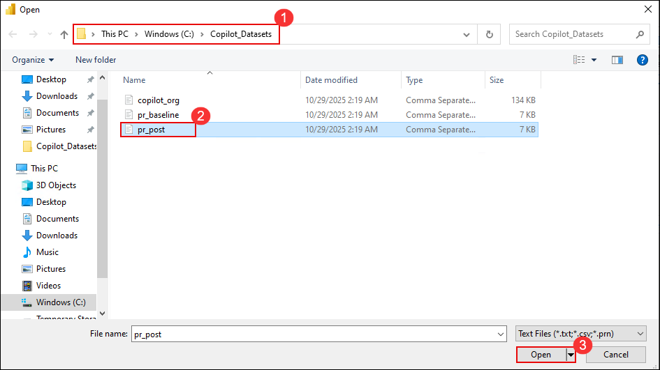

1. Verify the data preview and click **Load**.

   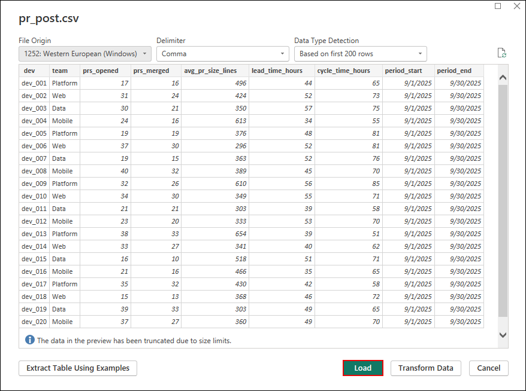

   > **Understanding Post-Adoption Data:** This shows productivity AFTER Copilot has been adopted. The difference tells the ROI story.

---

## Task 2: Create Productivity Comparison Measures

Now we'll create measures that quantify the improvements. These calculations translate developer efficiency gains into metrics executives understand.

### A. Lead Time Measures

1. In the **Data** pane, right-click **pr_baseline** table (1) and select **New measure** (2).

   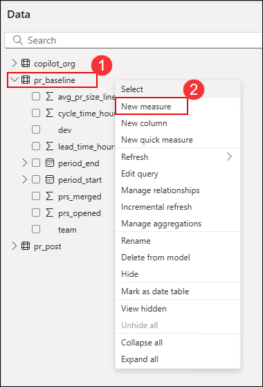

1. Create **Baseline Lead Time**:

   ```
   Baseline Lead Time = AVERAGE('pr_baseline'[lead_time_hours])
   ```

   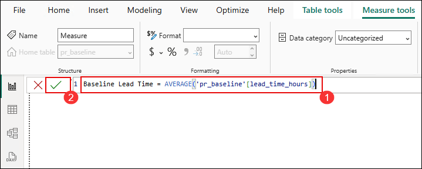

1. Right-click **pr_post** table and create **Post-Copilot Lead Time**:

   ```
   Post-Copilot Lead Time = AVERAGE('pr_post'[lead_time_hours])
   ```

   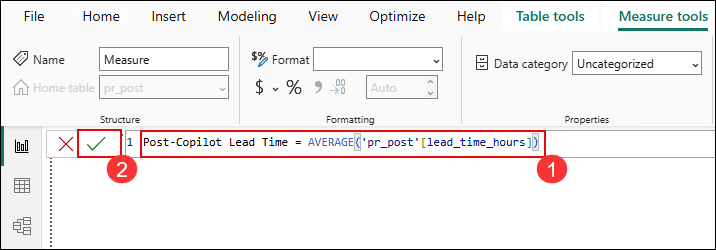

1. Right-click **pr_baseline** table and create **Lead Time Improvement %**:

   ```
   Lead Time Improvement % = DIVIDE([Baseline Lead Time] - [Post-Copilot Lead Time], [Baseline Lead Time], 0)
   ```

   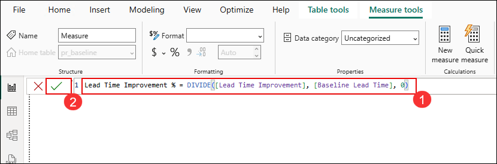

   - Format as **Percentage** with **1 decimal place**.

   > **Manager Insight:** A 20% improvement in lead time means PRs that took 10 hours now take 8 hours. Over hundreds of PRs, this translates to significant time savings.

### B. Cycle Time Measures

1. Create **Baseline Cycle Time** in pr_baseline table:

   ```
   Baseline Cycle Time = AVERAGE('pr_baseline'[cycle_time_hours])
   ```

   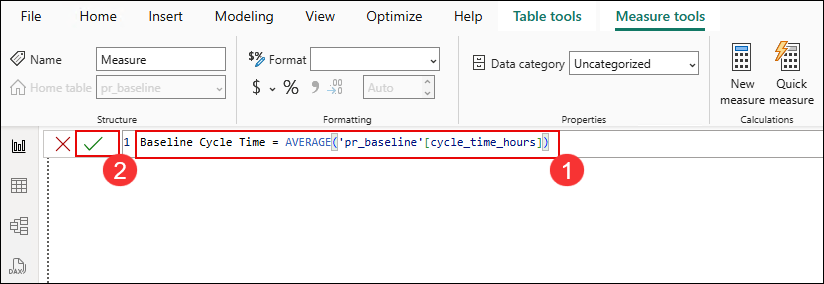

1. Create **Post-Copilot Cycle Time** in pr_post table:

   ```
   Post-Copilot Cycle Time = AVERAGE('pr_post'[cycle_time_hours])
   ```

   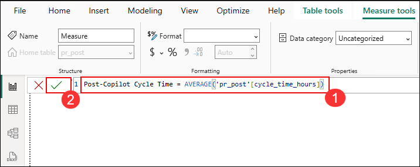

1. Create **Cycle Time Improvement %** in pr_baseline table:

   ```
   Cycle Time Improvement % = DIVIDE([Baseline Cycle Time] - [Post-Copilot Cycle Time], [Baseline Cycle Time], 0)
   ```

   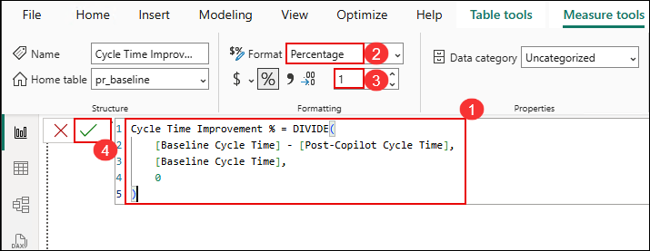

   - Format as **Percentage** with **1 decimal place**.

   > **Manager Insight:** Cycle time specifically measures developer coding efficiency - this is where Copilot has the most direct impact.

### C. Throughput Measures

1. Create **Baseline PRs Merged** in pr_baseline table:

   ```
   Baseline PRs Merged = AVERAGE('pr_baseline'[prs_merged])
   ```

   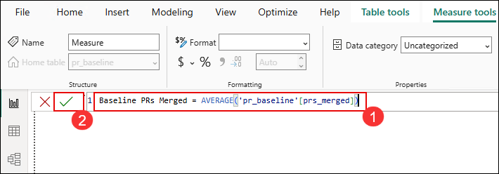

1. Create **Post-Copilot PRs Merged** in pr_post table:

   ```
   Post-Copilot PRs Merged = AVERAGE('pr_post'[prs_merged])
   ```

   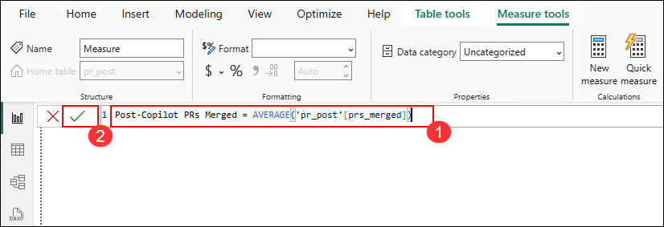

1. Create **Throughput Improvement %** in pr_baseline table:

   ```
   Throughput Improvement % = DIVIDE([Post-Copilot PRs Merged] - [Baseline PRs Merged], [Baseline PRs Merged], 0)
   ```

   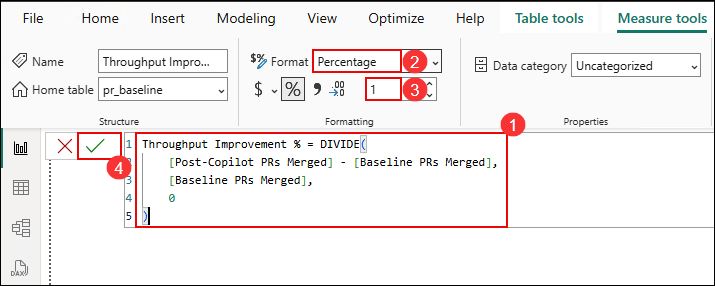

   - Format as **Percentage** with **1 decimal place**.

   > **Manager Insight:** Increased throughput means your team is delivering more work in the same amount of time - a direct productivity gain.

---

## Task 3: Build Productivity Impact Visuals

### A. Create KPI Cards

1. Insert a **Card** visual from the Visualizations pane.

   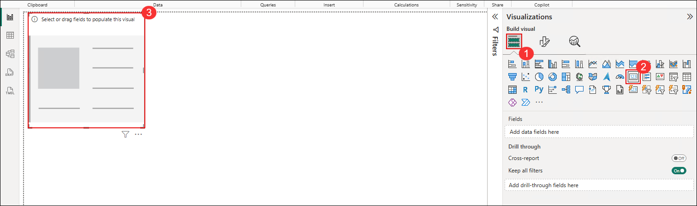

1. Add **Lead Time Improvement %** to the card.

   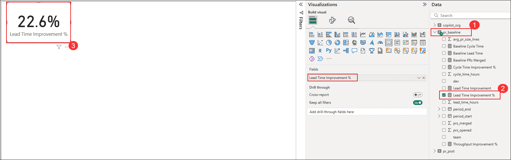

1. Create additional cards for:
   - **Cycle Time Improvement %**
   - **Throughput Improvement %**

   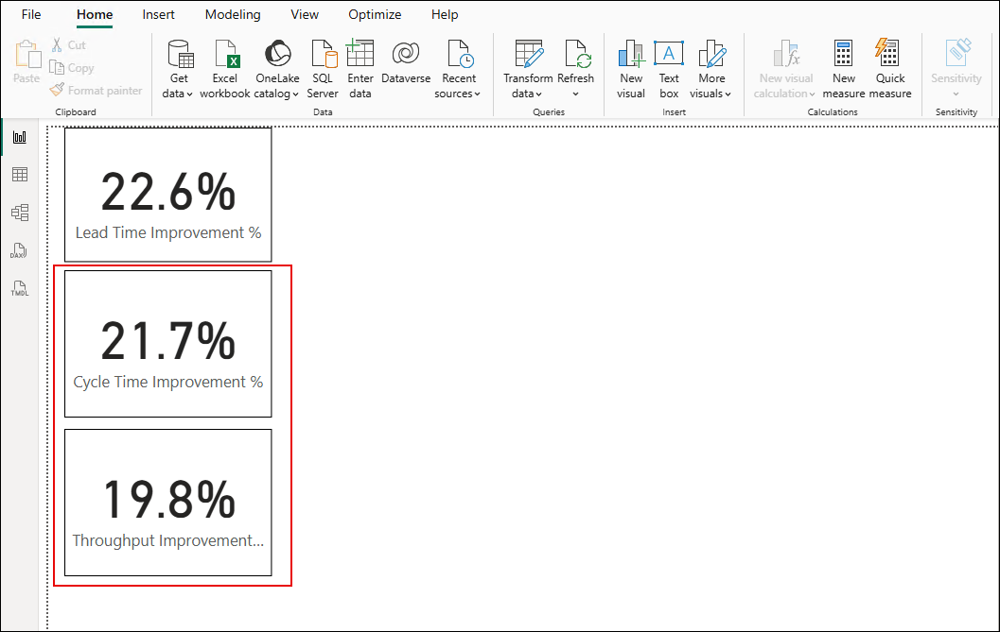

   > **Executive Communication:** These three cards tell the productivity story at a glance. "Lead time down 25%, cycle time down 30%, throughput up 20%" is a compelling message.

### B. Create Team Comparison Chart

1. Insert a **Clustered bar chart**.

   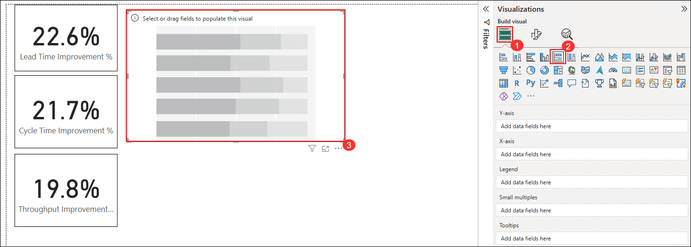

1. Configure the chart:
   - **Y-axis**: team (from pr_baseline)
   - **X-axis**: Lead Time Improvement %

   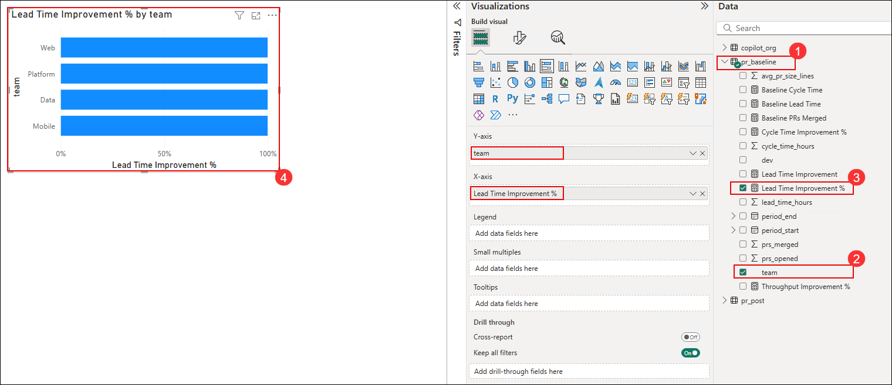

   > **Manager Insight:** This shows which teams are seeing the most productivity benefit. Use this to identify success stories and areas needing support.

### C. Create Before/After Comparison Matrix

1. Insert a **Matrix** visual.

   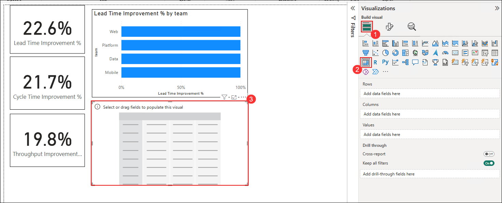

1. Configure the matrix:
   - **Rows**: team
   - **Values**: Baseline Lead Time, Post-Copilot Lead Time, Lead Time Improvement %, Throughput Improvement %

   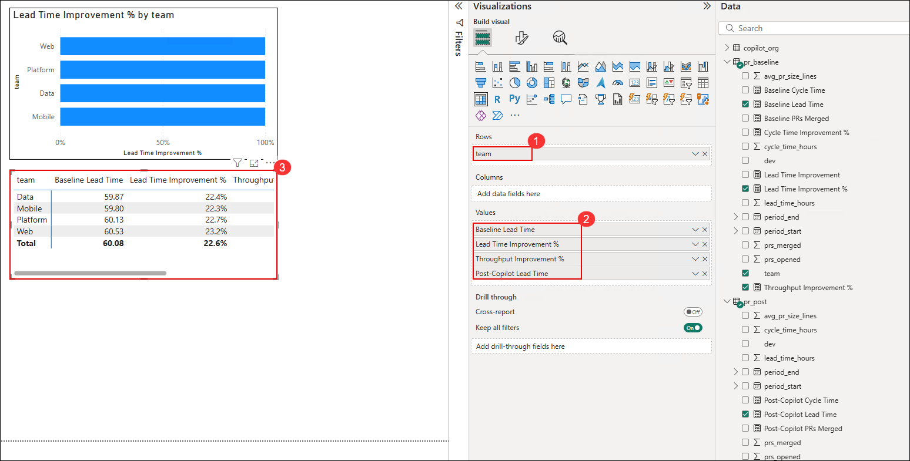

   > **Executive Value:** This provides detailed comparison data for teams who want to dig into the numbers.

### D. Add Team Filter

1. Insert a **Slicer** and add the **team** field from pr_baseline.

   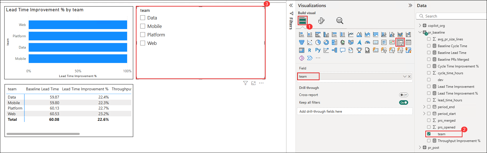

1. Format the slicer as **Tile** style for easy selection.

   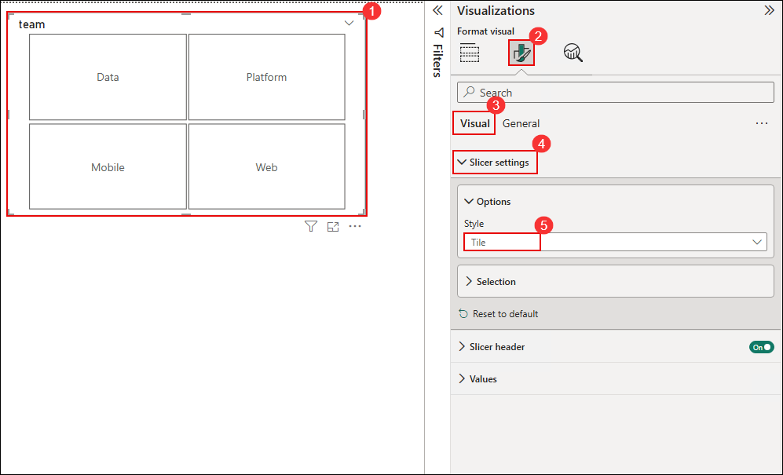

1. Test the interactivity by selecting different teams:

   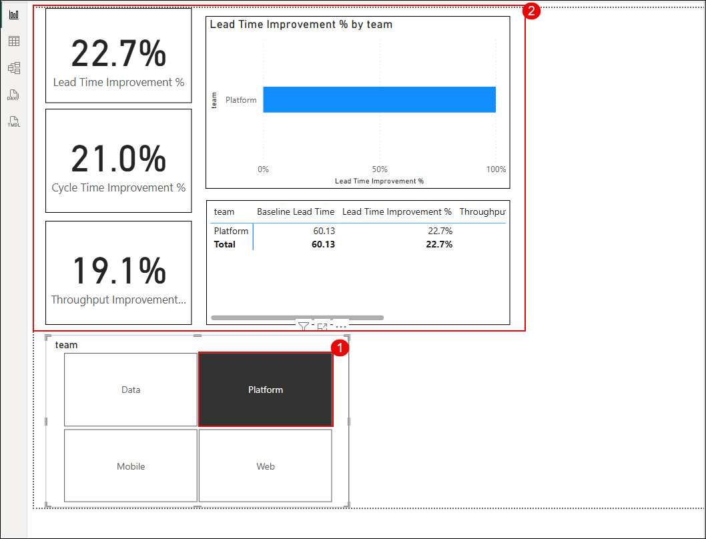

---

## Task 4: Interpret Results for Stakeholder Conversations

This is the critical management skill: translating data into compelling narratives.

### A. Building Your Productivity Story

Use this framework for executive conversations:

**Opening Statement (30 seconds):**
> "Since adopting GitHub Copilot, our teams have seen a [X]% reduction in lead time and [Y]% increase in throughput. Let me show you what this means for our delivery capacity."

**Key Metrics to Highlight:**

| Metric | Sample Message | Impact |
|--------|----------------|--------|
| Lead Time Improvement | "PRs that took 12 hours now take 9 hours" | Faster delivery |
| Cycle Time Improvement | "Active coding time reduced by 25%" | Developer efficiency |
| Throughput Improvement | "Teams are completing 20% more PRs per sprint" | Increased capacity |

**Closing with Business Value:**
> "This translates to approximately [X] hours saved per developer per month, which we'll quantify in our ROI analysis."

### B. Handling Common Questions

| Question | How to Answer |
|----------|---------------|
| "Is this really from Copilot?" | "We compared the same teams before and after adoption, controlling for other variables. The timing correlates directly with Copilot rollout." |
| "Which teams see the most benefit?" | Use your team comparison chart to show specific results |
| "What about code quality?" | "Lead time includes review time - faster reviews suggest code is higher quality and easier to review" |
| "Can we replicate this?" | "Yes - let me show you which teams are succeeding and what practices they follow" |

### C. Connecting to Adoption Data

Link your findings from Exercise 3:

| Adoption Metric | Productivity Impact | Insight |
|-----------------|---------------------|---------|
| Teams with high acceptance rates | Usually show best lead time improvement | Confirms Copilot effectiveness |
| Teams with chat usage | Often show cycle time gains | Advanced features add value |
| Teams with low adoption | Lower productivity gains | Opportunity for training |

> **Manager Insight:** The correlation between adoption and productivity is your strongest argument for continued investment in Copilot training and expansion.

---

## Notes

- Positive improvements in lead time and cycle time reductions indicate faster delivery
- Increased throughput shows teams are completing more work
- Use the team slicer to analyze which teams benefit most
- Focus on teams with significant improvements to identify replicable success patterns
- Some teams may show benefits in speed while others show throughput gains

---

## Summary

In this exercise, you successfully:

- **Imported before-and-after PR data** - You have the foundation for measuring concrete impact.

- **Created productivity comparison measures** - You can quantify lead time, cycle time, and throughput improvements.

- **Built executive-ready visualizations** - Your charts clearly communicate productivity gains.

- **Learned stakeholder communication** - You have frameworks for presenting results and handling questions.

This productivity analysis, combined with your adoption metrics from Exercise 3, creates a comprehensive view of Copilot's organizational impact. In Exercise 5, you'll combine everything to calculate ROI and build your final executive dashboard.

### You have successfully completed this exercise. Click Next >> to continue.
