# Exercise 6: Build Executive Dashboard & Calculate ROI

### Estimated Duration: 30 Minutes

## Overview

In this exercise, you will create an executive-ready dashboard that combines adoption metrics and productivity improvements to calculate and present the return on investment (ROI) of GitHub Copilot. You'll learn how to translate technical metrics into financial value and present compelling business cases to leadership.

> **Manager Value:** This is where everything comes together. You'll leave with a dashboard you can present to executives and the skills to articulate Copilot's business value.

## Objectives

You will be able to complete the following tasks:

- Task 1: Create ROI calculation measures
- Task 2: Build an executive summary dashboard
- Task 3: Present the business case effectively
- Task 4: Publish and share your dashboard

## Prerequisites

- Completion of Exercises 4 and 5 (adoption and productivity analysis)
- Understanding of basic ROI concepts

## Task 1: Create ROI Calculation Measures

In this task, you'll create measures that translate productivity improvements into financial value.

### A. Create Executive Dashboard Page

1. Click on **(+)** at the bottom tab area to create a new page.

1. Rename the page to **Executive Dashboard**.

   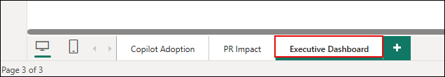

### B. Time Savings Calculations

1. In the **Data** pane, right-click **pr_baseline** table and select **New measure**.

   

1. First, create **Lead Time Improvement** measure:

   ```
   Lead Time Improvement = [Baseline Lead Time] - [Post-Copilot Lead Time]
   ```

   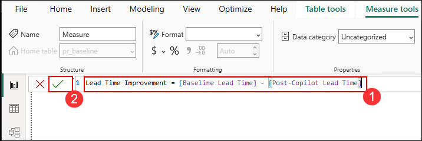

   > **Manager Insight:** This measures the time reduction in hours between your baseline and post-Copilot periods. It's the foundation for calculating time savings.

1. In the **Data** pane, right-click **pr_baseline** table and select **New measure**. Create **Hours Saved per Dev per Month**:

   ```
   Hours Saved per Dev per Month = 
   VAR LeadTimeReduction = [Lead Time Improvement]
   VAR TotalPRs = [Post-Copilot PRs Merged]
   VAR MonthsOfData = DISTINCTCOUNT(pr_post[period_start].[Month])
   VAR MonthlyPRs = DIVIDE(TotalPRs, MonthsOfData, 0)
   VAR ActiveDevs = [Active Users]
   VAR PRsPerDev = DIVIDE(MonthlyPRs, ActiveDevs, 0)
   VAR HoursSaved = LeadTimeReduction * PRsPerDev
   RETURN HoursSaved
   ```

   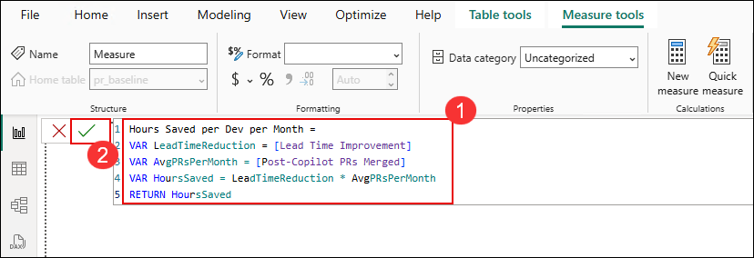

   > **Manager Insight:** This calculates how many hours each developer saves monthly. It divides total PRs by the number of months in your dataset to get monthly average, then divides by active users to get per-developer savings. This is multiplied by the time saved per PR to get total hours saved per developer per month.

1. In the **Data** pane, right-click **pr_baseline** table and select **New measure**. Create **Total Hours Saved Organization**:

   ```
   Total Hours Saved Organization = 
   [Hours Saved per Dev per Month] * [Active Users]
   ```

   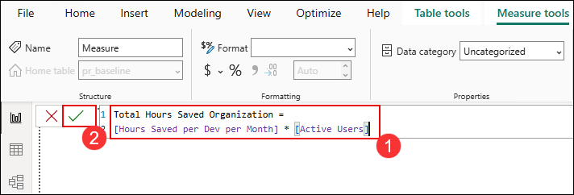

   > **Manager Insight:** This scales individual time savings to the entire organization - a key number for executive conversations.

### C. Create Dynamic Parameters

Dynamic parameters allow executives to explore different scenarios during presentations.

1. Go to **Modeling (1)** → **New parameter** → **Numeric range (2)**.

   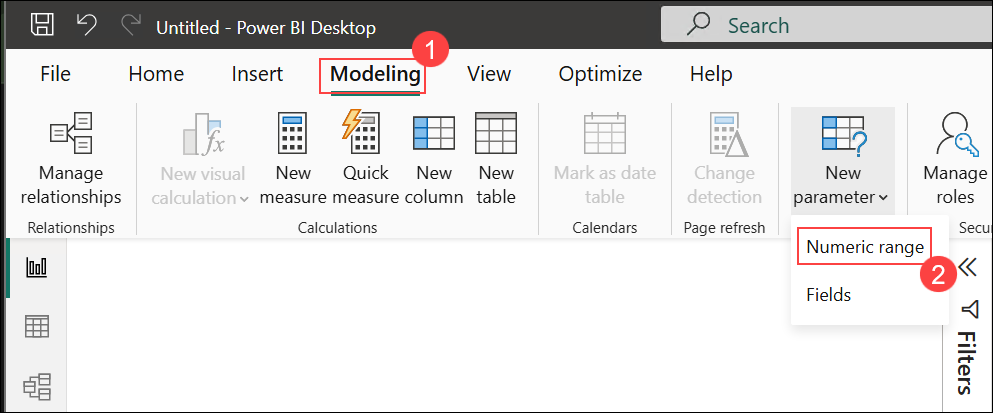

1. Configure the **Developer Hourly Rate** parameter:
   - **Name:** Developer Hourly Rate (2)
   - **Data type:** Whole number (3)
   - **Minimum:** 50 (4)
   - **Maximum:** 200 (5)
   - **Increment:** 10 (6)
   - **Default:** 75 (7)
   - **Add slicer to this page:** Checked (8)
   - Click **Create** (9)

      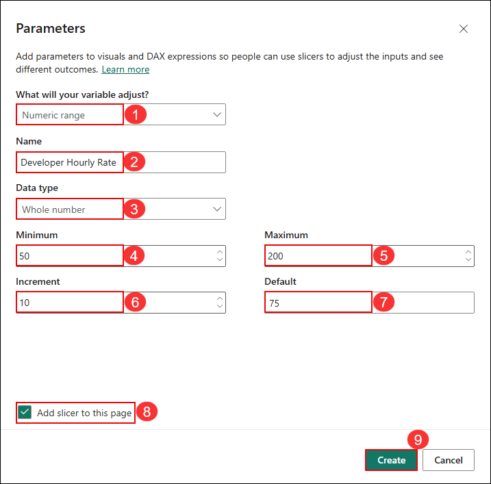

   > **Manager Insight:** This allows executives to see ROI based on their own cost assumptions. Different regions or teams may have different rates.

1. In the **Data** pane, right-click **pr_baseline** table and select **New measure**. Create **Monthly Time Savings Value**:

   ```
   Monthly Time Savings Value = 
   [Total Hours Saved Organization] * 'Developer Hourly Rate'[Developer Hourly Rate Value]
   ```

   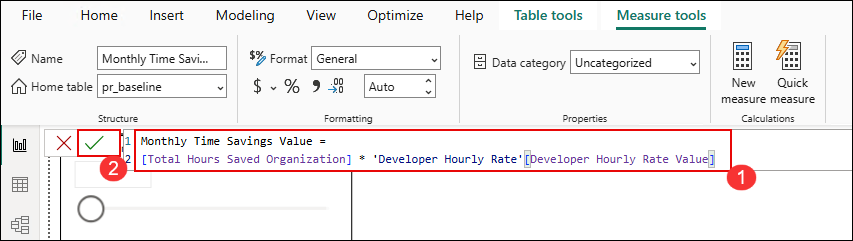

   Format as **Currency** with **0 decimal places**.

1. In the **Data** pane, right-click **pr_baseline** table and select **New measure**. Create **Annual Time Savings Value**:

   ```
   Annual Time Savings Value = [Monthly Time Savings Value] * 12
   ```

   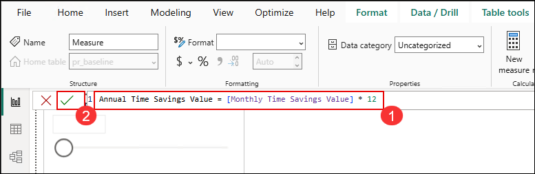

   Format as **Currency** with **0 decimal places**.

### D. Create ROI Measures

1. Create another parameter for **Annual Copilot Cost per User**:
   - Go to **Modeling** → **New parameter** → **Numeric range**

      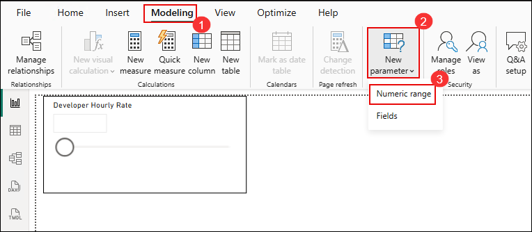

1. Configure the cost parameter:
   - **Name:** Annual Copilot Cost per User (2)
   - **Data type:** Whole number (3)
   - **Minimum:** 100 (4)
   - **Maximum:** 500 (5)
   - **Increment:** 20 (6)
   - **Default:** 228 (7) *(Copilot Business annual cost)*
   - **Add slicer to this page:** Checked (8)
   - Click **Create** (9)

      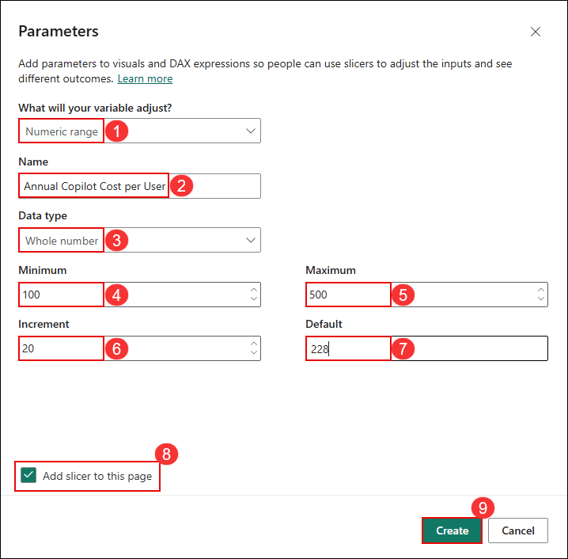

1. In the **Data** pane, right-click **pr_baseline** table and select **New measure**. Create **Total Annual Copilot Investment**:

   ```
   Total Annual Copilot Investment = 
   [Active Users] * 'Annual Copilot Cost per User'[Annual Copilot Cost per User Value]
   ```

   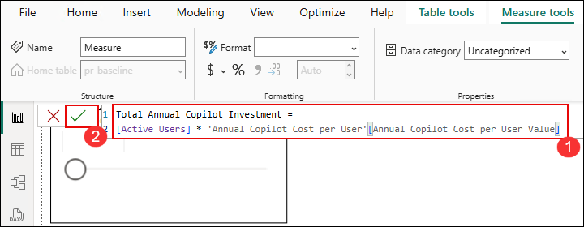

   Format as **Currency** with **0 decimal places**.

1. In the **Data** pane, right-click **pr_baseline** table and select **New measure**. Create **Copilot ROI %**:

   ```
   Copilot ROI % = DIVIDE(
       [Annual Time Savings Value] - [Total Annual Copilot Investment],
       [Total Annual Copilot Investment],
       0
   )
   ```

   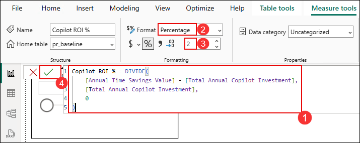

   Format as **Percentage** with **0 decimal places**.

   > **Manager Insight:** A positive ROI % means the time savings value exceeds the cost of Copilot. For example, 200% ROI means you're getting $3 in value for every $1 spent.

1. In the **Data** pane, right-click **pr_baseline** table and select **New measure**. Create **ROI Payback Period (months)**:

   ```
   ROI Payback Period (months) = DIVIDE(
       [Total Annual Copilot Investment],
       [Monthly Time Savings Value],
       0
   )
   ```

   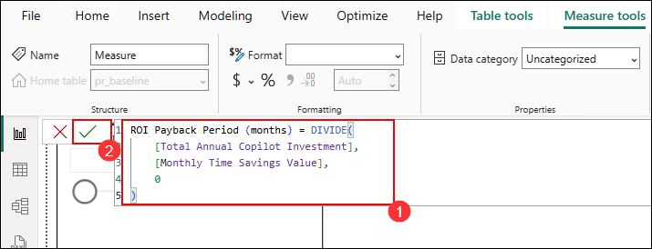

   Format as **Decimal number** with **1 decimal place**.

   > **Manager Insight:** Payback period shows how quickly the investment pays for itself. Less than 6 months is excellent; less than 12 months is good.

1. Verify your parameters appear in the Data pane:

   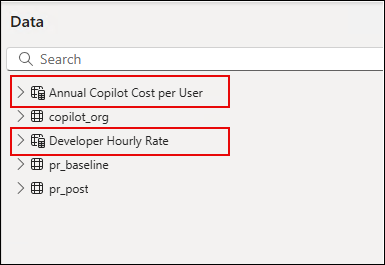

   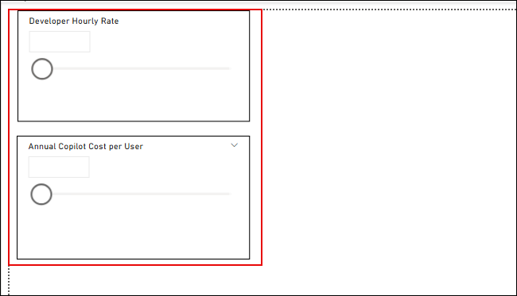


## Task 2: Build the Executive Dashboard

Now let's create a dashboard designed for executive audiences.

### A. Create Key Metric Cards

1. Insert **Card** visuals for these priority metrics:

   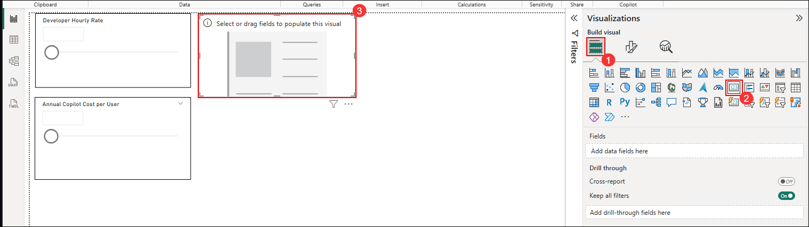

1. Add **Copilot ROI %** - make this prominent:

   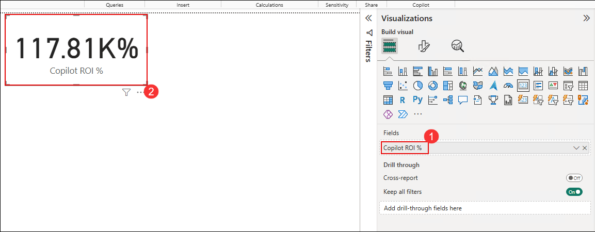

1. Add additional cards for:
   - **ROI Payback Period (months)**
   - **Annual Time Savings Value**
   - **Active Users**

      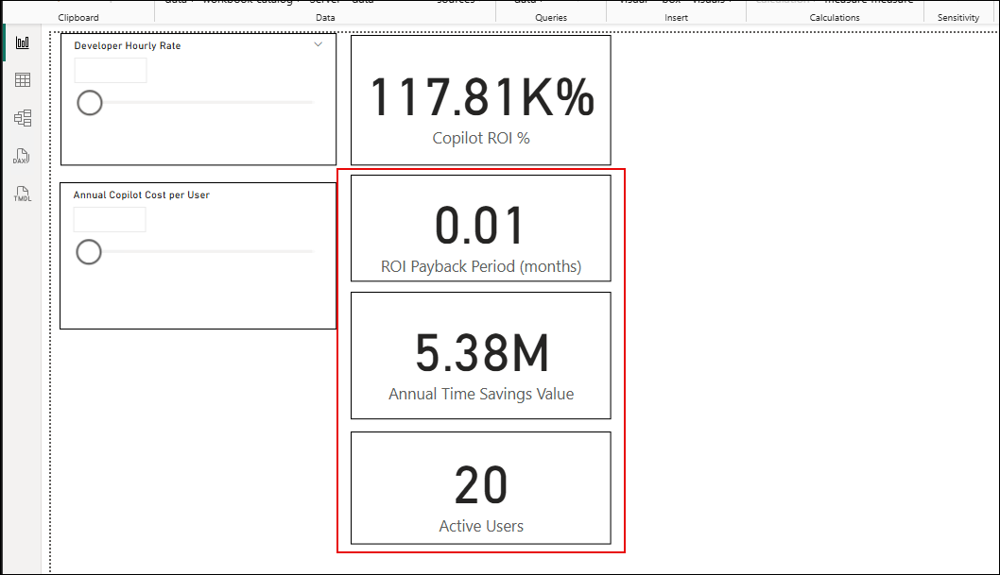

   > **Executive Value:** These four cards immediately communicate the business case in terms executives understand: ROI, payback, savings, and scale.

### B. Create Adoption vs. Impact Matrix

1. Insert a **Scatter chart** to show the relationship between adoption and productivity:

   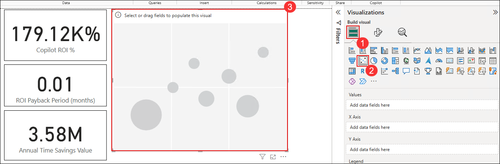

1. Configure the scatter chart:
   - **X-axis**: Active Users (from copilot_org, by team)
   - **Y-axis**: Lead Time Improvement % (from pr_baseline)
   - **Legend**: team

      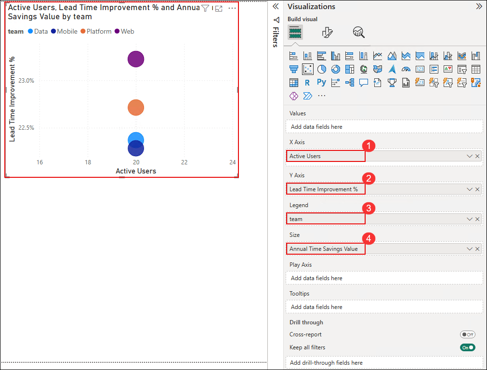

      > **Executive Insight:** This shows which teams are both adopting Copilot well AND seeing productivity benefits. Teams in the upper-right quadrant are your success stories.

### C. Add Improvement Summary

1. Insert a **Clustered column chart** showing key improvements:

   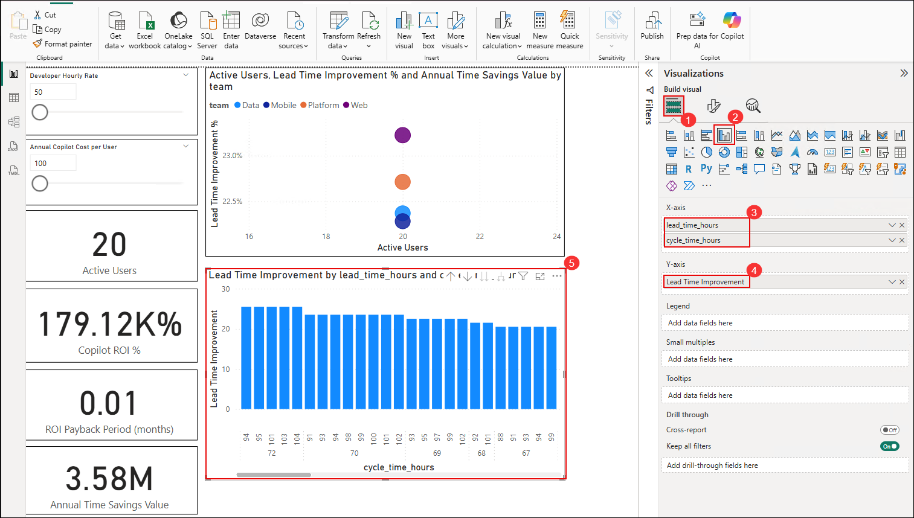

1. Your completed dashboard should look similar to:

   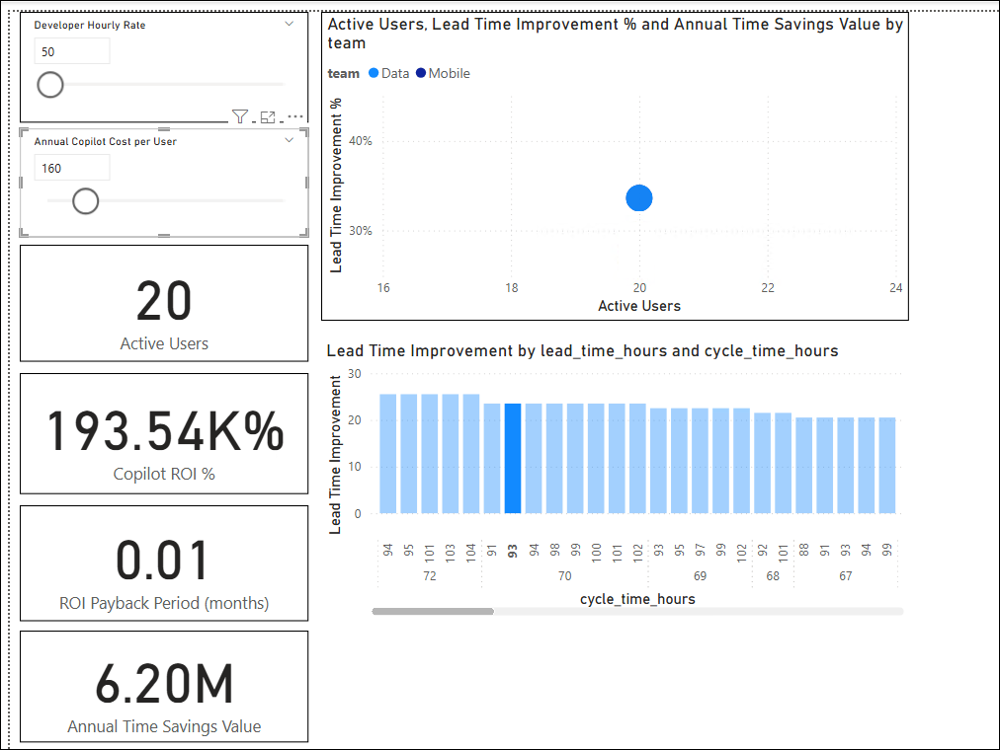

### D. Dashboard Layout Best Practices

Arrange your dashboard with executive viewing in mind:

```
┌─────────────────────────────────────────────────────────┐
│  [ROI %]    [Payback]    [Annual Savings]  [Users]     │  ← Key metrics at top
├─────────────────────────────────────────────────────────┤
│                                                         │
│  [Adoption vs Impact Scatter Chart]                     │  ← Main insight visual
│                                                         │
├───────────────────────────┬─────────────────────────────┤
│  [Improvement Summary]    │  [Parameter Sliders]        │  ← Details & interactivity
│                           │  - Developer Rate           │
│                           │  - Copilot Cost             │
└───────────────────────────┴─────────────────────────────┘
```

> **Manager Insight:** Executives scan from top-left to bottom-right. Put your most important metrics where they look first.

---

## Task 3: Present the Business Case

This task covers how to use your dashboard in executive presentations.

### A. Handling Executive Questions

| Question | Response Strategy |
|----------|-------------------|
| "Is this sustainable?" | "We're tracking trends over time. Early data suggests improvements compound as developers become more proficient." |
| "What about code quality?" | "Faster lead times include review time - the data suggests reviewers are finding code easier to approve." |
| "Should we expand?" | Use sliders to show ROI at larger scale: "If we add 50 more developers, projected ROI increases to..." |
| "What's the risk?" | "The main risk is low adoption. We're addressing this through training programs and identifying team champions." |
| "How does this compare to industry?" | "GitHub reports average 55% faster coding with Copilot. Our results at [X]% are [above/in line with] expectations." |

### b. Connecting to Strategic Goals

Frame Copilot benefits in terms of business objectives:

| Business Goal | Copilot Contribution | Your Data Point |
|---------------|---------------------|-----------------|
| Faster time-to-market | Reduced lead time | "X% improvement" |
| Developer retention | Better tooling, less tedious work | "Y% using advanced features" |
| Cost efficiency | More output per developer | "Z hours saved monthly" |
| Innovation capacity | Less time on boilerplate | "W% throughput increase" |

> **Manager Insight:** Executives care about business outcomes, not technology. Always connect your metrics to what the business is trying to achieve.

---

## Task 4: Publish to Power BI Service

Make your dashboard accessible to stakeholders.

1. In Power BI Desktop, select **File** → **Publish** → **Publish to Power BI**.

   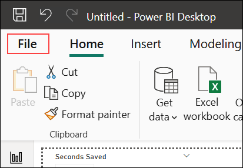

1. Choose **My workspace** and click **Select**.

   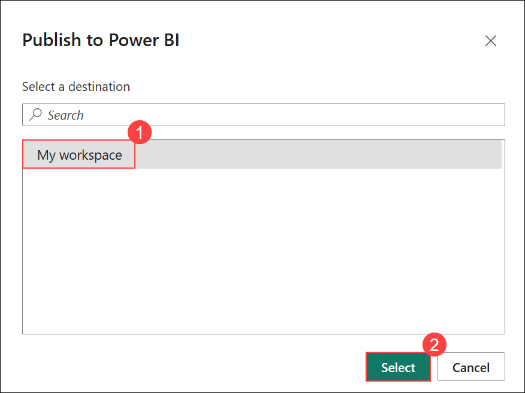

1. When prompted, save with a meaningful filename like: `Copilot_ROI_Dashboard`

   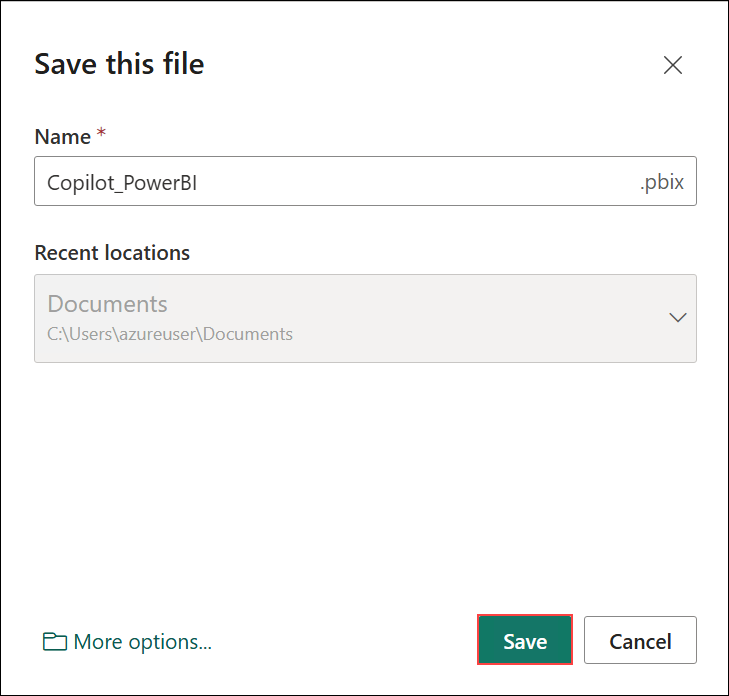

1. After successful publish, click **Got it**.

   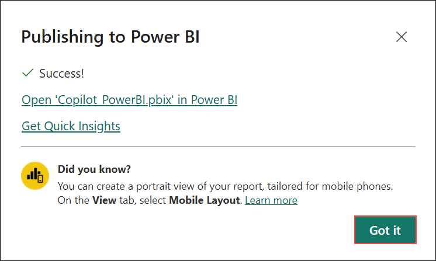

### Sharing Options

Once published, you can:
- **Share direct link** - Send URL to specific executives
- **Embed in Teams** - Add to management team channel
- **Schedule refresh** - Keep data current automatically
- **Export to PDF** - For offline presentations

---

## Notes

- ROI calculations focus on time savings - the primary quantifiable benefit
- Parameters make the dashboard interactive for different scenarios
- Executives need "so what" not "how" - focus on business impact
- Payback period is often more compelling than ROI percentage
- Always have team-level detail available for drill-down questions

---

## Summary

In this exercise, you successfully:

- **Created ROI calculation measures** - You can quantify the financial value of Copilot adoption.

- **Built an executive dashboard** - Your visualizations communicate business value clearly.

- **Learned presentation strategies** - You have frameworks for executive conversations.

- **Published for sharing** - Your dashboard is accessible to stakeholders.

---

## Workshop Completion

### Congratulations!

You have successfully completed the **Measuring GitHub Copilot Impact for Managers** workshop.

### What You've Learned:

| Exercise | Key Skill |
|----------|-----------|
| Exercise 1 | Copilot features, governance, and policy management |
| Exercise 2 | Hands-on experience with GitHub Copilot |
| Exercise 3 | Accessing and understanding usage reports |
| Exercise 4 | Analyzing adoption patterns and team performance |
| Exercise 5 | Measuring productivity impact with PR metrics |
| Exercise 6 | Calculating ROI and presenting to executives |

### Your Toolkit:

You now have:
- An adoption dashboard to track team engagement
- A productivity dashboard showing before/after impact  
- An ROI dashboard for executive presentations
- Frameworks for stakeholder conversations
- Governance best practices for your organization

### Recommended Next Steps:

1. **This Week:** Share your dashboard with your leadership team
2. **This Month:** Identify 2-3 teams for focused adoption improvement
3. **This Quarter:** Establish regular reporting cadence for Copilot metrics
4. **Ongoing:** Update dashboards monthly and track trends over time

### Additional Resources

- [GitHub Copilot Documentation](https://docs.github.com/copilot)
- [Copilot for Business Admin Guide](https://docs.github.com/copilot/managing-copilot-business)
- [Copilot Trust Center](https://resources.github.com/copilot-trust-center/)
- [GitHub Administration Certification](https://resources.github.com/learn/certifications/)

### Support

If you have questions after the workshop:
- **CloudLabs Support:** cloudlabs-support@spektrasystems.com
- **GitHub Documentation:** docs.github.com/copilot

---

## Thank you for participating! 

We hope this workshop has equipped you with the skills to effectively measure and communicate GitHub Copilot's business value in your organization.
