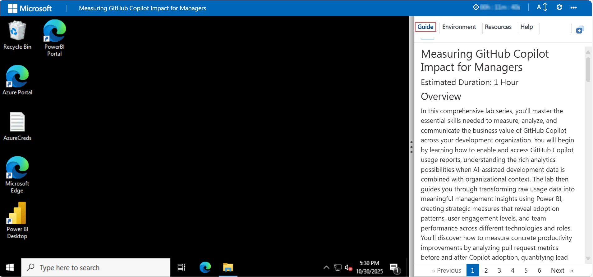
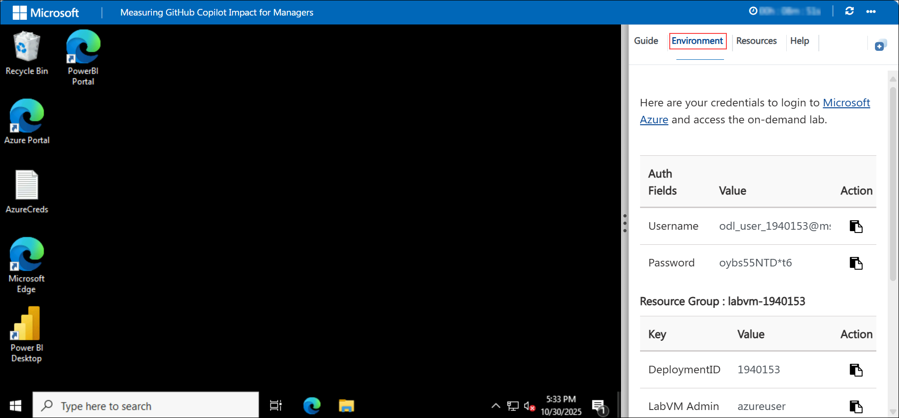
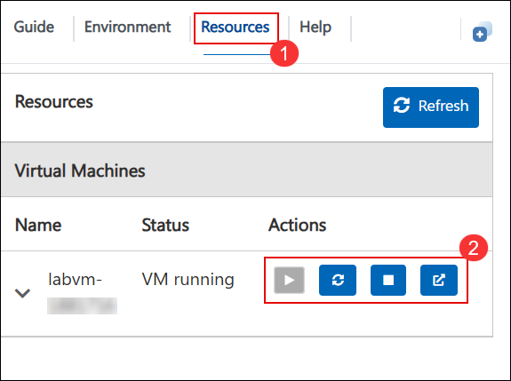

# Measuring GitHub Copilot Impact for Managers

### Overall Estimated Duration: 4 Hours

## Overview

In this comprehensive lab series, you will master the essential skills needed to measure, analyze, and communicate the business value of **GitHub Copilot** across your development organization. You'll start by understanding GitHub Copilot's administrative controls, governance features, and policy management - giving you the foundation to effectively manage Copilot at scale. You'll then learn to access and interpret usage reports, analyze adoption patterns, measure productivity improvements through PR metrics, and build executive-ready ROI dashboards.

This workshop balances **GitHub Copilot administration and governance** with **data-driven decision making**, ensuring you leave with both the technical knowledge to manage Copilot and the analytical skills to demonstrate its business value.

## Objective

By the end of this lab, you will be able to:

- **Understand Copilot Features & Governance:** Navigate GitHub Copilot administrative settings, manage policies, configure features, and implement best practices for organizational rollout.

- **Enable & Access Usage Reports:** Activate reporting features and download organization-level usage data for adoption analysis.

- **Analyze Adoption & Engagement:** Interpret Copilot usage data to identify team performance patterns and areas needing support.

- **Measure Productivity Impact:** Analyze pull request metrics to quantify concrete productivity improvements from Copilot adoption.

- **Calculate ROI & Present to Executives:** Build dashboards that demonstrate clear business value and support strategic decision-making.

## Pre-requisites

- **GitHub Organization Owner** permissions to access Copilot settings and usage reports
- **GitHub Copilot Business or Enterprise** licensing activated for your organization
- Access to **Power BI Desktop** and **Power BI Service**
- Basic familiarity with software development metrics and team management

## Workshop Agenda

| Exercise | Duration | Focus Area |
|----------|----------|------------|
| Exercise 1: Copilot Features & Governance | 45 min | GitHub Copilot Admin |
| Exercise 2: Enable & Access Usage Reports | 20 min | GitHub Copilot Admin |
| Exercise 3: Analyze Adoption & Engagement | 30 min | Analytics & Insights |
| Exercise 4: Measure Productivity with PR Analysis | 25 min | Analytics & Insights |
| Exercise 5: Build Executive ROI Dashboard | 30 min | Business Value |
| Q&A and Discussion | 30 min | Real-world Scenarios |

## Architecture

You'll progress through a comprehensive five-exercise journey:

1. **Copilot Features & Governance:** Understand Copilot capabilities, configure organizational policies, manage access, and implement governance best practices.
2. **Enable Usage Reports:** Navigate GitHub administrative settings to generate and download Copilot Activity reports.
3. **Adoption Analysis:** Import usage data into Power BI and interpret dashboards showing team performance and engagement patterns.
4. **Productivity Impact:** Analyze before-and-after pull request metrics to measure improvements in delivery velocity.
5. **Executive ROI Dashboard:** Combine adoption and productivity data to calculate and present return on investment.

## Getting Started with the Lab

Once you're ready to dive in, your virtual machine and lab guide will be right at your fingertips within your web browser.

## Virtual Machine & Lab Guide

Your virtual machine is your workhorse throughout the workshop. The lab guide is your roadmap to success.

## Pre-Session Checklist

Before starting the lab, please verify the following:

### Network Connectivity
- [ ] Can you access https://github.com from your browser?
- [ ] Can you access https://app.powerbi.com from your browser?
- [ ] Are there any corporate firewall restrictions blocking these sites?

### Required Access
- [ ] GitHub Organization Owner permissions confirmed
- [ ] Power BI Desktop installed and accessible
- [ ] Lab credentials received and tested

### Troubleshooting Common Issues

| Issue | Solution |
|-------|----------|
| Cannot access GitHub | Try using incognito/private browser mode, or contact your IT team about firewall rules |
| Power BI sign-in fails | Ensure you're using the lab credentials provided, not your personal account |
| VM connection drops | Use the "Restart" button in the Resources tab, wait 2 minutes before reconnecting |
| Slow performance | Close unnecessary browser tabs and applications |

### Need Help?
**CloudLabs Support (24/7):**
- Email: cloudlabs-support@spektrasystems.com  
- Live Chat: https://cloudlabs.ai/labs-support

## Exploring Your Lab Resources

To get a better understanding of your lab resources and credentials, navigate to the **Environment** tab.

## Utilizing the Split Window Feature

For convenience, you can open the lab guide in a separate window by selecting the **Split Window** button from the top right corner.

## Managing Your Virtual Machine

On the **Resources (1)** tab, use the **Action buttons (2)** next to your VM. Feel free to **start**, **stop**, or **restart** your Virtual Machine as needed.

## Lab Guide Zoom In/Zoom Out

To adjust the zoom level for the environment page, click the **A↕ : 100%** icon located next to the timer in the lab environment.

## Let's Get Started with Power BI Portal

1. On the Lab VM, Open **Power BI Desktop** from the desktop of your lab environment.

    

1. In the app window, click **Sign in** (top-right) to start the login process.

    

1. On **Enter your email address (1)** and click **Continue (2)**

    - **Email/Username:** <inject key="AzureAdUserEmail"></inject>

      

1. When prompted again, sign in with the email and click **Next (2)**.

     - **Email/Username:** <inject key="AzureAdUserEmail"></inject> **(1)**

      

1. Enter the **password (1)** and click **Sign in (2)**.

    - **Password:** <inject key="AzureAdUserPassword"></inject>

      

1. For the prompt **Automatically sign in to all desktop apps and websites on this device?**, select **No, this app only**.

   

1. If the **Power BI free license assigned** message appears, click **OK** to continue.

   

Click **Next** at the bottom-right to begin your lab journey!

## Happy Learning!!
